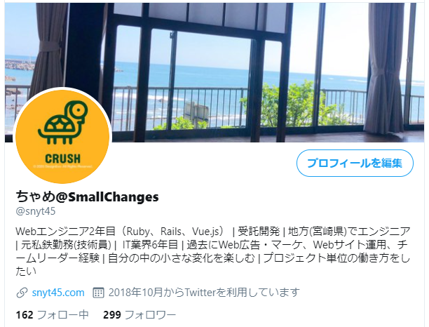

ふと思ったので、勢いで色々やってみる。  
まず、何のためにするのかというところを考えてみたい。

・エンジニア同士のつながりを作るためにSNS上での認知の獲得。覚えてもらう。  
・主にバックエンドなのでお仕事的にはクライアントさんは企業になると思うけど、企業向けに発信していくのは手間暇かかる。  

だったら、エンジニアさんの目に留まるようなアカウント運用がよさそう。

=> 同業のエンジニアに認知されたい！

（まあ、プロフィールの見栄えをよくする前にQiitaで記事書いたりとかやることあるだろという突っ込みはなしで^^;）

ということで、キャッチーで親しみやすさを意識して色々変更してみました。

### その前に変更前のTwitterのプロフィール

### アカウント名を変更する
エンジニアで有名どころでいうと思い浮かんだのが勝又さん。
技術力も高く、マーケ能力も高い（フォロワー数で判断）ので参考にしました。

親しみやすさというよりは、アカウント名は実名＋出版しましたという形で
実名での信頼感や出版しましたという実績での権威性を高めるような構成だった。

自分の実績でいうと  
・未経験からWebエンジニア  
・地方(宮崎県)でエンジニア  
・鉄道 → web広告運用、webマーケ、チームリーダー経験 → webエンジニア 一貫性のないキャリアだが、面白いことを求め続けている  
とはいえ、なんかぱっとしない実績しかない。

権威性はあとでついてくるとして、今は目標とマインドのほうがいいのかもしれない。  
てか、結局何を発信するかかもしれない。アカウント名と発信している内容に乖離があると離脱しやすそうだし。  

Yuta Sano@人と違うから面白い  
佐野優太@人と違うから面白い  
Yuta Sano@独学エンジニア  
佐野優太@変化を起こしたい  
Yuta Sano@人生化学変化  

うーん、実名とキャッチコピーて自分の場合はなんか相性わるい気がする。

エンジニアという職業をうまく使って、自分の中での変化をいろいろ楽しませてもらっている感はあるのでそれ系にしたい。

「自分の中の小さな変化を楽しむ」とかいいかも。

[小さな変化が持つ大きな力 \| Hello, Coaching\!](https://coach.co.jp/report/20190222.html)とかいい言葉

小さな変化  
Small changes  
スモチェンの人みたいな感じで略せそう。  

動物で例えると、カメレオンが一番近い。  
カメレオンは英語でchameleonで、chameがちゃめって呼べるからちゃめにしよっかなw  

ちゃめ@SmallChanges

だいぶ、キャッチーよりになってしまったがいったんこれで行ってみるw

#### before
yuta.sano

#### after
ちゃめ@Small Changes

### プロフィール文を変更する
もう少し親しみのある文章にしてみる。

#### before
プロジェクト単位の働き方をしたい/IT業界6年目/Webエンジニア2年目。 過去にWeb広告・マーケ/Web運用/チームリーダー経験。

#### after
Webエンジニア2年目（Ruby、Rails、Vue.js） | 受託開発 | 地方(宮崎県)でエンジニア | 元私鉄勤務(技術員) |  IT業界6年目 | 過去にWeb広告・マーケ、Webサイト運用、チームリーダー経験 | 自分の中の小さな変化を楽しむ | プロジェクト単位の働き方をしたい

### アイコンを変更する
せっかくだし、ココナラで依頼してみようかなーと思います

### ヘッダー画像を変更する
これは気が向いたら時間のあるときにやる。テイストは少しアイコンに寄せたい。

### 変更後のTwitterプロフィール

アイコンとかはまだだけど、いったんこれで！

