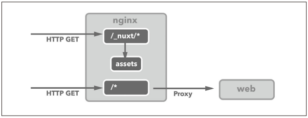
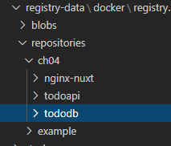
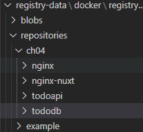
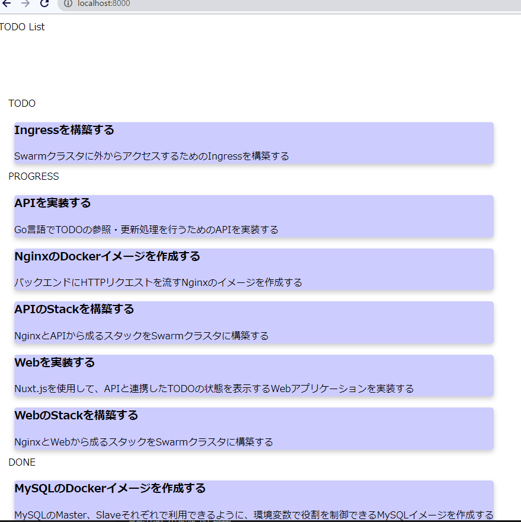

[Docker/Kubernetes 実践コンテナ開発入門：書籍案内｜技術評論社](https://gihyo.jp/book/2018/978-4-297-10033-9)

前回はNginxの構築を行いました。
サービスが立ち上がっていない気がするのですが、いったん進んでみようと思います。

## 4.5 Webの構築
* TODOの進行状況を確認できるカンバンを表示するWebアプリをNode.jsで構築
* 利用するFWは、Nuxt.jsというVue.jsベースのFW

```
$ git clone https://github.com/gihyodocker/todoweb
```

* treeコマンドでディレクトリ構造を確認
```
$ tree .\todoweb\ /f
フォルダー パスの一覧:  ボリューム Windows
ボリューム シリアル番号は 6607-7B7E です
C:\USERS\SNYT45\DESKTOP\DOCKER_KUBERNETES 実践コンテナ開発入門\4-2\TODOWEB
│  .eslintrc.js
│  .gitignore
│  Dockerfile
│  nuxt.config.js
│  package-lock.json
│  package.json
│  README.md
│  server.js
│
├─assets
│  │  README.md
│  │
│  └─style
│          app.styl
│
├─layouts
│      default.vue
│      README.md
│
├─middleware
│      README.md
│
├─pages
│      index.vue
│      README.md
│
├─plugins
│      README.md
│      vuetify.js
│
├─static
│      favicon.ico
│      README.md
│      v.png
│
└─store
        README.md
```

### 4.5.1 TODO APIを呼び出し，ページのHTMLを返却する
* axiosというHTTPクライアントライブラリを使用
* 実装はtodoweb/pages/index.vue

* scriptタグの実装
  * process.env.TODO_API_URLで環境変数を取得
```
<script>
import axios from 'axios'
let todoApiUrl = process.env.TODO_API_URL || 'http://localhost:8000'
export default {
  async asyncData (context) {
    const { data: todoItems } = await axios.get(`${todoApiUrl}/todo?status=TODO`)
    const { data: progressItems } = await axios.get(`${todoApiUrl}/todo?status=PROGRESS`)
    const { data: doneItems } = await axios.get(`${todoApiUrl}/todo?status=DONE`)
    return {
      todoItems,
      progressItems,
      doneItems
    }
  }
}
</script>
```

### 4.5.2 WebのDockerle
* ビルドとサーバ起動のための3つのステップ
  * この手順をDockerfileに組み込む
```
(todoweb) $ npm install # 依存モジュールのダウンロード
(todoweb) $ npm run build # リリース用ビルド
(todoweb) $ npm run start # アプリケーションサーバの開始
```

* Dockerfile
```
FROM node:9.2.0

WORKDIR /todoweb
COPY . /todoweb

RUN npm install -g vue-cli@2.9.3
RUN npm install
RUN npm run build

ENV HOST 0.0.0.0

CMD ["npm", "run", "start"]

EXPOSE 3000
```

* ch04/todoweb:latestという名前でイメージをビルド
```
$ docker image build -t ch04/todoweb:latest .
[+] Building 170.4s (11/11) FINISHED
 => [internal] load .dockerignore                                                                                                                                                  0.0s 
 => => transferring context: 2B                                                                                                                                                    0.0s 
 => [internal] load build definition from Dockerfile                                                                                                                               0.1s 
 => => transferring dockerfile: 217B                                                                                                                                               0.0s 
 => [internal] load metadata for docker.io/library/node:9.2.0                                                                                                                      3.6s 
 => [1/6] FROM docker.io/library/node:9.2.0@sha256:7c9099e0f68242387d7755eaa54c287e16cedd3cca423444ca773794f5f1e423                                                               97.3s 
 => => resolve docker.io/library/node:9.2.0@sha256:7c9099e0f68242387d7755eaa54c287e16cedd3cca423444ca773794f5f1e423                                                                0.0s 
 => => sha256:817c8cd48a09f6f7d54fc509d1890d349d1ba1720848531ed8bcb19fccc42962 43.23MB / 43.23MB                                                                                  37.6s 
 => => sha256:7c9099e0f68242387d7755eaa54c287e16cedd3cca423444ca773794f5f1e423 2.04kB / 2.04kB                                                                                     0.0s 
 => => sha256:c1d02ac1d9b4de08d3a39fdacde10427d1c4d8505172d31dd2b4ef78048559f8 7.09kB / 7.09kB                                                                                     0.0s 
 => => sha256:85b1f47fba49da65256f07c8790542a3880e9216f9c491965040f35ce2c6ca7a 52.60MB / 52.60MB                                                                                  37.6s 
 => => sha256:ba6bd283713a743ee651be9e0a833547e00c6f31584a948db2df96fded4def55 19.26MB / 19.26MB                                                                                   9.8s 
 => => sha256:7b3933a5e640b1c6073e218eba424b269925971c354933515c99c6a8ca440a93 2.01kB / 2.01kB                                                                                     0.0s 
 => => sha256:47cc0ed96dc3a88c79f26dc97950ec81a5c35699f48f07662f99c97412af6e95 134.93MB / 134.93MB                                                                                92.0s 
 => => sha256:8888adcbd08b22208eec8b1719ae91391c156962567f4e443db015e0bb4da654 4.42kB / 4.42kB                                                                                    37.9s 
 => => sha256:6f2de60646b92af71b80e4be2594b0506b3ccddf357c5567cbb42403ab296c8e 116.48kB / 116.48kB                                                                                38.0s 
 => => extracting sha256:85b1f47fba49da65256f07c8790542a3880e9216f9c491965040f35ce2c6ca7a                                                                                         45.5s 
 => => sha256:9dd205971dc0fc99c9dd6e260cf6b251e0f2af259772ee057d60d5012ef7813c 18.31MB / 18.31MB                                                                                  61.2s 
 => => sha256:5859715a4691cb485ab12b051dc8c77bf19e83ff37f369c8260e694a30826b99 1.01MB / 1.01MB                                                                                    38.8s 
 => => extracting sha256:ba6bd283713a743ee651be9e0a833547e00c6f31584a948db2df96fded4def55                                                                                          0.4s 
 => => extracting sha256:817c8cd48a09f6f7d54fc509d1890d349d1ba1720848531ed8bcb19fccc42962                                                                                          1.6s 
 => => extracting sha256:47cc0ed96dc3a88c79f26dc97950ec81a5c35699f48f07662f99c97412af6e95                                                                                          3.4s 
 => => extracting sha256:8888adcbd08b22208eec8b1719ae91391c156962567f4e443db015e0bb4da654                                                                                          0.0s 
 => => extracting sha256:6f2de60646b92af71b80e4be2594b0506b3ccddf357c5567cbb42403ab296c8e                                                                                          0.0s 
 => => extracting sha256:9dd205971dc0fc99c9dd6e260cf6b251e0f2af259772ee057d60d5012ef7813c                                                                                          1.1s 
 => => extracting sha256:5859715a4691cb485ab12b051dc8c77bf19e83ff37f369c8260e694a30826b99                                                                                          0.0s 
 => [internal] load build context                                                                                                                                                  0.4s 
 => => transferring context: 648.92kB                                                                                                                                              0.2s 
 => [2/6] WORKDIR /todoweb                                                                                                                                                         1.7s 
 => [3/6] COPY . /todoweb                                                                                                                                                          0.1s 
 => [4/6] RUN npm install -g vue-cli@2.9.3                                                                                                                                        15.0s 
 => [5/6] RUN npm install                                                                                                                                                         18.2s 
 => [6/6] RUN npm run build                                                                                                                                                       31.9s 
 => exporting to image                                                                                                                                                             2.7s 
 => => exporting layers                                                                                                                                                            2.7s 
 => => writing image sha256:c6e8ff40cce2641a3d68a0b6022ce9c8982dd108568d54dcef959e75908f67c1                                                                                       0.0s 
 => => naming to docker.io/ch04/todoweb:latest 
```

### 4.5.3 静的ファイルの扱いを工夫する
* webの前段にリバースプロキシとしてnginxを配置
* 不変な静的ファイルをNode.jsからnginxに返すのでは無駄が多い。
* 静的ファイルであるassetsファイルは、Nginxから直接レスポンスする。



* デプロイ用の静的ファイルはイメージビルド時にnpm run buildで生成される。
* todowebコンテナの.nuxt/distに配置される。
* 例えば.nuxt/distに配置されたjsファイルは、/_nuxt/xxxxxx.jsというURLでレスポンスできるようになる。

* 静的ファイルをNginxからレスポンスするためにnuxt.conf.tmplを作成する
```
(todonginx) $ cp etc/nginx/conf.d/public.conf.tmpl etc/nginx/conf.d/nuxt.conf.tmpl
```

* etc/nginx/conf.d/nuxt.conf.tmpl
  * 元のファイルに①の定義を追加しただけ
  * /_nuxt/*のリクエストの場合、Nginxコンテナの/var/www/_nuxtディレクトリに配置されているファイルをレスポンスするようになる。
```
server {
    listen {{ var "SERVER_PORT" | default "80" }} default_server;
    server_name {{ var "SERVER_NAME" | default "localhost" }};
    charset utf-8;

    location /_nuxt/ { # ← ①
        alias /var/www/_nuxt/$1;
        {{ if var "LOG_STDOUT" }}
        access_log /dev/stdout json;
        error_log /dev/stderr;
        {{ else }}
        access_log /var/log/nginx/assets_access.log json;
        error_log /var/log/nginx/assets_error.log;
        {{ end }}
    }

    location / {
        proxy_pass http://backend;
        proxy_pass_request_headers on;
        proxy_set_header host $host;
        {{ if var "LOG_STDOUT" }}
        access_log /dev/stdout json;
        error_log /dev/stderr;
        {{ else }}
        access_log /var/log/nginx/backend_access.log json;
        error_log /var/log/nginx/backend_error.log;
        {{ end }}
        {{ if var "BASIC_AUTH_FILE" }}
        auth_basic "Restricted";
        auth_basic_user_file {{ var "BASIC_AUTH_FILE" }};
        {{ end }}
    }
}
```

* todonginx/Dockerfile-nuxt
  * render箇所public.confからnuxt.confに変更
```
FROM nginx:1.13

RUN apt-get update
RUN apt-get install -y wget
RUN wget https://github.com/progrium/entrykit/releases/download/v0.4.0/entrykit_0.4.0_linux_x86_64.tgz
RUN tar -xvzf entrykit_0.4.0_linux_x86_64.tgz
RUN rm entrykit_0.4.0_linux_x86_64.tgz
RUN mv entrykit /usr/local/bin/
RUN entrykit --symlink

RUN rm /etc/nginx/conf.d/*
COPY etc/nginx/nginx.conf.tmpl /etc/nginx/
COPY etc/nginx/conf.d/ /etc/nginx/conf.d/

ENTRYPOINT [ \
  "render", \
      "/etc/nginx/nginx.conf", \
      "--", \
  "render", \
      "/etc/nginx/conf.d/upstream.conf", \
      "--", \
  "render", \
      "/etc/nginx/conf.d/nuxt.conf", \ # <-- public.confからnuxt.confに変更
      "--" \
]

CMD ["nginx", "-g", "daemon off;"]
```

* Dockerfileの名前が普段と違うので、-fでファイル名を指定してイメージをビルド
* タグを付けてregistryにpush
```
(todonginx) $ docker image build -f Dockerfile-nuxt -t ch04/nginx-nuxt:latest .
(todonginx) $ docker image tag ch04/nginx-nuxt:latest localhost:5000/ch04/nginx-nuxt:latest
(todonginx) $ docker image push localhost:5000/ch04/nginx-nuxt:latest
```

* assetsファイルが存在しているのNginxコンテナではなくtodowebコンテナ
* asset用のdocker volumeを作成し、nginxとtodowebコンテナで共有する方法をとる。

### 4.5.4 Nginxを通してアクセスできるようにする
* todowebをNginx経由でアクセスできるようにする。

* todo-fronted.yml
  * Nginxはtodoapiと同様のイメージを使っているが一部環境変数をweb向けにしている。
  * ①：後ほどのIngressでの公開でのServiceのポートを見つけるための設定
  * ②：Nginxのバックエンドのtodowebのホストの設定
  * ④：todowebがTODO APIにアクセスするためのURL。APIの前段のNginxのService名をホスト名に設定
  * ③、⑤、⑥：assetsをdocker volumeとして共有するための設定
    * ほんと、docker volumeを使った共有は簡単にできるからありがたい！！

```
version: "3"
services:
  nginx:
    image: registry:5000/ch04/nginx-nuxt:latest
    deploy:
      replicas: 2
      placement:
        constraints: [node.role != manager]
    depends_on:
      - web
    environment:
      SERVICE_PORTS: 80 # ← ①
      WORKER_PROCESSES: 2
      WORKER_CONNECTIONS: 1024
      KEEPALIVE_TIMEOUT: 65
      GZIP: "on"
      BACKEND_HOST: todo_frontend_web:3000 # ← ②
      BACKEND_MAX_FAILS: 3
      BACKEND_FAIL_TIMEOUT: 10s
      SERVER_PORT: 80
      SERVER_NAME: localhost
      LOG_STDOUT: "true"
    networks:
      - todoapp
    volumes:
      - assets:/var/www/_nuxt # ← ③

  web:
    image: registry:5000/ch04/todoweb:latest
    deploy:
      replicas: 2
      placement:
        constraints: [node.role != manager]
    environment:
      TODO_API_URL: http://todo_app_nginx # ← ④
    networks:
      - todoapp
    volumes:
      - assets:/todoweb/.nuxt/dist # ← ⑤

networks:
  todoapp:
    external: true

volumes: # ← ⑥
  assets:
    driver: local
```

* todo_fronted Stackとしてデプロイ
```
$ docker container exec -it manager docker stack deploy -c stack/todo-frontend.yml todo_frontend
todoapp Additional property todoapp is not allowed
```

* todo-frontend.ymlのインデントで間違っている箇所があったようだ。
* 修正して、再度デプロイ
```
Creating service todo_frontend_nginx
Creating service todo_frontend_web
```

### 4.5.5 Ingressで公開する
* WebアプリがSwarm上にデプロイされた。
* Ingressでswarmの外に公開してみる。

* todo-ingress.yml
```
version: "3"
services:
  haproxy:
    image: dockercloud/haproxy
    networks:
      - todoapp
    volumes:
      - /var/run/docker.sock:/var/run/docker.sock
    deploy:
      mode: global
      placement:
        constraints:
          - node.role == manager
    ports:
      - 80:80
      - 1936:1936

networks:
  todoapp:
    external: true
```

* todo-ingress.ymlをデプロイ
```
$ docker container exec -it manager docker stack deploy -c stack/todo-ingress.yml todo_ingress
services.haproxy.deploy.placement must be a mapping
```

* また、ymlのインデント・・・修正して、再度デプロイ。
```
$ docker container exec -it manager docker stack deploy -c stack/todo-ingress.yml todo_ingress
Creating service todo_ingress_haproxy
```

* Swarmのmanagerノードの80番ポートは、ホストの8000番ポートから参照できる。
* curlでGETリクエストを送信してみる。

```
$ curl -I http://localhost:8000/
HTTP/1.0 503 Service Unavailable
Cache-Control: no-cache
Connection: close
Content-Type: text/html
```

* 503エラー・・・多分、前回の章でNginxが正しく起動していなかったのでそれが原因だと思う。
* 起動しているサービスを見てみる。以下のサービスが正しく動いていないっぽい。
  * todo_app_nginx
  * todo_frontend_nginx
  * todo_frontend_web
```
$ docker container exec -it manager docker service ls
ID                  NAME                   MODE                REPLICAS            IMAGE                                  PORTS
nz210v1bx7ar        todo_app_api           replicated          2/2                 registry:5000/ch04/todoapi:latest
0s0ivsgitps7        todo_app_nginx         replicated          0/2                 registry:5000/ch04/nginx:latest
loloda9aitfi        todo_frontend_nginx    replicated          0/2                 registry:5000/ch04/nginx-nuxt:latest
vkkl2iyntfpd        todo_frontend_web      replicated          0/2                 registry:5000/ch04/todoweb:latest
fke63shna281        todo_ingress_haproxy   global              1/1                 dockercloud/haproxy:latest             *:80->80/tcp, *:1936->1936/tcp
nlhixxweyeil        todo_mysql_master      replicated          1/1                 registry:5000/ch04/tododb:latest
cdt3g4mmmo6a        todo_mysql_slave       replicated          2/2                 registry:5000/ch04/tododb:latest
```

* nginxのイメージ単体でコンテナ起動してみる。
* 動いてないけど、そもそも環境変数渡してないからな気が・・
```
$ docker container run --rm ch04/nginx
2020/11/03 13:04:57 [emerg] 1#1: host not found in upstream "max_fails=3" in /etc/nginx/conf.d/upstream.conf:2
nginx: [emerg] host not found in upstream "max_fails=3" in /etc/nginx/conf.d/upstream.conf:2
```

* プロセスを確認すると、イメージがなくて落ちてる！？
```
$ docker-compose exec manager docker service ps todo_app_nginx
ID                  NAME                   IMAGE                             NODE                DESIRED STATE       CURRENT STATE             ERROR                              PORTS
oi2p5hf0yqpu        todo_app_nginx.1       registry:5000/ch04/nginx:latest   3cb697256825        Ready               Rejected 2 seconds ago    "No such image: registry:5000/…"
jlrjtk16x7vv         \_ todo_app_nginx.1   registry:5000/ch04/nginx:latest   3a2de3f08dbe        Shutdown            Rejected 7 seconds ago    "No such image: registry:5000/…"
2229nxde54un         \_ todo_app_nginx.1   registry:5000/ch04/nginx:latest   3a2de3f08dbe        Shutdown            Rejected 12 seconds ago   "No such image: registry:5000/…"
u5x26mqk7blo         \_ todo_app_nginx.1   registry:5000/ch04/nginx:latest   3a2de3f08dbe        Shutdown            Rejected 17 seconds ago   "No such image: registry:5000/…"
t91odc6e4bef         \_ todo_app_nginx.1   registry:5000/ch04/nginx:latest   9372f731e1c1        Shutdown            Rejected 22 seconds ago   "No such image: registry:5000/…"
mumor6fkvx5p        todo_app_nginx.2       registry:5000/ch04/nginx:latest   3cb697256825        Ready               Rejected 1 second ago     "No such image: registry:5000/…"
uoi0oq18jd40         \_ todo_app_nginx.2   registry:5000/ch04/nginx:latest   9372f731e1c1        Shutdown            Rejected 7 seconds ago    "No such image: registry:5000/…"
wg7w4awe46df         \_ todo_app_nginx.2   registry:5000/ch04/nginx:latest   9372f731e1c1        Shutdown            Rejected 12 seconds ago   "No such image: registry:5000/…"
tl65b9lpq0rv         \_ todo_app_nginx.2   registry:5000/ch04/nginx:latest   9372f731e1c1        Shutdown            Rejected 22 seconds ago   "No such image: registry:5000/…"
wv5xrh2vqxa0         \_ todo_app_nginx.2   registry:5000/ch04/nginx:latest   3a2de3f08dbe        Shutdown            Rejected 22 seconds ago   "No such image: registry:5000/…"
```

* registryコンテナの永続化のため、ホストにマウントしているregistry-dataをみるとなんとnginxのimageがない。。



* pushしたはずだけど...再度push
```
$ docker image push localhost:5000/ch04/nginx:latest
```

* registryにnginxイメージが追加された


* todo_app_nginxは正常に起動してくれた！
```
$ docker-compose exec manager docker service ls
ID                  NAME                   MODE                REPLICAS            IMAGE                               PORTS
ksi15hu9vkhm        todo_app_api           replicated          2/2                 registry:5000/ch04/todoapi:latest
jujn53qfffbp        todo_app_nginx         replicated          2/2                 registry:5000/ch04/nginx:latest
fke63shna281        todo_ingress_haproxy   global              1/1                 dockercloud/haproxy:latest          *:80->80/tcp, *:1936->1936/tcp
nlhixxweyeil        todo_mysql_master      replicated          1/1                 registry:5000/ch04/tododb:latest
cdt3g4mmmo6a        todo_mysql_slave       replicated          2/2                 registry:5000/ch04/tododb:latest
```

* 改めて、todo-frontendをデプロイ。
```
$ docker container exec -it manager docker stack deploy -c stack/todo-frontend.yml todo_frontend
```

* あれ、todo_frontendはだめだ。でも、registryみると同じくイメージが足りてないみたいだ。
```
$ docker-compose exec manager docker service ls
ID                  NAME                   MODE                REPLICAS            IMAGE                                  PORTS
ksi15hu9vkhm        todo_app_api           replicated          2/2                 registry:5000/ch04/todoapi:latest
jujn53qfffbp        todo_app_nginx         replicated          2/2                 registry:5000/ch04/nginx:latest
71ev368lioxx        todo_frontend_nginx    replicated          0/2                 registry:5000/ch04/nginx-nuxt:latest
b9qw9zrj9lys        todo_frontend_web      replicated          0/2                 registry:5000/ch04/todoweb:latest
fke63shna281        todo_ingress_haproxy   global              1/1                 dockercloud/haproxy:latest             *:80->80/tcp, *:1936->1936/tcp
nlhixxweyeil        todo_mysql_master      replicated          1/1                 registry:5000/ch04/tododb:latest       
cdt3g4mmmo6a        todo_mysql_slave       replicated          2/2                 registry:5000/ch04/tododb:latest
```

* todowebのイメージをregistryにpush
```
$ docker image tag ch04/todoweb:latest localhost:5000/ch04/todoweb:latest
$ docker image push localhost:5000/ch04/todoweb:latest
```

* todo_frontend_nginxは起動した！todo_frontend_webは死んでる・・・
```
$ docker-compose exec manager docker service ls
ID                  NAME                   MODE                REPLICAS            IMAGE                                  PORTS
ksi15hu9vkhm        todo_app_api           replicated          2/2                 registry:5000/ch04/todoapi:latest
jujn53qfffbp        todo_app_nginx         replicated          2/2                 registry:5000/ch04/nginx:latest
71ev368lioxx        todo_frontend_nginx    replicated          2/2                 registry:5000/ch04/nginx-nuxt:latest
b9qw9zrj9lys        todo_frontend_web      replicated          0/2                 registry:5000/ch04/todoweb:latest
fke63shna281        todo_ingress_haproxy   global              1/1                 dockercloud/haproxy:latest             *:80->80/tcp, *:1936->1936/tcp
nlhixxweyeil        todo_mysql_master      replicated          1/1                 registry:5000/ch04/tododb:latest
cdt3g4mmmo6a        todo_mysql_slave       replicated          2/2                 registry:5000/ch04/tododb:latest
```

* 起動に時間がかかってただけみたいだった。
```
$ docker-compose exec manager docker service ls
ID                  NAME                   MODE                REPLICAS            IMAGE                                  PORTS
ksi15hu9vkhm        todo_app_api           replicated          2/2                 registry:5000/ch04/todoapi:latest
jujn53qfffbp        todo_app_nginx         replicated          2/2                 registry:5000/ch04/nginx:latest
71ev368lioxx        todo_frontend_nginx    replicated          2/2                 registry:5000/ch04/nginx-nuxt:latest
b9qw9zrj9lys        todo_frontend_web      replicated          2/2                 registry:5000/ch04/todoweb:latest
fke63shna281        todo_ingress_haproxy   global              1/1                 dockercloud/haproxy:latest             *:80->80/tcp, *:1936->1936/tcp
nlhixxweyeil        todo_mysql_master      replicated          1/1                 registry:5000/ch04/tododb:latest
cdt3g4mmmo6a        todo_mysql_slave       replicated          2/2                 registry:5000/ch04/tododb:latest
```

* 再度、webアプリにcurl。成功。
* NginxからNode.jsを経由してレスポンスを返しているため、X-Powered-By: Expresとなっている。
```
$ curl -I http://localhost:8000
HTTP/1.1 200 OK
Server: nginx/1.13.12
Date: Tue, 03 Nov 2020 14:02:28 GMT
Content-Type: text/html; charset=utf-8
Content-Length: 19403
X-Powered-By: Express
ETag: "4bcb-Ezen0NTkSQjUBaBoyLHc7JUOtvQ"
Vary: Accept-Encoding
```

* nginxに共有しているファイルをリクエストしたときにNode.jsを介していないかの確認をする。
* Nginxのファイル名を調べるため、todo_frontend_nginxコンテナに接続するためのコマンド取得
```
$ docker container exec -it manager docker service ps todo_frontend_nginx --no-trunc --filter "desired-state=running" --format "docker container exec -it {{.Node}} docker container exec -it {{.Name}}.{{.ID}} bash"
docker container exec -it 9372f731e1c1 docker container exec -it todo_frontend_nginx.1.5wtot6m3obiwwsu3jdjnvgoxe bash
docker container exec -it 9372f731e1c1 docker container exec -it todo_frontend_nginx.2.qljby7jvtbke031c3le5c08jt bash
```

* todo_frontend_nginxコンテナの/var/www/_nuxtディレクトリのファイル一覧を取得
* 何もファイル名が返ってこないので、ボリュームの共有がうまくいっていない気がする。
* 調査に時間がかかりそうなので、この件は今回はスルーする。
```
$ docker container exec -it 9372f731e1c1 docker container exec -it todo_frontend_nginx.1.5wtot6m3obiwwsu3jdjnvgoxe ls var/www/_nuxt
```

* localhost:8000にアクセス
* assetsが共有されておらずスタイルが効いていないけど、OK！（笑）




## 今日の学び
* nginxが起動しない件は、まさかのregistryへのpush漏れ！？（したはずだけど・・・）pushされたかホスト側のマウント先のディレクトリを確認すると確実！
* やっぱりこういった動かない経験はいい学びになる。
* スタイルが効いていないとはいえ、4章をやりきれたのは大きい。次はkubernetes！
