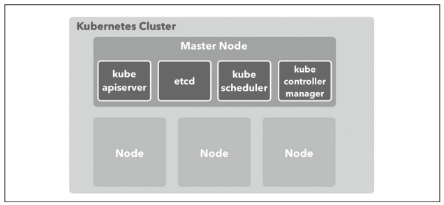
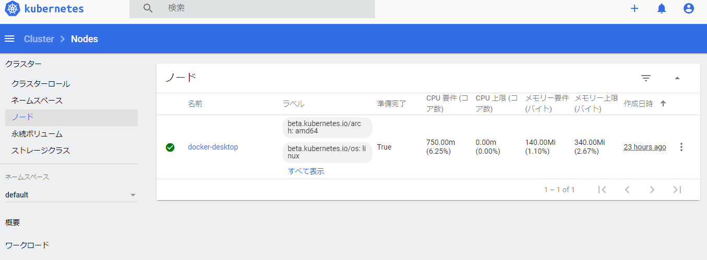

[Docker/Kubernetes 実践コンテナ開発入門：書籍案内｜技術評論社](https://gihyo.jp/book/2018/978-4-297-10033-9)

前回は、k8sのダッシュボードをブラウザから見れるように環境構築を行いました。

その続きをやっていきます。

## 5.3 Kubernetesの概念
* k8sのリソース
  * アプリケーションのデプロイ構成するための部品のようなもの
  * Node、Namespace、Podといった構成要素のこと

k8sのリソース一覧  
※テキストの一部のみ抜粋

* Node
  * k8sクラスタで実行するコンテナを配置するためのサーバ
* Namespace
  * k8sクラスタ内で作る仮想的なクラスタ
* Pod
  * コンテナ集合体の単位で、コンテナを実行する方法を定義する

## 5.4 KubernetesクラスタとNode
* k8sクラスタ
  * k8sのリソースを管理する集合体
* Node
  * クラスタが持つリソースで最も大きな概念
  * Dockerホストのことで、k8sでコンテナをデプロイするために利用される
* Master Node
  * k8sクラスタの全体を管理するサーバで最低でも1つは配置されている。

* k8sクラスタは次のようにMasterとNode群によって構成されている。



* k8sはNodeの使用リソース状況や、配置戦略によって適切にコンテナを配置
* Nodeによってクラスタのキャパシティを調整する
* ローカル環境のk8sは、クラスタ作成時に作られたVMがNodeの1つとして登録されている

* クラスタに参加しているNodeの一覧を取得
```
$ kubectl get nodes
NAME             STATUS   ROLES    AGE   VERSION
docker-desktop   Ready    master   23h   v1.18.8
```

* k8sのダッシュボード画面からも確認できる。



### コラム Masterを構成する管理コンポーネント

* k8sのMasterサーバにデプロイされる管理コンポーネント

* kube-apiserver
  * k8sのAPIを公開するコンポーネント。kubectlからのリソース操作を受け付ける
* etcd
  * 高可用性を備えた分散キーバリューストア
  * k8sクラスタのバッキングストアとして利用
* kube-scheduler
  * Nodeを監視
  * コンテナを配置する最適なNodeを選択
* kube-controller-manager
  * リソースを制御するコントローラーを実行

* 非マネージド環境でk8sを運用する場合は、Masterが単一障害点にならないよう、マルチMasterで3台配置するのが一般的

## 5.5 Namespace
* k8sはクラスタの中に入れ子となる仮想的なクラスタを作成できる => Namespaceという概念
* クラスタを構築するとdefault、docker、kube-public、kube-systemというNamespaceが用意されている

* クラスタが持つNamespaceの一覧を取得
```
$ kubectl get namespace
NAME                   STATUS   AGE
default                Active   23h
kube-node-lease        Active   23h
kube-public            Active   23h
kube-system            Active   23h
kubernetes-dashboard   Active   23h
```

* k8sのダッシュボードからもネームスペースを確認できる


## 今日の学び
* kubectlコマンドで確認した項目はダッシュボードでも確認できるので、ダッシュボード便利。
* クラスタが一番大きな概念でその中にNodeがありとSwarmと近いものがある（stackなどはない？みたいだが・・・）。
