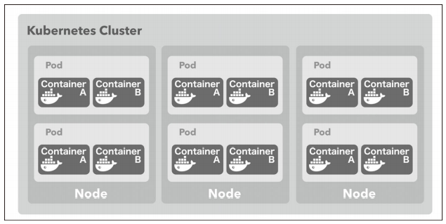

[Docker/Kubernetes 実践コンテナ開発入門：書籍案内｜技術評論社](https://gihyo.jp/book/2018/978-4-297-10033-9)

今日はk8sのリソース（アプリケーションのデプロイ構成するための部品）のPod（ポッド）について学んでいきたいと思います。

## 5.6 Pod
* Podはコンテナの集合体の単位。少なくとも1つのコンテナを持つ
* k8sとDockerを組み合わせる場合Podが持つのはDockerコンテナ単体あるはDockerコンテナの集合体 → DockerでいうServiceの単位に近い??
* k8sではPodの単位でデプロイする → **デプロイする単位ということなので、Dockerでいうスタックという単位のほうが近いかも**

* Podの配置
  * Nodeのどれかに配置される。
  * 同じPodを複数のNodeに配置する、1つのNodeに複数配置も可能
  * 1つのPod内のコンテナが複数Nodeに渡って配置することはできない

* Podの粒度
  * リバースプロキシとしてのNginxと、その背後のアプリケーションで1つのPodにまとめるのはポピュラー
  * 同時にデプロイしないと整合性を保てないケースは、同一のPodにまとめる
  * k8sのMaster Node
    * Docker Swarmでいうmanagerノードの役割
    * Master Nodeは管理用のコンポーネントのPodだけがデプロイされたNode

* => **クラスタがあり、その中にMaster Nodeが最低1つとそれ以外のNodeで構成される。そして、そのNode群の各Nodeの中にPodが配置されるイメージ**

* 下のイメージの中にMaster Nodeがあるかんじ。



### 5.6.1 Podを作成してデプロイする
* Podの作成
  * kubectlだけで行うことも可能
  * バージョン管理の観点からyamlファイルとして定義することがほとんど

* マニフェストファイル
  * k8sの各種リソースを定義するファイル

* simple-pod.yaml
  * nginxとechoで構成されるPodを定義したマニフェストファイル

```
apiVersion: v1
kind: Pod
metadata:
  name: simple-echo
spec:
  containers:
  - name: nginx
    image: gihyodocker/nginx-proxy:latest
    env:
    - name: BACKEND_HOST
      value: localhost:8080
    ports:
    - containerPort: 80
  - name: echo
    image: gihyodocker/echo:latest
    ports:
    - containerPort: 8080
```

* マニフェストファイル
  * kind
    * k8sのリソースの種類を指定
    * kindの値次第でspec配下のスキーマが変わってくる
  * metadata
    * リソースに付与するメタデータ
    * metadata.name属性で指定した値がリソースの名称
  * spec
    * リソースを定義するための属性
    * Podの場合はPodを構成するコンテナ群をcontainersとして定義

* containers以下
  * name
    * コンテナ名
  * image
    * Docker Hubのイメージ保存先。ローカルでビルドしたイメージも指定可能
  * ports
    * コンテナがEXPOSEするポートを指定 ※Dockerfileで指定している場合は不要
  * env
    * 環境変数を指定

* このPodをk8sクラスタに反映
  * apply
    * 新規作成、内容に変更があった場合も反映

```
$ kubectl apply -f simple-pod.yaml
pod/simple-echo created
```

* 動作はするが、このままではPodにアクセスできないらしい

### 5.6.2 Podを操作する

* Podの一覧取得
  * STATUSがRunning => Pod内のすべてのコンテナ実行状態
  * READYの分母はPodに定義されたコンテナ数、分子は実行状態になったコンテナ数
```
$ kubectl get pod
```

* kubectlを使ってコンテナの中に入る
  * -cでコンテナ名を指定
```
$  kubectl exec -it simple-echo sh -c nginx
kubectl exec [POD] [COMMAND] is DEPRECATED and will be removed in a future version. Use kubectl kubectl exec [POD] -- [COMMAND] instead.
/ #
```

* Pod内コンテナの標準出力を表示
```
$ kubectl logs -f simple-echo -c echo
2020/11/06 17:03:12 start server
```

* Podの削除
```
$ kubectl delete pod simple-echo
pod "simple-echo" deleted
```

* マニフェストファイルベースでPod削除
  * マニフェストファイルに記述されている全てのリソースが削除される
```
$ kubectl delete -f simple-pod.yaml
```

### コラム PodとPod内コンテナのアドレス
* Podごとに固有の仮想IPアドレスが割り振られる
* 同一Pod内の全てのコンテナの仮想IPアドレスは同じ
* 同一Pod内であればlocalhost:80などでアクセスできる。
* 別のPodであれば、172.17.0.4:80のようにPodの仮想IP:ポート名でアクセスできる。

## 今日の学び
* マニフェストファイルはdocker-compose.ymlと書き方が似ているが、若干違うので慣れが必要そう。
* PodはDocker SwarmでいうStack。同じネットワーク内であればコンテナ間通信ができる。別のネットワークでも仮想IPを指定すれば通信可能。
