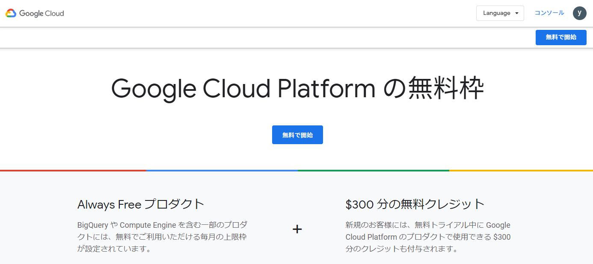
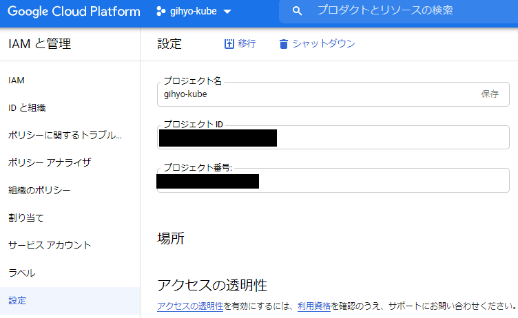

[Docker/Kubernetes 実践コンテナ開発入門：書籍案内｜技術評論社](https://gihyo.jp/book/2018/978-4-297-10033-9)

IngressはServiceよりも高機能なリソースでHTTP/HTTPSのようにパスベースで転送先のServiceを切り替えるといった制御ができるリソースでした。

次の章からは実践的なk8sでのアプリケーション構築やオンプレミスでのk8sクラスタの構築をやっていくようです。

* オンプレミス
  * 自社内の物理サーバーで管理

## 6.Kubernetesのデプロイ・クラスタ構築
* Google Kubernetes Engineでのクラウド構築
* Kubersprayによるオンプレミス構築

### 6.1 Google Kubernetes Engineのセットアップ
* クラウドのデプロイにGKEを利用
* デプロイ方法やリソースの扱い方を学ぶ

* GKEの無料トライアル登録画面



#### 6.1.1 GCPプロジェクトの作成
* 初回は「My First Project」というプロジェクトが作られている。
* プロジェクト名を「gihyo-kube」に変更する



#### 6.1.2 Google Cloud SDK（gcloud）のセットアップ
* Google Cloud SDK ※以降、gcloud
  * GCPのサービスをコマンドラインから操作するためのツール

* gcloudのインストール
  * [Google Cloud SDK のインストール  \|  Cloud SDK のドキュメント](https://cloud.google.com/sdk/docs/install?hl=ja)

* gcloudのコマンド操作はPowerShellで行います
* gcloudのバージョン確認
```
$ gcloud version
Google Cloud SDK 317.0.0
bq 2.0.62
core 2020.10.30
gsutil 4.54
```

* コンポーネントのバージョンアップを行う
```
$ gcloud components update

To help improve the quality of this product, we collect anonymized
usage data
and anonymized stacktraces when crashes are encountered; additional
information
is available at <https://cloud.google.com/sdk/usage-statistics>. This
data is
handled in accordance with our privacy policy
<https://policies.google.com/privacy>. You may choose to opt in this
collection now (by choosing 'Y' at the below prompt), or at any time
in the
future by running the following command:

    gcloud config set disable_usage_reporting false


Do you want to opt-in (y/N)?  y


All components are up to date.
```

* gcloudの認証を行う
```
$ gcloud auth login
```

* gcloud認証画面


* gcloudで対象のプロジェクトIDを設定
```
$ gcloud config set project xxxxxx
Updated property [core/project].
```

* デフォルトリージョンを指定
  * asia-northeast1-aは東京リージョン
```
$ gcloud config set compute/zone asia-northeast1-a
Updated property [compute/zone].
```

#### 6.1.3 Kubernetesクラスタの作成

* クラスタの作成
  * --cluster-version
    * クラスタのバージョン
  * --num-nodes
    * ノードとなるインスタンスの数

```
$ gcloud container clusters create gihyo --cluster-version=1.10.4-gke.2 --machine-type=n1-standard-1 --num-nodes=3
WARNING: Warning: basic authentication is deprecated, and will be removed in GKE control plane versions 1.19 and newer. For a list of recommended authentication methods, see: https://cloud.google.com/kubernetes-engine/docs/how-to/api-server-authentication
WARNING: Currently VPC-native is not the default mode during cluster creation. In the future, this will become the default mode and can be disabled using `--no-enable-ip-alias` flag. Use `--[no-]enable-ip-alias` flag to suppress this warning.
WARNING: Newly created clusters and node-pools will have node auto-upgrade enabled by default. This can be disabled using the `--no-enable-autoupgrade` flag.
WARNING: Starting with version 1.18, clusters will have shielded GKE nodes by default.
WARNING: Your Pod address range (`--cluster-ipv4-cidr`) can accommodate at most 1008 node(s).
ERROR: (gcloud.container.clusters.create) ResponseError: code=400, message=Failed precondition when calling the ServiceConsumerManager: tenantmanager::185014: Consumer 813247996088 should enable service:container.googleapis.com before generating a service account.
```

* テキストが古くなって動かない
  * テキストの正誤表の情報をもとにやってみる。
    * [サポートページ：Docker/Kubernetes 実践コンテナ開発入門：｜技術評論社](https://gihyo.jp/book/2018/978-4-297-10033-9/support)

```
$ gcloud container clusters create gihyo --cluster-version=1.15.7-gke.2 --machine-type=n1-standard-1 --num-nodes=3
WARNING: Warning: basic authentication is deprecated, and will be removed in GKE control plane versions 1.19 and newer. For a list of recommended authentication methods, see: https://cloud.google.com/kubernetes-engine/docs/how-to/api-server-authentication
WARNING: Currently VPC-native is not the default mode during cluster creation. In the future, this will become the default mode and can be disabled using `--no-enable-ip-alias` flag. Use `--[no-]enable-ip-alias` flag to suppress this warning.
WARNING: Newly created clusters and node-pools will have node auto-upgrade enabled by default. This can be disabled using the `--no-enable-autoupgrade` flag.
WARNING: Starting with version 1.18, clusters will have shielded GKE nodes by default.
WARNING: Your Pod address range (`--cluster-ipv4-cidr`) can accommodate at most 1008 node(s).
ERROR: (gcloud.container.clusters.create) ResponseError: code=400, message=Master version "1.15.7-gke.2" is unsupported.
```

* これも古かったらしい…
* 公式を見ると利用できないバージョンに載っていた
  * [Release notes  \|  Kubernetes Engine ドキュメント  \|  Google Cloud](https://cloud.google.com/kubernetes-engine/docs/release-notes)

* リリースノートで最新の安定版でやることにしました。


```
$ gcloud container clusters create gihyo --cluster-version=1.16.13-gke.401 --machine-type=n1-standard-1 --num-nodes=3
WARNING: Warning: basic authentication is deprecated, and will be removed in GKE control plane versions 1.19 and newer. For a list of recommended authentication methods, see: https://cloud.google.com/kubernetes-engine/docs/how-to/api-server-authentication
WARNING: Currently VPC-native is not the default mode during cluster creation. In the future, this will become the default mode and can be disabled using `--no-enable-ip-alias` flag. Use `--[no-]enable-ip-alias` flag to suppress this warning.
WARNING: Newly created clusters and node-pools will have node auto-upgrade enabled by default. This can be disabled using the `--no-enable-autoupgrade` flag.
WARNING: Starting with version 1.18, clusters will have shielded GKE nodes by default.
WARNING: Your Pod address range (`--cluster-ipv4-cidr`) can accommodate at most 1008 node(s).
Creating cluster gihyo in asia-northeast1-a... Cluster is being health-checked (master is healthy)...done.
Created [https://container.googleapis.com/v1/projects/marine-proposal-295213/zones/asia-northeast1-a/clusters/gihyo].
To inspect the contents of your cluster, go to: https://console.cloud.google.com/kubernetes/workload_/gcloud/asia-northeast1-a/gihyo?project=marine-proposal-295213
kubeconfig entry generated for gihyo.
NAME   LOCATION           MASTER_VERSION   MASTER_IP     MACHINE_TYPE   NODE_VERSION     NUM_NODES  STATUS
gihyo  asia-northeast1-a  1.16.13-gke.401  35.221.107.8  n1-standard-1  1.16.13-gke.401  3          RUNNING
```

* GCPでクラスタ確認


* gcloud経由でkubectlに認証情報を設定。
```
$ gcloud container clusters get-credentials gihyo
Fetching cluster endpoint and auth data.
kubeconfig entry generated for gihyo.
```

* kubectlでクラスタのノード一覧を取得
  * GKEのノードが表示される
```
$ kubectl get nodes
NAME                                   STATUS   ROLES    AGE     VERSION
gke-gihyo-default-pool-17a578e7-bk9s   Ready    <none>   4m31s   v1.16.13-gke.401
gke-gihyo-default-pool-17a578e7-jvkh   Ready    <none>   4m41s   v1.16.13-gke.401
gke-gihyo-default-pool-17a578e7-qkpj   Ready    <none>   4m41s   v1.16.13-gke.401
```

* 作成したクラスタのダッシュボードk8s APIへのプロキシを起動
```
$ kubectl proxy
Starting to serve on 127.0.0.1:8001
```

* http://127.0.0.1:8001/ui にアクセス

#### コラム kubectx
* kubectx
  * コンテキストのスイッチに便利
* kubens
  * デフォルトのNamespaceを簡単に設定できる

## 今日の学び
* クラスタ作成時のクラスタのバージョンはリリースノートを確認して現在も使えるか確認する。
* gcloudでのクラスタ作成やGCPの画面でのクラスタの確認などを行った。
