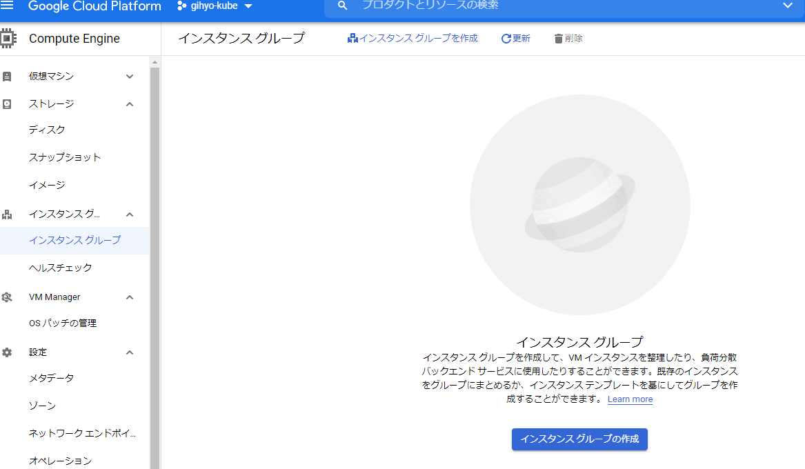

[Docker/Kubernetes 実践コンテナ開発入門：書籍案内｜技術評論社](https://gihyo.jp/book/2018/978-4-297-10033-9)

前回はついにIngressを通じてWEBアプリケーションを公開することができました。

ですがひとつ分かったこととしてクラスタを起動しっぱなしでいると少額ですが1日数百円ずつトライアルクレジットから費用が差し引かれていることに気づきました。

今回は番外編としてクラスタを停止する方法について調査しようと思います。

## GCPのKubernetes Engineのクラスタを停止する方法

まずは管理画面のお支払い > レポートで発生している費用を確認します。

このとき、デフォルトでプロモーションの箇所にチェックがついている方はチェックを外しましょう！

すると、すでに約2,500円ほど費用がかかっていることがわかります。

ただ、クラスタを起動しているだけなのにこんなにかかるのですね…

このままだと知らないうちに無料トライアルクレジットを食いつぶしてしまいます。

調べてみましたが、停止するみたいな方法がうまく見つからなかったので簡単な方法としてクラスタを削除する方法で行いました。

* クラスタの削除

* クラスタ削除中にVMインスタンスを見てみると、インスタンスが停止されている。

* クラスタが削除されるまで5分～10分くらいかかりました。
* 削除されたのか見ていきます。

* インスタンスグループは削除されました。

* VMインスタンスも削除されました。

* 最後にクラスタも正常に削除されていることも確認できました。

ひとまずこれで数日様子を見てみようと思います。
