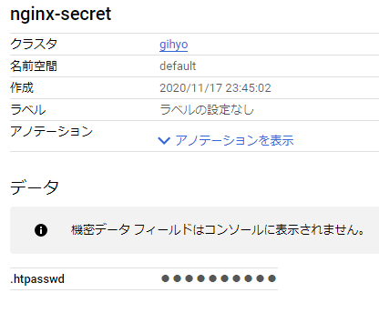

[Docker/Kubernetes 実践コンテナ開発入門：書籍案内｜技術評論社](https://gihyo.jp/book/2018/978-4-297-10033-9)

前回は、オンプレミス環境でのk8sクラスタ構築について読み進めました。

今回はk8sの応用についてやっていきます。

## 7.Kubernetesの発展的な利用

### 7.1 Kubernetesの様々なリソース
* 常駐型のサーバアプリケーション構築する上で基本となるリソース
  * Pod、ReplicaSet、Deployment、Service、Ingress
* 上記以外にもジョブサーバなど多様な使い道がある

#### 7.1.1 Job
* 一つ以上のPodを作成し、指定された数のPodが正常に完了するまでを管理するリソース
* Jobによる全てのPodが正常に終了してもPodは削除されずに保持される => Dockerのコンテナと似ている
* バッチ処理に向いている

* simple-job.yaml
```
apiVersion: batch/v1
kind: Job # Jobリソース
metadata:
  name: pingpong # リソース名
  labels:
    app: pingpong # リソースのラベル
spec:
  parallelism: 3 # 同時に実行されるPod数
  template:
    metadata:
      labels:
        app: pingpong
    spec:
      containers:
      - name: pingpong
        image: gihyodocker/alpine:bash # Alpine Linuxにbashをインストールしたイメージ
        command: ["/bin/sh"]
        args:
          - "-c"
          - |
            echo [`date`] ping!
            sleep 10
            echo [`date`] pong!
      restartPolicy: Never # Pod終了時の再実行の設定。失敗時にPodを再作成して実行する
```

* Jobをデプロイするとエラー
```
$ kubectl apply -f simple-job.yaml
Unable to connect to the server: dial tcp 35.221.107.8:443: connectex: A connection attempt failed because the connected party did not properly respond after a period of time, or established connection failed because connected host has failed to respond.
```

* 先日クラスタ削除したためのエラーだと思われる。

* クラスタを作り直す(PowerShellで実行)
```
$ gcloud container clusters create gihyo --cluster-version=1.16.13-gke.401 --machine-type=n1-standard-1 --num-nodes=3
WARNING: Warning: basic authentication is deprecated, and will be removed in GKE control plane versions 1.19 and newer. For a list of recommended authentication methods, see: https://cloud.google.com/kubernetes-engine/docs/how-to/api-server-authentication
WARNING: Currently VPC-native is not the default mode during cluster creation. In the future, this will become the default mode and can be disabled using `--no-enable-ip-alias` flag. Use `--[no-]enable-ip-alias` flag to suppress this warning.
WARNING: Newly created clusters and node-pools will have node auto-upgrade enabled by default. This can be disabled using the `--no-enable-autoupgrade` flag.
WARNING: Starting with version 1.18, clusters will have shielded GKE nodes by default.
WARNING: Your Pod address range (`--cluster-ipv4-cidr`) can accommodate at most 1008 node(s).
Creating cluster gihyo in asia-northeast1-a... Cluster is being health-checked (master is healthy)...done.
Created [https://container.googleapis.com/v1/projects/marine-proposal-295213/zones/asia-northeast1-a/clusters/gihyo].
To inspect the contents of your cluster, go to: https://console.cloud.google.com/kubernetes/workload_/gcloud/asia-northeast1-a/gihyo?project=marine-proposal-295213
kubeconfig entry generated for gihyo.
NAME   LOCATION           MASTER_VERSION   MASTER_IP        MACHINE_TYPE   NODE_VERSION     NUM_NODES  STATUS
gihyo  asia-northeast1-a  1.16.13-gke.401  104.xxx.xxx.xxx  n1-standard-1  1.16.13-gke.401  3          RUNNING


Updates are available for some Cloud SDK components.  To install them,
please run:
  $ gcloud components update
```

* コンポーネントアップデート
```
$ gcloud components update
```

* 再度デプロイ
```
$ kubectl apply -f simple-job.yaml
job.batch/pingpong created
```

* ログを確認
* ping!を表示し10秒sleepした後に「ping!」を表示し終了する
```
$ kubectl logs -l app=pingpong
[Tue Nov 17 13:58:37 UTC 2020] ping!
[Tue Nov 17 13:58:47 UTC 2020] pong!
[Tue Nov 17 13:58:35 UTC 2020] ping!
[Tue Nov 17 13:58:45 UTC 2020] pong!
[Tue Nov 17 13:58:35 UTC 2020] ping!
[Tue Nov 17 13:58:45 UTC 2020] pong!
```

* 終了したPodはCompletedとして表示される
```
$ kubectl get pod -l app=pingpong
NAME             READY   STATUS      RESTARTS   AGE
pingpong-hcd7j   0/1     Completed   0          8m1s
pingpong-tzc8v   0/1     Completed   0          8m1s
pingpong-vd9j9   0/1     Completed   0          8m1s
```

#### 7.1.2 CronJob
* Jobは一度きりのPodの実行
* 対してCronJobはスケジューリングして定期的にPodを実行

* simple-cronjob.yaml
```
apiVersion: batch/v1beta1
kind: CronJob
metadata:
  name: pingpong
spec:
  schedule: "*/1 * * * *" # Cron記法でPodの起動スケジュールを定義できる
  jobTemplate:
    spec:
      template:
        metadata:
          labels:
            app: pingpong
        spec:
          containers:
          - name: pingpong
            image: gihyodocker/alpine:bash
            command: ["/bin/sh"]
            args:
              - "-c"
              - |
                echo [`date`] ping!
                sleep 10
                echo [`date`] pong!
          restartPolicy: OnFailure
```

* CronJobをデプロイ
```
$ kubectl apply -f simple-cronjob.yaml
cronjob.batch/pingpong created
```

* jobの確認
```
$ kubectl get job -l app=pingpong
NAME                  COMPLETIONS   DURATION   AGE
pingpong              3/1 of 3      18s        14m
pingpong-1605622260   1/1           11s        87s
pingpong-1605622320   1/1           12s        27s
```

* ログの確認
```
$ kubectl logs -l app=pingpong
[Tue Nov 17 14:11:04 UTC 2020] ping!
[Tue Nov 17 14:11:14 UTC 2020] pong!
[Tue Nov 17 14:12:04 UTC 2020] ping!
[Tue Nov 17 14:12:14 UTC 2020] pong!
[Tue Nov 17 14:13:04 UTC 2020] ping!
[Tue Nov 17 14:13:14 UTC 2020] pong!
[Tue Nov 17 13:58:37 UTC 2020] ping!
[Tue Nov 17 13:58:47 UTC 2020] pong!
[Tue Nov 17 13:58:35 UTC 2020] ping!
[Tue Nov 17 13:58:45 UTC 2020] pong!
[Tue Nov 17 13:58:35 UTC 2020] ping!
[Tue Nov 17 13:58:45 UTC 2020] pong!
```

* 従来の非コンテナ環境ではLinuxのcrontabにスケジュールと実行するスクリプトを定義する手法が中心だった。
* k8sのCronJobを利用すれば全てをコンテナベースで解決できる

#### 7.1.3 Secret
* Secretリソースを定義すると、機密情報の文字列をBase64文字列に変換
* 例として、NginxのBasic認証の認証情報を記述したファイルをSecretで管理
* opensslを利用してユーザー名とパスワードを暗号化し、その結果をBase64文字列に変換
```
$ echo "your_username:$(openssl passwd -quiet -crypt your_password)" | base64
eW91cl91c2VybmFtZTpPOWhncjF3UXZIY1ZFCg==
```

* nginx-secret.yaml
```
apiVersion: v1
kind: Secret
metadata:
  name: nginx-secret
type: Opaque
data:
  .htpasswd: eW91cl91c2VybmFtZTpyejc5SXpTalplaWZvCg== # .htpasswdというファイルを生成し、内容にはBase64化された文字列を指定
```

* Secretをデプロイ
```
$ kubectl apply -f nginx-secret.yaml
secret/nginx-secret created
```

* ダッシュボードでSecret確認



* basic-auth.yaml
```
apiVersion: v1
kind: Service
metadata:
  name: basic-auth
spec:
  type: NodePort
  selector:
    app: basic-auth
  ports:
  - protocol: TCP
    port: 80
    targetPort: http
    nodePort: 30060

---
apiVersion: apps/v1
kind: Deployment
metadata:
  name: basic-auth
  labels:
    app: basic-auth
spec:
  replicas: 1
  selector:
    matchLabels:
      app: basic-auth
  template:
    metadata:
      labels:
        app: basic-auth
    spec:
      containers:
      - name: nginx
        image: "gihyodocker/nginx:latest"
        imagePullPolicy: Always
        ports:
          - name: http
            containerPort: 80
        env:
          - name: BACKEND_HOST
            value: "localhost:8080"
          - name: BASIC_AUTH_FILE
            value: "/etc/nginx/secret/.htpasswd" # nginx-secretで.htpasswdとして設定したBase64文字列は復号される
        volumeMounts:
          - mountPath: /etc/nginx/secret
            name: nginx-secret
            readOnly: true
      - name: echo
        image: "gihyodocker/echo:latest"
        imagePullPolicy: Always
        ports:
          - containerPort: 8080
        env:
          - name: HTTP_PORT
            value: "8080"
      volumes: # すでに作成しているSecretであるnginx-secretをボリュームとしてマウント
      - name: nginx-secret
        secret:
          secretName: nginx-secret
```

* Deploymentをデプロイ
```
$ kubectl apply -f basic-auth.yaml
service/basic-auth unchanged
deployment.apps/basic-auth created
```

* 認証されるかHTTPリクエスト送信するとエラー
```
$ curl http://127.0.0.1:30060
curl: (7) Failed to connect to 127.0.0.1 port 30060: Connection refused
```

* コンテナ作成中になっている。。時間がかかるのだろうか。
```
$ kubectl get pod
NAME                          READY   STATUS              RESTARTS   AGE
basic-auth-67667776f9-zj47j   0/2     ContainerCreating   0          5m22s
```

[kubernetes で ContainerCreating \(FailedMount\) で Pod が起動しない時 \| ytyng\.com](https://www.ytyng.com/blog/kubernetes-ContainerCreating-FailedMount/)

* 以下のような警告が出ている。
* マウントできずにタイムアウトしてしまったようだ。
* basic-auth.yamlのボリュームのtがコピペミスでなくなっていた。。修正したところちゃんと起動した。
```
$ kubectl describe pods
47j to gke-gihyo-default-pool-477390af-djj8
  Warning  FailedMount  2m38s (x2 over 4m56s)  kubelet, gke-gihyo-default-pool-477390af-djj8  Unable to attach or mount volumes: unmounted volumes=[nginx-secret], unattached volumes=[default-token-wxrm6 nginx-secret]: timed out waiting for the condition
  Warning  FailedMount  62s (x12 over 9m16s)   kubelet, gke-gihyo-default-pool-477390af-djj8  MountVolume.SetUp failed for volume "nginx-secret" : secret "nginx-secre" not found
  Warning  FailedMount  24s (x2 over 7m13s)    kubelet, gke-gihyo-default-pool-477390af-djj8  Unable to attach or mount volumes: unmounted volumes=[nginx-secret], unattached volumes=[nginx-secret default-token-wxrm6]: timed out waiting for the condition
```

* 再度curlすると認証されるはずだが、やっぱりエラーのまま…なぜ・・・！？

#### コラム 認証情報をセキュアに環境変数へ設定する
* valueFrom.secretKeyRefを利用してSecretのdataを渡すことができる。

## 今日の学び
* ハンズオン時にはログを残しておくとあとで役にたつ。
* 単発のバッチ処理にはJob、スケジューリングしたバッチ処理にはCronJobが便利。
* セキュリティ対策としてSecretを使える。
