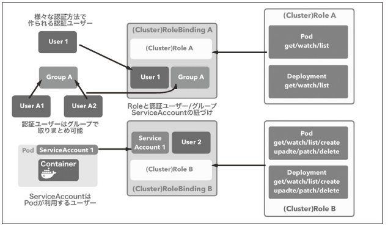

[Docker/Kubernetes 実践コンテナ開発入門：書籍案内｜技術評論社](https://gihyo.jp/book/2018/978-4-297-10033-9)

前回は、バッチ処理に便利なJob、スケジューリングしたタスクの実行に便利なcronJob、暗号化してセキュリティを高めるSecretについてやりました。

今回は、ユーザー管理周りについてやっていきます。

## 7.2 ユーザー管理とRole-Based Access Control （RBAC）
* k8sにおけるユーザー ※UNIXユーザーとは別物
  * 認証ユーザー
    * クラスタ外からk8sを操作するためのユーザー
    * 認証ユーザーはグループで取りまとめ可能
  * ServiceAccount
    * Podが利用するユーザー
    * ServiceAccountはk8sのリソース
    * ServiceAccountと紐づけられたPodは与えられた範囲内でリソースの操作が可能
* Role-Based Access Control ※以降、RBAC
  * k8sのリソースへのアクセスをロールによって制御

### 7.2.1 RBACを利用して権限制御を実現する
* RBACの権限制御
  * 以下の2つの要素で成立する
    * k8s APIのどの操作が可能であるかを定義したロール(図のRole A、Role B)
    * 認証ユーザー・グループ・ServiceAccountとロールの紐づけ(図のRoleBinding A、RoleBinding A)

* RBACを利用した権限制御の例



* RBACでの権限制御のために提供されているリソース
  * Role
    * k8s APIへの操作許可のルール定義。指定のnamespace内でのみ有効
  * RoleBinding
    * 認証ユーザー・グループ・ServiceAccountとRoleの紐づけを定義(ざっくりいうと、ユーザーと権限を紐づけ)
  * ClusterRole
    * k8s APIへの操作許可のルール定義。クラスタ全体で有効
  * ClusterRoleBinding
    * 認証ユーザー・グループ・ServiceAccountとClusterRoleの紐づけを定義

ここからはローカルで確認できないため、メモのみ。

#### ロール・紐づけリソースの作成
* ClusterRoleの作成
  * Pod情報を参照するための権限をロールを定義
```
kind: ClusterRole
apiVersion: rbac.authorization.k8s.io/v1
metadata:
  name: pod-reader
rules:
- apiGroups: [""] # リソースが含まれているAPIグループの名前をリスト指定
  resources: ["pods"] # ルールを適用するリソースをリスト指定
  verbs: ["get", "watch", "list"] # 指定したリソースに対する操作をリスト指定
```

* ClusterRoleと認証ユーザーを紐づけるためのClusterRoleBindingを作成
  * ユーザー（gihyo-user）とロール（pod-reader）を紐づけ
```
kind: ClusterRoleBinding
apiVersion: rbac.authorization.k8s.io/v1
metadata:
  name: pod-read-binding
subjects: # ユーザーやグループ、ServiceAccountを指定
- kind: ServiceAccount
  name: gihyo-user
  namespace: default
roleRef: # ユーザーやグループに紐づけるClusterRole名を指定
  kind: ClusterRole
  name: pod-reader
  apiGroup: rbac.authorization.k8s.io
```

#### 認証ユーザー・グループの作成
* ロールのリソース、紐づけるためのリソースは用意したがユーザーがまだ。
* 認証ユーザーの認証方法
  * Service Accountトークン方式 ← ★今回はこれで認証
  * 静的トークンファイル方式
  * パスワードファイル方式
  * X509でのクライアント証明書方式
  * OpenID Connect方式

* gihyo-userというServiceAccountを追加
```
$ kubectl create serviceaccount gihyo-user
```

* gihyo-userの詳細を確認(yaml形式で表示)
  * ServiceAccountを作成すると認証情報となるSecretも同時に作成される
```
$ kubectl get serviceaccount gihyo-user -o yaml
```

* Secretから認証トークンを取り出す
  * data.token部分
```
$ kubectl get secret gihyo-user-token-dwwmp -o yaml
```

* Base64でエンコードされているためデコードする
```
$ echo 'ZXlKaGJHY2lPaUpTV......' | base64 -D
```

#### 作成した認証ユーザーを利用する
* 必要な認証情報はMasterノードの~/.kube/configに設定されている
* 次のように参照できる
```
$ kubectl config view
apiVersion: v1
clusters:
- cluster:
    insecure-skip-tls-verify: true
    server: https://localhost:6443
  name: docker-for-desktop-cluster
contexts:
- context:
    cluster: docker-for-desktop-cluster # docker-for-desktop-clusterというクラスタを操作している
    user: docker-for-desktop # docker-for-desktopというユーザーを利用して
  name: docker-for-desktop
current-context: docker-for-desktop # 現在のコンテキスト。コンテキストは「どの認証ユーザーでどのk8sクラスタのAPIを操作するかを決める情報」
kind: Config
preferences: {}
users:
- name: docker-for-desktop
  user:
    client-certificate-data: REDACTED
    client-key-data: REDACTED
```

* トークンをセット
```
$ kubectl config set-credentials gihyo-user --token=eyJhbGciOiJSUzI1NiIsImtpZCI......
```

* contextを設定
  * gihyo-userがgihyo-k8sクラスタを操作するための情報を設定
```
$ kubectl config set-context gihyo-k8s-gihyo-user --cluster=gihyo-k8s --user=gihyo-user
```

* set-contextではcontextは切り替わらないため、use-contextでcontextを切り替え
```
$ kubectl config use-context gihyo-k8s-gihyo-user
```

* これでkubectlのk8s APIの操作はgihyo-userで行われる。
```
$ kubectl get pod --all-namespaces
```

* このユーザーでPodの一覧を取得
```
$ kubectl get pod --all-namespaces
```

* このユーザーはPod閲覧以外の権限をもたないため、他のリソースを参照できない ← ClusterRoleで指定しているのか！

* 実行ユーザーを戻す
```
$ kubectl config use-context docker-for-desktop
```

## 今日の学び
* 思った以上にボリュームがあったのでServiceAccountは明日に回す…
* 実際に手を動かせていないので理解度はいまいち…
