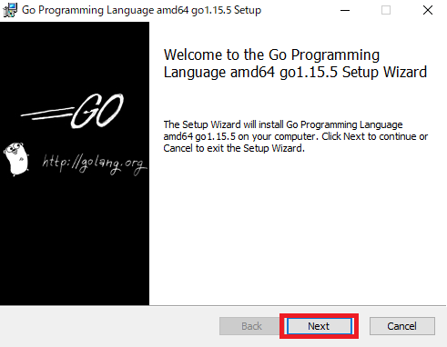
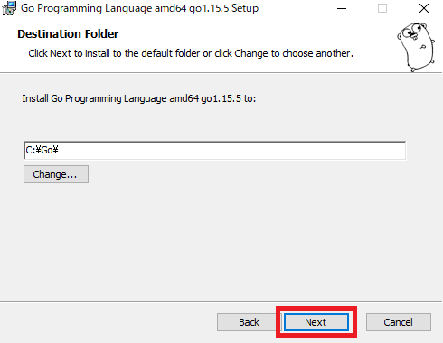
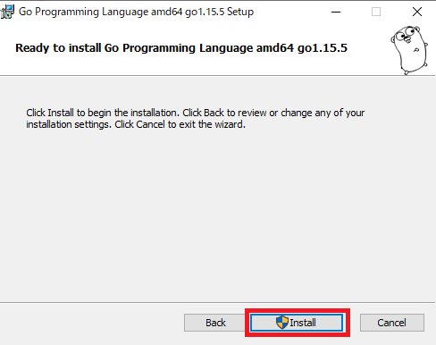

[Goならわかるシステムプログラミング – 技術書出版と販売のラムダノート](https://www.lambdanote.com/collections/go/products/go)

を少しずつ読もうと思ったけど、インターフェース？構造体？となったので最低限Go言語を読めることを目指して「たった1日で基本が身に付く！ Go言語 超入門」を買いました。

[たった1日で基本が身に付く！ Go言語 超入門：書籍案内｜技術評論社](https://gihyo.jp/book/2020/978-4-297-11617-0)

2020年10月発売されたばかりで情報もまだ最新のはずなので入門するにはうってつけのタイミングですね。

ページ数も約220P程度なのでボリュームもちょうどよさそうですね。

せっかくなので、手を動かしつつ作業ログのような形で記録を残していきたいと思います。

## CHAPTER 1　Let's go !　Go言語
### コンパイラ、実行環境
* コンパイラを用いるプログラミング
  * プログラム → コンパイラで変換 → 実行プログラム作成 を事前に行い実行プログラムを用意しておく
* 実行環境を用いるプログラミング
  * プログラム → コンパイラで変換 → 実行プログラム作成 をその都度読み込んで実行プログラムを用意する

### 主なプログラミング言語
* C/C++
  * コンパイラを用いる
* Java
  * 実行環境をインストールした上でコンパイラで中間言語に変換
* C#
  * コンパイラが必要
* Python
  * 実行環境を用いる
* JavaScript
  * Webブラウザに実行環境が実装されている

### Go言語の特徴
* **Go言語はコンパイラで実行プログラムを事前に作成して用意しておく**
* 2009年に登場。2012年にバージョン1をリリース
* Googleを中心に開発
* 比較的後発であり、色んな言語の良いところを取り入れて古典的な処理から先進的な機能まで幅広い機能が用意されている

* Go公式HPにはGoを実行できる環境が用意されている
  * [The Go Programming Language](https://golang.org/)
    * Try Go の Open in Playground

### Go言語のダウンロードまわり・準備
* [Downloads \- The Go Programming Language](https://golang.org/dl/)

1. ダウンロードページを開く(Download Goをクリック)


2. Windows版をダウンロード


3. インストールウェイザードに沿って進める









4. VS CodeにGo言語の拡張機能をインストール


### mainの意味
* パッケージ名
```
package main
```
* パッケージ
  * 実行ファイルと区別するため、補助ファイルは別のフォルダに分ける。これをパッケージ
  * 一般的にパッケージ名はフォルダ名
* パッケージとして管理する場合
  * 実行内容が書かれたファイル(実行ファイル)を全てのパッケージフォルダの外に1つ配置
  * そして**実行ファイルのパッケージ名は「main」にするのが決まり**

* もう1つmainが使われている
```
func main()
```

* funcは関数を示す
* **Goには関数が必ず1つ必要。実行の中心となる関数には「main」という名前をつける決まり**

↓

**「ファイルが1つしかない場合はパッケージ名をmainにする。またその中に1つしか関数がない場合は、関数名をmainにする」**

### importの意味
```
import "fmt"
```
* fmtパッケージを読み込んでいる

```
fmt.Println("Go言語でLet's go!")
```
* fmtパッケージにあるPrintln関数を用いて()内の内容を出力

### 変数
```
var a int
```
* 変数aを宣言
  * データ型はint

### 文の区切り
* 改行記号を使用

## CHAPTER 2　よく使うデータ型
### データ型のメリット
* 無駄な処理を行わないで済む
* そのデータ型にのみ使変える関数を正しく把握できる
* 不正アクセスを防げる

### データ型を自動判別する代入記法
```
var a int
a = 5
```
は
```
a := 5
```
のように書ける

* `:=`は変数を定義して値を代入するという意味
* 「5」と書いてあるから整数、つまりint型を意味する
  * つまり、**宣言と代入を同時に行いデータ型は値を見て自動判別してくれる**

### 整数intと少数float64
* int
  * そのコンピュータで表せるだけの範囲の整数値を表す
* float64
  * 64ビットの小数値を表す

* float64型の宣言を省略するには、小数点以下に1桁でも数字をつける
  * 32ビットのコンピュータではfloat32型
  * 64ビットのコンピュータではfloat64型
```
a := 5.0
```

### 文字列の基本
* 文字列のデータ型はstring型
* string型の値を作成するには、二重引用符「"」で文字を囲む

### 文字列の結合
* 文字列を結合するには、「+」を使用

### 数値を文字列に埋め込む
* fmtパッケージのPrintf関数
  * 文字列の中に埋め込める
  * 表示形式を指定できる

```
fmt.Printf("%.2f", c)
```
* 第1引数には表示形式を指定
  * `%`
    * 表示形式の指定を開始
  * `.2`
    * 小数点とそのあとの桁数。この例だと小数点第2位まで表示される
  * `f`
    * 小数点とそのあとの桁数であるという指定
* 第2引数には表示したい内容

```
c := 5.0
fmt.Printf("cは%.2fです", c)
=> cは5.00です
```
* Printf関数は第1引数に表示したい内容だけではなく他の文字列も混在できる

```
c := 5.0
fmt.Printf("cは%.2fです", c)
fmt.Println("cは小数点です")
=> cは5.00ですcは小数点です

c := 5.0
fmt.Printf("cは%.2fです\n", c)
fmt.Println("cは小数点です")
=> cは5.00です
cは小数点です
```
* Printf関数は改行されない。改行したい場合は改行文字を含めることで改行できる

### 整数を要素とする配列
* **Go言語では、1つの配列で保持することのできる要素のデータ型は同一でなければならない**
* 配列の要素は0番目から始まる

```
intvals := [5]int{98, 125, 232, 147, 486}
```
* [5]
  * 配列は、要素の数を決めて作成
* {98, 125, 232, 147, 486}
  * 要素の数を示した後に、波括弧で囲んで要素を列記
  * 要素はカンマで区切る

```
fmt.Printf("1番目の要素は%d\n", intvals[1])
```
* %d
  * 整数を表す

### 配列とスライス
* 配列を使う場合は要素の数を先に決めておくのはデータ型の宣言と同じくメモリなどのリソースを無駄にしないように最初から処理すべきものの大きさを決めておくため。
* とはいえ、必要な数よりも多く確保しておく分には問題ない

```
# エラーにならない
intvals := [100]int{1, 2, 3, 4, 5}
# エラーになる
intvals := [3]int{1, 2, 3, 4, 5}
```

* 次のように要素数を決めずに配列を作成することもできる。
* ただし、この書き方は配列そのものではなく、配列の情報を与えるデータ型で **スライス(Slice)** と呼ぶ
```
intvals := []int{1, 2, 3, 4, 5}
```

* 普通に配列として作った場合とスライスとして作った場合でも結果は変わらない
```
intvals_array := [5]int{1, 2, 3, 4, 5}
intvals_slice := []int{6, 7, 8, 9, 10}

fmt.Printf("この配列の要素素は%d\n", len(intvals_array))
fmt.Printf("このスライスが見ている配列の要素素は%d\n", len(intvals_slice))

=> この配列の要素素は5
このスライスが見ている配列の要素素は5
```

* 配列もスライスも要素の扱い方は特に変わらないみたい？？何が違うのか。
  * **スライスは配列の一部分を切り取った形で見る為に用いられる**
    * といっても、本当に切り取ったり、切り取って別の値を作成するわけではない
    * もとの配列を小さな窓から「見た」ときに得られる情報

* 配列からスライスを作成するときは、
  * `配列[最初のインデックス:最後のインデックス+1]`という表記をする
  * 例えば、intarrayの125から147(配列の1番目から3番目)までのスライスを作成するときは、`intarray[1:4]`となる。最後のインデックスを+1しないといけないのはややこしいが…
* 配列の最初の要素のみをスライスする場合は`intarray[0:1]`となるが、`intarray[:1]`のように最初のインデックスを省略可
* 配列の最後の要素のみをスライスする場合は`intarray[4:5]`となるが、`intarray[4:]`のように最後のインデックスを省略可
```
intarray := [5]int{98, 125, 232, 147, 486}
slice13 := intarray[1:4] // [125 232 147]
slice0 := intarray[:1] // [98]
slice4 := intarray[4:] // [486]
```

* 配列からスライスを作成。作成したスライスの値を変更。
  * => 元の配列の値も変わってしまうようだ。
```
intarray := [5]int{98, 125, 232, 147, 486}
slice13 := intarray[1:4] // [125 232 147]
slice13[2] -= 100

fmt.Printf("%d", intarray[3]) // 47
```

* で、最終的に配列とスライスの違いは？となったが調べるとちょっと深そうなので、ここではスルーしよう。

### ブール型
* Printfでフォーマットする場合は`%t`とする
* rubyと特に大きな違いはなさそうなので割愛

## CHAPTER 3　処理の流れを操る制御文
### for文
```
for i := 0; i < len(prices); i++ {
  fmt.Printf("%d円\n", prices[i])
}
```
1. i = 0
2. 式評価 trueの場合は処理を繰り返す
3. iをインクリメント
4. 式評価 falseになったら処理を抜ける

### 文字列の配列(スライス)
```
items := []string{"消しゴム", "ボールペン", "ノート", "付箋紙", "バインダー"}
```

* 第2引数以降は複数フォーマットしたいものを指定できるのか。フォーマットする側では%の順番で対応するのか。
* `%s`で文字列の中に文字列を埋め込める
```
fmt.Printf("%s: %d円\n", items[i], prices[i])
```

### if文
```
if (式) {
  // 処理
} else if (式) {
  // 処理
} else {
  // 処理
}
```

### switch文
```
switch (変数) {
  case (式):
    // 処理
  case (式):
    // 処理
  case (式):
    // 処理
  default:
    // どれにも当てはまらない場合の処理
}
```

* switch先がtrue固定の場合は省略形で書ける
* case (式)のいずれかがtrueになった場合に処理を行う
```
switch {
  case (式):
    // 処理
  case (式):
    // 処理
  case (式):
    // 処理
  default:
    // どれにも当てはまらない場合の処理
}
```

## 今日の学び
* 3章までは基本的な話だったので早く理解できた。Rubyなど他言語をやっている人は早く理解できるはず。
* 配列とスライスについてはこの本だけで明確に理解するには至らないので別でやる必要がありそう。
* for文を使っている例題が多いが、Rubyだとmapとかeachで分かりやすく書けるのでかなり脳みそ使う。少なくとも業務でfor文なんて使わないのでGoでは頻繁に使うのだろうか？と疑問がわいている。
