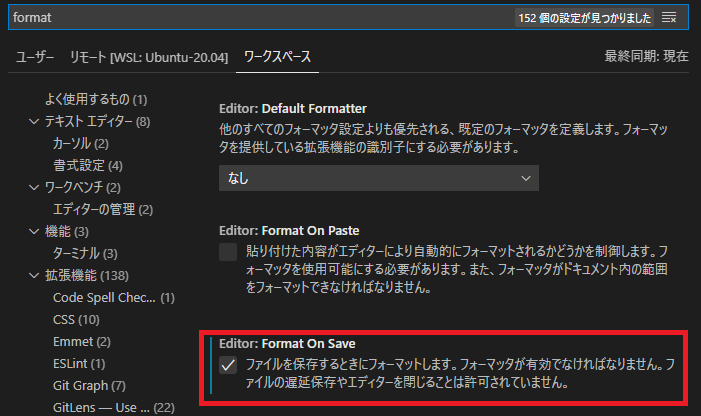

VSCODEの拡張機能[Prettier - Code formatter](https://marketplace.visualstudio.com/items?itemName=esbenp.prettier-vscode)をインストールします。  

今回はワークスペース毎に設定を反映させます。

VSCODEの左下の歯車 > 設定 > ワークスペースタブに移動します。

設定の検索窓から「format」で検索して「Format On Save」にチェックを入れます。



すると、プロジェクトのルート以下に「.vscode/settings.json」というファイルが作成されます。
※直接自分で作成してもOKですが、ファイルのスペルミスで設定が反映されなくて時間を消耗したのでこの方法で設定ファイルを作るのが間違いないです。

settings.jsonは次のようになっていると思います。

```
{
  "editor.formatOnSave": true,
}
```

残りの設定は直接settings.jsonに定義していきます。

```
{
  "editor.formatOnSave": true,
  "[vue]": {
    "editor.defaultFormatter": "esbenp.prettier-vscode"
  },
  "[javascript]": {
    "editor.defaultFormatter": "esbenp.prettier-vscode"
  },
  "[typescript]": {
    "editor.defaultFormatter": "esbenp.prettier-vscode"
  },
}
```

今回はRails + Vue.js + TypeScriptを使ったプロジェクトなので、vue,javascript,typescriptのフォーマッタにprettierを使う設定にしています。

`"editor.formatOnSave": true`にしているので、保存時に自動でフォーマットされ指定された拡張子の場合はフォーマッタにprettierが使われるようになります。
