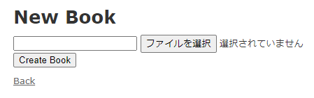
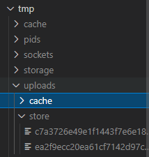

プロジェクトで使っている箇所があったので試しに触ってみようという記事です。  

Rails5 + MySQL + DockerでRails部分が動けばいいので下記を参考に進めました。  

[丁寧すぎるDocker\-composeによるrails5 \+ MySQL on Dockerの環境構築\(Docker for Mac\) \- Qiita](https://qiita.com/azul915/items/5b7063cbc80192343fc0)

## プロジェクトの作成

まずはプロジェクトの作成を行います。  

```
mkdir -p ~/tmp/sample-rails
cd ~/tmp/sample-rails
```

## Dockerfileの作成

```
vi Dockerfile
```

Dockerfileの中身。  

imagemagickはrefile用。
```
FROM ruby:2.6.5

RUN apt-get update -qq && \
    apt-get install -y build-essential \
                       libpq-dev \
                       nodejs \
                       imagemagick

RUN mkdir /app
ENV APP_ROOT /app
WORKDIR $APP_ROOT
COPY ./Gemfile $APP_ROOT/Gemfile
COPY ./Gemfile.lock $APP_ROOT/Gemfile.lock
RUN bundle install
COPY . $APP_ROOT
```

## Gemfileを作成、編集

```
vi Gemfile
```

Gemfileの中身。  
```
source 'https://rubygems.org'
gem 'rails', '5.2.6'
```

## 空のGemfile.lockを作成

```
touch Gemfile.lock
```

## docker-compose.ymlを作成、編集

```
vi docker-compose.yml
```

docker-compose.ymlの中身。  
dbのデータとbundleのデータはvolumesで永続化しています。
```
version: '3'
services:
  db:
    image: mysql:5.7
    volumes: 
      - db_data:/var/lib/mysql # <= dbデータを永続化
    environment:
      MYSQL_ROOT_PASSWORD: password
      MYSQL_DATABASE: root
    ports:
      - "3306:3306"
  web:
    build: .
    command: rails s -p 3000 -b '0.0.0.0'
    stdin_open: true # <= Dockerでpryを止めるのに必要
    tty: true # <= Dockerでpryを止めるのに必要
    volumes:
      - .:/app
      - bundle_data:/usr/local/bundle # <= gemデータを永続化
      - /etc/group:/etc/group:ro
      - /etc/passwd:/etc/passwd:ro
    ports:
      - "3000:3000"
    links:
      - db

volumes:
  db_data:
  bundle_data:
```

## rails newを実行する

```
docker-compose run -u 1000:1000 web rails new . --force --database=mysql --skip-bundle
```

webコンテナ上でrails new ~ が走る。  
docker-compose.ymlでvolumesでコンテナのappフォルダをホストのカレントディレクトリに共有するのでrails newで作られたファイル等がホスト側にできる。  
```
.
├── Dockerfile
├── Gemfile
├── Gemfile.lock
├── README.md
├── Rakefile
├── app
├── bin
├── config
├── config.ru
├── db
├── docker-compose.yml
├── lib
├── log
├── package.json
├── public
├── storage
├── test
├── tmp
└── vendor
```

## docker-compose.ymlとrails newコマンド解説
私の環境はWindows10 + WSL2 + DockerでWSL上でDockerコンテナを動かしています。  

WSL上でDockerコンテナを実行しDockerコンテナで作成されたファイルのパーミッションはWSLからみるとrootになっており、編集ができない。  

そのため、下記を参考にした。  
[dockerでvolumeをマウントしたときのファイルのowner問題 \- Qiita](https://qiita.com/yohm/items/047b2e68d008ebb0f001#%E3%81%86%E3%81%BE%E3%81%8F%E3%81%84%E3%81%8F%E6%96%B9%E6%B3%952--etcpasswd%E3%81%A8etcgroup%E3%82%92%E3%82%B3%E3%83%B3%E3%83%86%E3%83%8A%E3%81%AB%E3%83%9E%E3%82%A6%E3%83%B3%E3%83%88%E3%81%99%E3%82%8B)

記事だとdocker run時にオプションでいろいろ渡している。  
今回はdocker-composeコマンドを使う。  
docker-compose runコマンドには-uオプションはあるが-vオプションはない。  
[run — Docker\-docs\-ja 19\.03 ドキュメント](https://docs.docker.jp/compose/reference/run.html)

そのため、-vオプションの内容はdocker-compose.ymlに記載している。  
/etc/groupと/etc/passwdを読み取り権限でコンテナに共有している。  
```
    volumes:
      - .:/app
      - /etc/group:/etc/group:ro
      - /etc/passwd:/etc/passwd:ro
```

そして、docker-composeコマンドは-u 1000:1000でWSLと同じ実行権限を指定している。  
このおかげでコンテナ上での実行ユーザーは1000:1000になり、WSLのユーザーと同じになるため、パーミッションエラーは出ずに編集することができた！  

これは私の中では結構大きな発見。  

また、この実行ユーザーを指定するのは実際に自分が触るファイルが生成されるときだけでとりあえず大丈夫そうだ。  

あとから権限を変更する場合は下記コマンドを実行すれば問題ない。  

```
sudo chown -R $(whoami) .
```

## database.ymlの編集

```
vi config/database.yml
```

```
default: &default
  adapter: mysql2
  encoding: utf8
  username: root
  password: password
  host: db
```

## コンテナ起動

```
docker-compose build
docker-compose up
```

build時にエラー  
> #11 2.607 Your Ruby version is 2.6.5, but your Gemfile specified 2.5.3

GemfileのRubyのバージョンを2.6.5にする。  

## DB作成
```
docker-compose run web rails db:create
```

## refile gemの導入

[refileの使い方徹底解説｜まろん｜note](https://note.com/maron_ta/n/n14e40e64138e)
[refileの使い方徹底解説②｜まろん｜note](https://note.com/maron_ta/n/nf0f1a079fe85)

`Gemfile`に追加  

```
gem "refile", require: "refile/rails", github: 'manfe/refile'
gem "refile-mini_magick"

# developmentの中に記載。動作確認用
gem 'pry-rails'
gem 'pry-byebug'
```

bundle installする。  
```
docker-compose run web bundle install
```

scaffoldを使って一気に作成。  

```
docker-compose run -u 1000:1000 web rails g scaffold book

Creating sample-rails_web_run ... done
Rails Error: Unable to access log file. Please ensure that /app/log/development.log exists and is writable (ie, make it writable for user and group: chmod 0664 /app/log/development.log). The log level has been raised to WARN and the output directed to STDERR until the problem is fixed.
      invoke  active_record
      create    db/migrate/20210605023809_create_books.rb
      create    app/models/book.rb
      invoke    test_unit
      create      test/models/book_test.rb
      create      test/fixtures/books.yml
      invoke  resource_route
       route    resources :books
      invoke  scaffold_controller
      create    app/controllers/books_controller.rb
      invoke    erb
      create      app/views/books
      create      app/views/books/index.html.erb
      create      app/views/books/edit.html.erb
      create      app/views/books/show.html.erb
      create      app/views/books/new.html.erb
      create      app/views/books/_form.html.erb
      invoke    test_unit
      create      test/controllers/books_controller_test.rb
      create      test/system/books_test.rb
      invoke    helper
      create      app/helpers/books_helper.rb
      invoke      test_unit
      invoke    jbuilder
      create      app/views/books/index.json.jbuilder
      create      app/views/books/show.json.jbuilder
      create      app/views/books/_book.json.jbuilder
      invoke  assets
      invoke    coffee
      create      app/assets/javascripts/books.coffee
      invoke    scss
      create      app/assets/stylesheets/books.scss
      invoke  scss
      create    app/assets/stylesheets/scaffolds.scss
```

最低限、image_idカラムがあればよいがメタデータも保存できるようなので、image_filename、image_size、image_content_typeも追加している。  

```
class CreateBooks < ActiveRecord::Migration[5.2]
  def change
    create_table :books do |t|
      t.string :title
      t.string :image_id
      t.string :image_filename
      t.string :image_size
      t.string :image_content_type

      t.timestamps
    end
  end
end
```

マイグレーションする。  

```
docker-compose run web rails db:migrate
```

Bookモデルにattachmentメソッドも追加する。  
今回はimage_idというカラムを追加したので、_idを取ったimageにする。  

```
class Book < ApplicationRecord
  attachment :image
end
```

タイトルと画像を保存できるようにします。  
画像をアップロードするためのヘルパー`attachment_field`をrefileが用意しているのでそれを使います。  

`app/views/books/new.html.erb`  

```
<h1>New Book</h1>

<%= form_with(model: @book, local: true) do |f| %>
 <%= f.text_field :title %>
 <%= f.attachment_field :image %>
 <div class="actions">
   <%= f.submit %>
 </div>
<% end %>

<%= link_to 'Back', books_path %>
```

こんな感じの画面になります。



実際に画像をアップロードできるようにコントローラーのbook_params部分を修正します。  

`app/controllers/books_controller.rb`  

```
def book_params
  params.require(:book).permit(:title, :image)
end
```

タイトルと画像を選択して、Create Bookします。


下記を見るとわかりますが、newしたタイミングではimage_idはnilです。  
それ以外のメタデータのimage_filename、image_size、image_content_typeは自動的に値が入っています。  

saveしたタイミングでimage_idが自動的に入るようです。  

デフォルトだとファイルはtmp/uploads/storeに保存されていました。  
ファイル名とimage_idが同じことが確認できます。  



```
From: /app/app/controllers/books_controller.rb:25 BooksController#create:

    23: def create
    24:   binding.pry
 => 25:   @book = Book.new(book_params)
    26:
    27:   respond_to do |format|
    28:     if @book.save
    29:       format.html { redirect_to @book, notice: "Book was successfully created." }
    30:       format.json { render :show, status: :created, location: @book }
    31:     else
    32:       format.html { render :new, status: :unprocessable_entity }
    33:       format.json { render json: @book.errors, status: :unprocessable_entity }
    34:     end
    35:   end
    36: end

[1] pry(#<BooksController>)> @book = Book.new(book_params)
=> #<Book:0x00007f380028ccd0
 id: nil,
 title: "Webを支える技術",
 image_id: nil,
 image_filename: "images.jpg",
 image_size: "8704",
 image_content_type: "image/jpeg",
 created_at: nil,
 updated_at: nil>
[2] pry(#<BooksController>)> @book.save
   (0.2ms)  BEGIN
  ↳ (pry):13
  Book Create (0.3ms)  INSERT INTO `books` (`title`, `image_id`, `image_filename`, `image_size`, `image_content_type`, `created_at`, `updated_at`) VALUES ('Webを支える技術', 'c7a3726e49e1f1443f7e6e180ca45ded1074b02c632d753026f149145751', 'images.jpg', '8704', 'image/jpeg', '2021-06-05 08:54:13', '2021-06-05 08:54:13')
  ↳ (pry):13
   (3.0ms)  COMMIT
  ↳ (pry):13
=> true
[3] pry(#<BooksController>)> @book
=> #<Book:0x00007f380028ccd0
 id: 2,
 title: "Webを支える技術",
 image_id: "c7a3726e49e1f1443f7e6e180ca45ded1074b02c632d753026f149145751",
 image_filename: "images.jpg",
 image_size: "8704",
 image_content_type: "image/jpeg",
 created_at: Sat, 05 Jun 2021 08:54:13 UTC +00:00,
 updated_at: Sat, 05 Jun 2021 08:54:13 UTC +00:00>
```

今度はViewに保存した画像を表示します。

`app/views/books/show.html.erb`

```
<p id="notice"><%= notice %></p>

<%= attachment_image_tag(@book, :image, :fill, 300, 300) %>

<%= link_to 'Edit', edit_book_path(@book) %> |
<%= link_to 'Back', books_path %>
```

bookのshowページにアクセスすると下記エラーが出ました。  


> Refileの設定に以下を追加し、アプリケーションを再起動してください。  

とありますので設定を行い、再起動します。  

`config/initializers/application_controller_renderer.rb`に設定を行います。  

再度bookのshowページにアクセスすると表示されました！  


一通り、画像のアップロードと表示をrefile gemを使ってやってみました。  

## まとめ

ざっくりやっていることが理解できた。

- gem入れる
- `{アタッチメント名}_id`カラムをモデルに追加する
  - ほかにも`{アタッチメント名}_filename`,`{アタッチメント名}_size`,`{アタッチメント名}_content_type`などのメタデータのカラムを追加することもできる。
- モデルに`attachment :{アタッチメント名}`する
- アップロードには`attachment_field`ヘルパーを使う
- 表示には`attachment_image_tag`を使う
