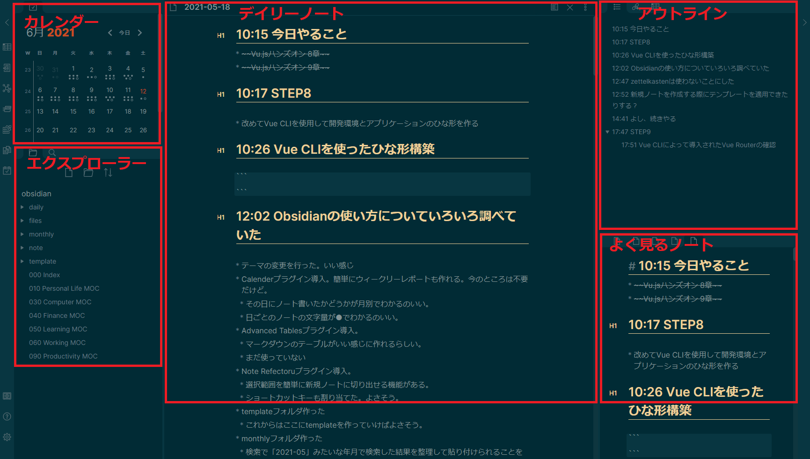
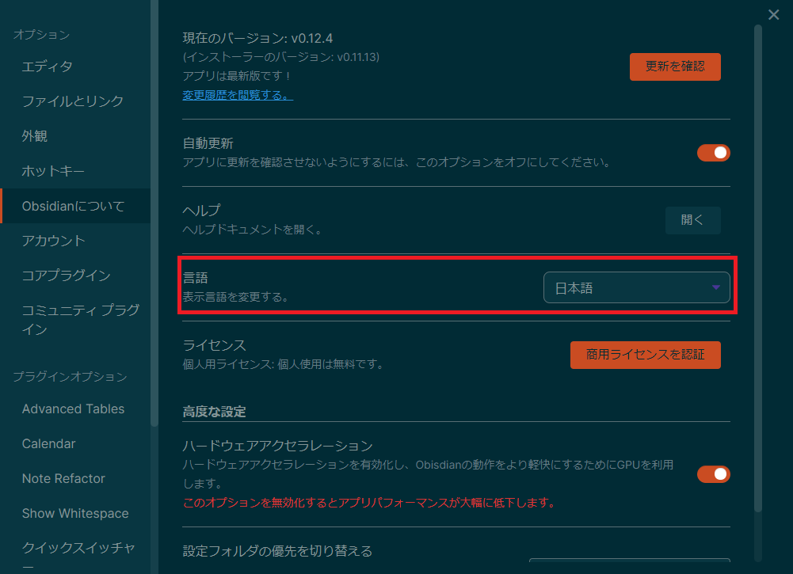
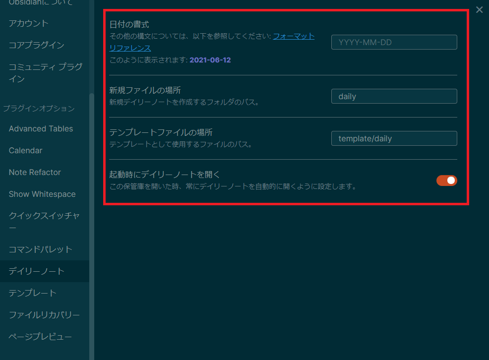
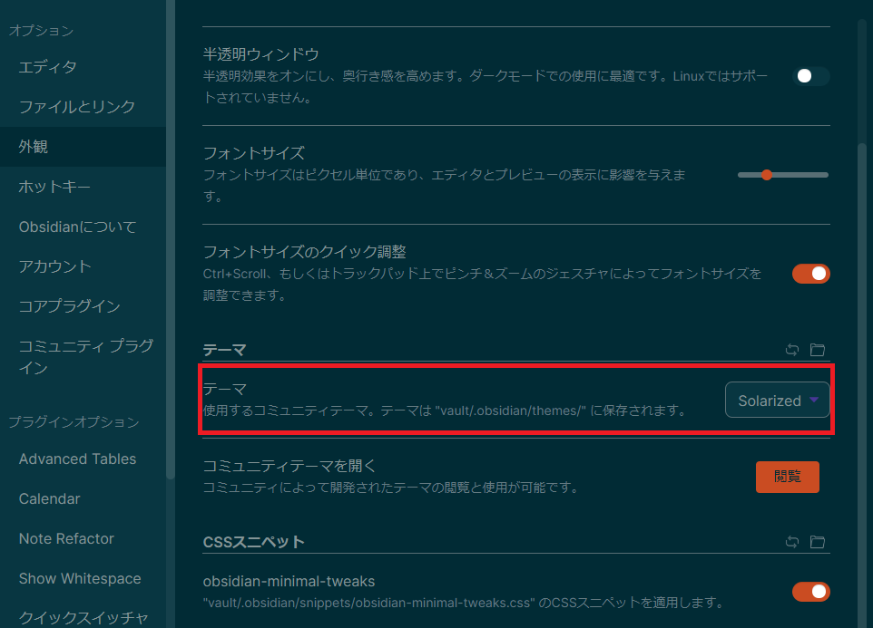
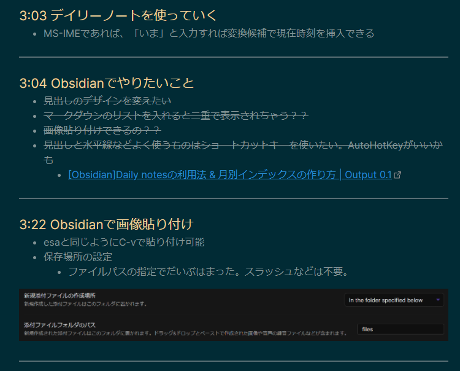
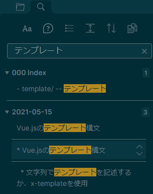

[Obsidian](https://obsidian.md/)はノートアプリです。  

次のような特長があります。  
ほかにもできることは多いノートアプリなのでもし気になった人は公式サイトを見てみるとよいです。  

- 個人使用は無料
- ローカルで使える
- マークダウンが使える
- デイリーノートが使える
- ペインを自由に配置
- ノート同士をつなげられる
- vimが使える

Obsidianを使う前はいろいろノートアプリを使っていて、最近はesaに落ち着いていましたが  
1年以上使っていると記事数も1000を超えてきて検索も少し重かったりでそろそろいいノートアプリ出てないか探したタイミングでObsidianを使ってみました。  

ローカルで使えるのでオフラインで使えますし、まだ記事数が少ないのもあり重さも全く気になりません。  
デフォルトでRoamResearchのようなデイリーノートをサポートしてますし、Scrapboxのようにノート同士を繋げることもできて今のところ困ったことはなく使えています。  

せっかくなので、ここ１か月で行った設定に焦点を当てObsidianの良さを伝えていこうと思います。  

## どうやって運用している？

私の普段のペインの配置です。  

カレンダー -- デイリーノートを探す用です。  
エクスプローラー -- ノートを探すときに使います。  
デイリーノート -- 作業ログを書き込んでいきます。  
アウトライン  -- いま開いているノートのアウトラインを表示させています。  
よく見るノート -- よく見るノートは右下に配置しています。  



Obsidianはこのように好きな場所に好きなペインを配置できるのでとても効率敵に使うことができるのでおすすめです!  

私は基本的に
- ①デイリーノートに作業ログを書く
- ②何度も見返す情報などはノートに整理する
- ③整理したノートはすぐに見つけられるようにMOCノートに整理する

②、③はIMF-v3という考え方にのっとっています。
私が参考にしているのは下記です。  
[My Obsidian workflow \- R\.K\.S\. blog](https://ryokbys.github.io/blog/posts/2020/08/03/my-obsidian-workflow/index.html)

このワークフローにのっとって情報を整理することでかなり使いやすさがマシマシになったと感じています。  
最初はデイリーノートから慣れていき、徐々にデイリーノート以外にノートを作成するようになってきたらこのワークフローの考え方を取り入れるとかなり快適に情報が整理できてアクセスしやすくなると思います。  

## 基本設定編

では、設定編にまいりましょう。  

### 日本語化する

日本語化された後の画面で申し訳ないですが、設定画面から言語を日本語に設定することができます。  



### デイリーノートを使えるようにする

私は基本的に作業ログを取る人なので、日ごとに自動でその日の日付がタイトルのノートを作成されるととても助かります。  
そんな機能がデイリーノートです。  
日付が変わると自動でノートを作成してくれるのでかなり重宝しています。  

デフォルトでは、有効になっていないので有効にします。  

設定のプラグインのところから、デイリーノートをONにするだけで有効になります。  

また、今日のディリーノートはショートカットキーが割り当てられており、デフォルトだとAlt+tで開けます。  


また、デイリーノートの設定もできるのでカスタマイズしています。  
下記の設定だと、dailyというフォルダにデイリーノートが自動で作成されていきます。  



### 記事に画像貼り付け

最近のノートアプリでは当たり前ですが、クリップボードにある画像をC-vで貼り付けることができます。  
esaでも同じことができていたのですが、ObsidianでもできたのでObsidianを使う理由の一つでもあります。  
デフォルトだとトップレベルの場所にファイルが保存されていくので、filesというフォルダにファイルが保存されるようにしています。  


### vimを使える設定にする

ノートアプリでvimが使えるアプリはそんな多くないと思いますが、なんとObsidianはvimのキー設定にも対応しています。  
このおかげで快適に作業ログを書くことができています。  

エディタの設定からVimのキー設定をONにするだけです。  


ここからはObsidianのすごいと思ったところなのですが、なんとvimrcもプラグインでサポートしています。  

自分は少しだけここを変えたいという設定があったので導入しています。

設定のコミュニティプラグインのところから、「Vimrc Support」というプラグインをインストールし有効にします。  

設定ファイルを作成することで有効になります。

`VAULT_ROOT/.obsidian.vimrc`を作成する。

私は下記の設定をしています。  

```vim
" Yank to system clipboard
set clipboard=unnamed

" 論理行、表示行移動のマッピング
" https://motamemo.com/vim/vim-tips/real-display-line/
nnoremap k gk
nnoremap gk k
nnoremap j gj
nnoremap gj j
```

### 保存先をDropboxにする

Obsidianでは、ただのマークダウンファイルを作成しているだけです。  
Obsidianの保管庫をDropboxに置くだけで、クラウドで管理できるようになります。  

Dropboxに保管庫を置いておけば、新しいPCにObsidianをインストールしてDropboxの保管庫を指定するだけで今まで通りの設定やノートを使うことができます。  

データが消えてしまう心配もありませんし、ほかのノートアプリへの記事移行も簡単です。  

[Obsidian での複数PC間でのデータの共有方法 \| DailyMix News](https://dailymix-news.com/obsidian-share-file/)

### テーマを変える

Obsidianはいろんなテーマがあり、設定の外観から簡単にテーマを導入できます。  

私は、Solarizedにしています。  



## 応用編

ここまでで十分普段づかいできるようになっていると思いますが、  
もっとよくしていきたい編です。  

### テンプレート

毎回使うひな形はテンプレート機能を使います。  

設定等は下記がわかりやすいです。  
[Obsidianのテンプレート機能 \| シゴタノ！](https://cyblog.jp/41914)

私のデイリーノートのテンプレート例です。  
デイリーノートの設定で下記テンプレートで新規作成するようにしています。  

```
tags: #daily

# Tasks
- [ ] something

# Notes
```

### Calenderプラグイン

Calenderプラグインを入れると下記のようにカレンダーのペインが表示されます。  
その日付をクリックすると、デイリーノートに飛びます。  
デイリーノートも数が多くなってくると、フォルダから探すと大変なのでカレンダーから移動することでだいぶ楽になりました。  
また、その日ごとの文字量が●でわかるので一目でその日はどれくらい作業したかの目安にもなります。  


下記の記事が参考になります。  
簡単にウィークリーレポートを作成できたりします(私は活用できていません...)。  

[\[Obsidian\]CalendarプラグインでDaily notesは進化する \| Output 0\.1](https://pouhon.net/obsidian-calendar/5996/)

### CSSスニペットで外観を調整する

ObsidianにはCSSスニペットという機能があり、cssを`VAULT_ROOT/.obsidian/snippets/`に配置するだけで、設定画面からCSSスニペットの有効/無効の切り替えができます。

手順は下記リポジトリを参考にしました。  

[lucasrla/obsidian\-css\-tweaks: CSS snippet for Obsidian – just a few \(minimal\) tweaks and fixes](https://github.com/lucasrla/obsidian-css-tweaks)

ここを調整したいけど、やり方がわからない人は下記リポジトリが参考になると思います。  

[obsidian\-css\-snippets/Snippets at master · Dmitriy\-Shulha/obsidian\-css\-snippets](https://github.com/Dmitriy-Shulha/obsidian-css-snippets/tree/master/Snippets)

また、私のCSSスニペットを参考においておきます。  
たぶん、いい感じになると思います。  
不要なら無効にするだけです。  

`obsidian-minimal-tweaks.css`

```
/* https://github.com/Dmitriy-Shulha/obsidian-css-snippets/blob/master/Snippets/Headers.md */

:root {
  --text-title-h1: rgb(239, 207, 146);
  --text-title-h2: rgb(239, 207, 146);
  --text-title-h3: rgb(239, 207, 146);
  --text-title-h4: rgb(239, 207, 146);
  --text-title-h5: rgb(239, 207, 146);
  --text-title-h6: rgb(239, 207, 146);
  --text-accent: rgb(239, 207, 146);
  --h1ys: rgb(239, 207, 146);
  --h2ys: rgb(239, 207, 146);
  --h3ys: rgb(239, 207, 146);
  --h4ys: rgb(239, 207, 146);
  --h5ys: rgb(239, 207, 146);
  --h6ys: rgb(239, 207, 146);
  --font-size-h1: 27px;
  --font-size-h2: 22px;
  --font-size-h3: 21px;
  --font-size-h4: 19px;
  --font-size-h5: 16px;
  --font-size-h6: 13px;
}

/* ========================================================== */

/* changing the color of the header in edit mode */
.cm-header-1 {
  color:var(--text-title-h1);
}

/* Coloured headings for editor and preview in Dracula */
.cm-header-1, .markdown-preview-view h1
{
  font-family: var(--font-family-editor);
  font-weight: 500;
  font-size: var(--font-size-h1);
  color: var(--text-title-h1);
}

.cm-header-2, .markdown-preview-view h2
{
  font-family: var(--font-family-editor);
  font-weight: 500;
  font-size: var(--font-size-h2);
  color: var(--text-title-h2);
}

.cm-header-3, .markdown-preview-view h3
{
  font-family: var(--font-family-editor);
  font-weight: 500;
  font-size: var(--font-size-h3);
  color: var(--text-title-h3);
}

.cm-header-4, .markdown-preview-view h4
{
  font-family: var(--font-family-editor);
  font-weight: 500;
  font-size: var(--font-size-h4);
  color: var(--text-title-h4);
}

.cm-header-5, .markdown-preview-view h5
{
  font-family: var(--font-family-editor);
  font-weight: 500;
  font-size: var(--font-size-h5);
  color: var(--text-title-h5);
}

.cm-header-6, .markdown-preview-view h6
{
  font-family: var(--font-family-editor);
  font-weight: 500;
  font-size: var(--font-size-h6);
  color: var(--text-title-h6);
} */

/* Coloured headings for editor and preview, same font-weight in Edit & Preview */
.cm-s-obsidian .cm-header-1,
 .markdown-preview-view h1 {
  font-weight: 450;
  color: var(--text-title-h1);
}

.cm-s-obsidian .cm-header-2,
 .markdown-preview-view h2 {
  font-weight: 450;
  color: var(--text-title-h2);
}

.cm-s-obsidian .cm-header-3,
 .markdown-preview-view h3 {
  font-weight: 450;
  color: var(--text-title-h3);
}

.cm-s-obsidian .cm-header-4,
 .markdown-preview-view h4 {
  font-weight: 450;
  color: var(--text-title-h4);
}

.cm-s-obsidian .cm-header-5,
 .markdown-preview-view h5 {
  font-weight: 450;
  color: var(--text-title-h5);
}

.cm-s-obsidian .cm-header-6,
 .markdown-preview-view h6 {
  font-weight: 450;
  color: var(--text-title-h6);
}

/* Underline H1 heading in Edit mode */
/* .cm-header-1 {
  border-bottom: 1px solid var(--text-accent);
} */

.cm-s-obsidian pre.HyperMD-header-1:after {
  content: "";
  position: absolute;
  bottom: 5px;
  left: 5px;
  width: calc(100% - 10px);
  height: 1px;
  background: rgb(239, 207, 146);
}


/* ========================================================== */


/* Eliminate margin (gap, space) under headings - Preview mode only */
/* H1 underlined too */
.markdown-preview-view h1 {
  padding-bottom: 5px;
  border-bottom: 1px solid rgb(239, 207, 146);
  margin-bottom: -10px;
}

.markdown-preview-view h2,
.markdown-preview-view h3,
.markdown-preview-view h4,
.markdown-preview-view h5,
.markdown-preview-view h6 {
    margin-bottom: -20px;
    padding-bottom: 5px;
}

/* Changing size/color of the header hashtags # */
.cm-formatting-header {
  color: var(--text-faint);
font-size: 0.6em;
}

/* USED IN CONTEXT OF "REMOVE CLUTTER" */
/* Replace header hashes (#) by H1, H2, etc. in edit mode */ 
/* from Blue Topaz theme: DIRTY WYSIWYM HEADERS by _ph */

/* Header folder icon */
.CodeMirror-foldgutter-open, .CodeMirror-foldgutter-folded {
  padding-left: -10px;
}

.CodeMirror-sizer{
  margin-left: 35px !important;
}

/*-- reduce left padding --*/
.CodeMirror {
  height: 100%;
  direction: ltr;
  padding: 0 5px;
}

/*-- hide # markup--*/
.cm-formatting.cm-formatting-header.cm-formatting-header-1.cm-header.cm-header-1,
.cm-formatting.cm-formatting-header.cm-formatting-header-2.cm-header.cm-header-2,
.cm-formatting.cm-formatting-header.cm-formatting-header-3.cm-header.cm-header-3,
.cm-formatting.cm-formatting-header.cm-formatting-header-4.cm-header.cm-header-4,
.cm-formatting.cm-formatting-header.cm-formatting-header-5.cm-header.cm-header-5,
.cm-formatting.cm-formatting-header.cm-formatting-header-6.cm-header.cm-header-6
{font-size:0.1px;}  /* 0pxにすると「#」に続けて日本語入力すると「#」が認識されなくなるので0.1pxとしている

/*-- display H1-h6 in gutter--*/
.cm-formatting.cm-formatting-header.cm-formatting-header-1.cm-header.cm-header-1:before{
  content:"H1";
  font-size:14px;
  color: var(--h1ys);
  left:-36.5px;
  top:11px;
  position:absolute;
}
.cm-formatting.cm-formatting-header.cm-formatting-header-2.cm-header.cm-header-2:before{
  content:"H2";
  font-size:13px;
  color: var(--h2ys);
  left:-36.5px;
  top:9px;
  position:absolute;
}
.cm-formatting.cm-formatting-header.cm-formatting-header-3.cm-header.cm-header-3:before{
  content:"H3";
  font-size:12px;
  color: var(--h3ys);
  left:-36.7px;
  top: 7px;
  position:absolute;
}
.cm-formatting.cm-formatting-header.cm-formatting-header-4.cm-header.cm-header-4:before{
  content:"H4";
  font-size:11px;
  color: var(--h4ys);
  left:-20.5px;
  top: 7px;
  position:absolute;
}
.cm-formatting.cm-formatting-header.cm-formatting-header-5.cm-header.cm-header-5:before{
  content:"H5";
  font-size:10px;
  color: var(--h5ys);
  left:-20px;
  top: 9px;
  position:absolute;
}
.cm-formatting.cm-formatting-header.cm-formatting-header-6.cm-header.cm-header-6:before{
  content:"H6";
  font-size:9px;
  color: var(--h6ys);
  left:-19.5px;
  top: 9px;
  position:absolute;
}

/*-- is active line, hide H[1-6] in gutter --*/
.CodeMirror-activeline span.cm-formatting.cm-formatting-header.cm-formatting-header-1.cm-header.cm-header-1:before,
.CodeMirror-activeline span.cm-formatting.cm-formatting-header.cm-formatting-header-2.cm-header.cm-header-2:before,
.CodeMirror-activeline span.cm-formatting.cm-formatting-header.cm-formatting-header-3.cm-header.cm-header-3:before,
.CodeMirror-activeline span.cm-formatting.cm-formatting-header.cm-formatting-header-4.cm-header.cm-header-4:before,
.CodeMirror-activeline span.cm-formatting.cm-formatting-header.cm-formatting-header-5.cm-header.cm-header-5:before,
.CodeMirror-activeline span.cm-formatting.cm-formatting-header.cm-formatting-header-6.cm-header.cm-header-6:before
{font-size:0px;}

/*-- is active line, display # markup --*/
.CodeMirror-activeline > pre > span .cm-formatting.cm-formatting-header.cm-formatting-header-1.cm-header.cm-header-1{
  font-size:24px;
  display:inline;
}
.CodeMirror-activeline > pre > span .cm-formatting.cm-formatting-header.cm-formatting-header-2.cm-header.cm-header-2{
  font-size:22px;
  display:inline;
}
.CodeMirror-activeline > pre > span .cm-formatting.cm-formatting-header.cm-formatting-header-3.cm-header.cm-header-3{
  font-size:20px;
  display:inline;
}
.CodeMirror-activeline > pre > span .cm-formatting.cm-formatting-header.cm-formatting-header-4.cm-header.cm-header-4{
  font-size:18px;
  display:inline;
}
.CodeMirror-activeline > pre > span .cm-formatting.cm-formatting-header.cm-formatting-header-5.cm-header.cm-header-5{
  font-size:16px;
  display:inline;
}
.CodeMirror-activeline > pre > span .cm-formatting.cm-formatting-header.cm-formatting-header-6.cm-header.cm-header-6{
  font-size:16px;
  display:inline;
}

/* Change header size in Edit mode */
.cm-header-1 {
  font-size: var(--font-size-h1);
}
  
.cm-header-2 {
  font-size: var(--font-size-h2);
}
  
.cm-header-3 {
  font-size: var(--font-size-h3);
}
  
.cm-header-4 {
  font-size: var(--font-size-h4);
}
  
.cm-header-5 {
  font-size: var(--font-size-h5);
}
  
.cm-header-6 {
  font-size: var(--font-size-h6);
}

/* Change header size in Preview mode */
.markdown-preview-view h1 {
  font-size: var(--font-size-h1);
}
  
.markdown-preview-view h2 {
  font-size: var(--font-size-h2);
}
  
.markdown-preview-view h3 {
  font-size: var(--font-size-h3);
}
  
.markdown-preview-view h4 {
  font-size: var(--font-size-h4);
}
  
.markdown-preview-view h5 {
  font-size: var(--font-size-h5);
}
  
.markdown-preview-view h6 {
  font-size: var(--font-size-h6);
  font-weight: bold;
}
```

## 小技集
### C-eでプレビューに切り替え

大体のマークダウンのプレビューは左にプレビュー前、右にプレビュー後のものが表示されるかと思いますが、Obsidianの場合は1画面でプレビュー前/プレビュー後と切り替えられるので目線が左右に移動せずにかなり使いやすいです。  

基本はプレビュー前の状態でゴリゴリ書いていって、プレビューを見たいときだけC-eで切り替えて確認したらC-eでプレビュー前に戻して書くという感じで使っています。  

プレビュー前です。  


プレビュー後です。  



### C-S-fで全てのノートから検索

Obsidianはオフラインなので全てのノートからの検索が早くストレスがないです。  
C-S-fを押下すると、検索欄にフォーカスされるのですぐに検索して目的の情報に到達できます。  



### 月別インデックスを作成する

Obsidianのすごいなーと思った機能で検索バーで検索した結果から簡単に月別インデックスが作れます。  
ほかにも応用ができそうな機能です。  

[\[Obsidian\]Daily notesの利用法 & 月別インデックスの作り方 \| Output 0\.1](https://pouhon.net/obsidian-daily/5691/)

## まとめ

どうだったでしょうか？  
思った以上にObsidianは優秀だったと思います。  
プラグインを入れればさらにできることは広がります。  

多機能ではありますが、少しずつ設定をしていけば問題ないのでまずはデイリーノートだけでも使ってみる価値はあると思います。  

Obsidianで快適なノートライフを送りましょう！  
