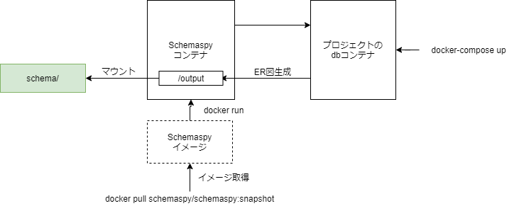

新しいプロジェクトはDocker + Rails + PostgreSQLで開発しており、  

「rails er図」で調べると大体rails-ERDが候補で上がってきます。  

プロジェクトには導入されていないので、個人的に毎回追加してbundle installするのも面倒だなーと思っていたら  

[Schemaspy](http://schemaspy.org/)を見つけました。  

Schemaspyで生成されるサンプルドキュメントは[こちら](http://schemaspy.org/sample/index.html)で確認できます。  

## SchemaspyコンテナからER図を生成

Schemaspyは[Dockerイメージ](https://hub.docker.com/r/schemaspy/schemaspy/)が提供されているため、今回の方法を使えば既存のプロジェクトに影響を与えることなくER図を生成できます。  

イメージはこんな感じです。  

Schemaspyコンテナを起動して、プロジェクトのDBコンテナを読み取ってER図を生成。  
Schemaspyコンテナの`/output`に出力されます。  
Schemaspyコンテナの`/output`はホストの`/schema`にマウントさせるので、ホスト側の`schema/index.html`をブラウザで開いてER図を確認できるようになります。  

特にプロジェクト側に何かを追加する必要はないので、プロジェクトに手を加えずにER図を出力することができます。  



### 手順

`docker pull`でschemaspyのイメージを取得。

```
docker pull schemaspy/schemaspy:snapshot
```

`docker-compose up`等でプロジェクトのdbコンテナを起動しておきます。  


Schemaspyを使ってER図を生成します。  
今回対象のDBはpostgreSQLになります。  
```
docker run -v "$PWD/schema:/output" --net="host" -u root:root schemaspy/schemaspy:snapshot -t pgsql -host localhost:5432 -db app_development -u root -p app_dev_password -connprops useSSL\\\\=false -all

# 上記コマンドの説明
docker run -v "[ホスト側のディレクトリ]:/output" --net="host" -u root:root schemaspy/schemaspy:snapshot -t [データベースの種類] -host localhost:[DBの接続ポート] -db [DB名] -u [DBのユーザー名] -p [DBのパスワード] -connprops useSSL\\\\=false -all
```

ホスト側の`$PWD/schema`に出力されるので、  
ホスト側の`schema/index.html`をブラウザで開いてER図確認します。  

出力する際にGraphvizがないために下記のエラーがでますが、GraphvizがなくてもとりあえずER図は確認できました。  

```
ERROR - dot -Tpng:cairo clients.2degrees.dot -oclients.2degrees.png -Tcmapx: in label of node inspections
ERROR - dot -Tpng:cairo clients.2degrees.dot -oclients.2degrees.png -Tcmapx: Warning: cell size too small for content
```

## 参考
[数ステップでテーブル定義書やER図を作成できるSchemaspyはすごく便利 \| High5's Menlo Park](http://tech.high5.science/2017/03/19/schemaspy-20170319/)

[Docker でサクッと MySQL 8 からER図を作成する \- Qiita](https://qiita.com/ngyuki/items/4efa0734e8d8582bfc16)
