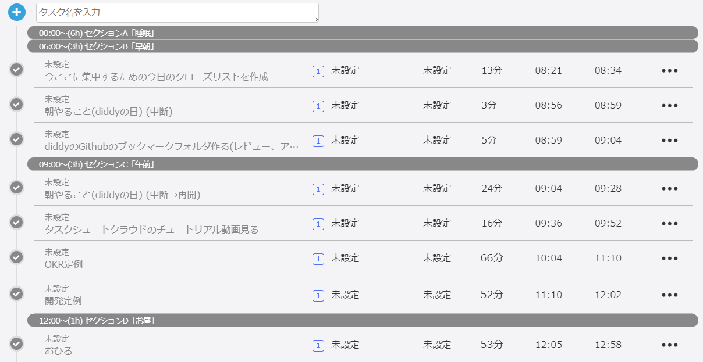
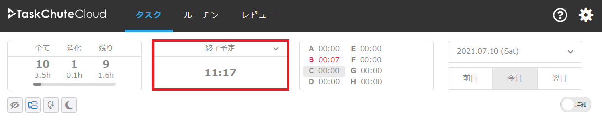
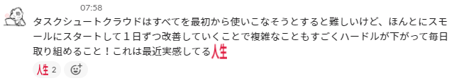

## 実は3回も挫折していた

実は以前はGTDといったタスク管理に熱心でいろんな記事を読んでは試してた時期がありました。  

TaskChute Cloud(タスクシュートクラウド)もそのときに何度かトライしては挫折した魔のツールです。  

これを見ると、2016年、2019年、2020年と挫折してはトライして挫折してますね…  

色んな理由があると思いますが、今思うと細かく記録しようとしすぎたのが続かなかった原因かなと思います。  

## タスクシュートクラウドってどんなツール？

クラウドファンディングのページですが良くまとまっていてこちらがわかりやすいかと思います。  

[人生を救ってくれた最強の時間管理術「タスクシュート時間術」をもっと世に広めたい](https://camp-fire.jp/projects/view/162572)

jMatsuzakiさんという方が作られたツールでタスクシュートというシゴタノ！の大橋 悦夫さんが考案されたタスク管理メソッドの考え方がベースになっています。  

## なんで3回も挫折したのに今さら再入門したの？

いい質問ですね！  

ここ最近私は転職し1か月経って振返ったときにこう思いました。  

**「やりたいことはたくさんあるのに、うまくできてない」**  

転職して最初の1か月ということもあり、新しいことの連続で毎日が過ぎていく中で  
やることはやっているはずなのですが、漠然とやれていないなーという思いともっと細切れの時間も活用したいなーと思ったので  
タスクシュートクラウドに再入門して改善しようと奮い立ちました。  

そして再入門して1週間経った今タスクシュートクラウドの良さに改めて気づき挫折せずに続けられているので  
**この記事を読むことで1週間自分が体験したことを疑似体験してもらおうと思ってこの記事を書いています。**  

## タスクシュートクラウドに再入門した1週間

### 1日目にやったこと(日曜の夜にはじめた)

- とりあえずタスクを登録して、見積いれて開始時間と終了時間を記録する

この日にやったのはこれだけです。  

タスクシュートクラウドは高機能なツールで
- コメント機能(タスクにコメントを入れられる)
- セクション機能(1日を意味のある単位で区切られる)
- プロジェクト機能(タスクがどのプロジェクトに属するかセットできる)
- モード機能(タスクごとに自分の動作を表す(集中、単純作業、移動、計画etc...))
- 評価機能(タスクを評価する機能)
- ルーチンタスク機能(ルーチンタスクを登録できる機能)

など色んなことができますが、  

**1日目はタスクを登録して記録するだけで適当にコメントもいれていたり、見積は入れ忘れていたりしました。**  

### 2日目にやったこと

- 仕事が始まりました
- 1日目と同じ感じで仕事をやりながらタスクなどを登録してこなしていきました

この日も1日目と同じで小難しいことは一切せずタスクを登録して記録する感じでした。  

**あと、歯磨きとかそういった生活系の細かい粒度のタスクは一切登録しませんでした。**

この日のtwitterでのつぶやき↓
  

### 3日目にやったこと

- **朝、仕事前に少しだけ昨日のタスクシュートクラウドの記録を振り返った**
  - 割り込みタスクがあったときにうまくいかなかったの思い出し、割り込みタスクの挙動を把握した
  - 仕事前に頭の中で気になっていた仕事環境改善系の小さなタスクに着手した
- **仕事が始まる前に今日やることがわかっているタスクは先に登録していた**

この日良かった点は、**仕事の前に少し時間を取ったことで1日の見通しが立てられたことです。**

### 4日目にやったこと
- 朝、昨日の振返りをした
- 朝、タスクを洗い出すときの行動パターンがわかったので、朝タスク洗い出し用のチェックリストを作った。
- 少しずつタスクシュートクラウドのチュートリアル動画を見るようになった
- セクションがなかったのでいつに何をやるかというのがわかりづらくなってきたのでこのタイミングでセクションを導入した。

4日目あたりから、**チェックリストを作ったり、タスクシュートクラウドのチュートリアル動画をみたり小さな改善に時間を回せるようになってきました。**

**この頃から、夜型だったのが少しずつ朝型になってきました。**
 
そして、本来はデフォルトでセクションが設定されているはずですが、  
以前自分が削除したままの状態になっていてここでセクションを導入しました。  

**このタイミングでセクションを入れたことで1日の区切りを改めて認識できて良かったです**

また、タスク中に脱線したときは無理にタスクを登録せずにコメントに〇〇のこともやっていた。みたいな感じで運用してました。  

### 5日目にやったこと
- ある程度タスクのデータも溜まってきて、**ルーチンタスクがわかってきたのでルーチンタスクを登録した**
- 朝のうちにチェックリストを使って、タスクを洗い出した。**この時点で見積時間を登録した**
- 引き続きタスクシュートクラウドのチュートリアル動画をみた
- **朝、少しだけ勉強に着手した**

この頃くらいから、**タスクの洗い出しがスムーズになり朝に少しだけ余裕ができてその時間で勉強したりできるようになりました**

また、**1日の終了予定をみる余裕がでてきて、たぶんのこのくらい時間が空きそう。とか、このタスクはもう少し時間かかりそうだから長く時間を取ろうとか、タスクの粒度が大きいからこの調査タスク後にタスクが増えるなとか考えられるようになってきました**

↓タスクに見積時間を入れるようになると1日の終了予定がわかるようになります  

この日のtwitterでのつぶやき↓
  

### 6日目にやったこと
- 朝一でプロジェクトとモードと評価を新たに設定するというタスクを登録しておいた着手できた
  - 思ったより時間がかかってしまいその日はできなかったので翌日にもタスクを登録した
- 引き続きタスクシュートクラウドのチュートリアル動画をみた
- 引き続き勉強した

**1～4日目くらいまではあまり余裕がなかったのですが、6日目になるとタスクの洗い出しもスムーズなので自分が取り組みたいことの時間が結構取れるようになってきたことを実感しました。**

この日のslackでのつぶやき↓

### 7日目にやったこと

**今この記事を書いています！**

## まとめ：細かいことは気にせず、スモールスタートすることでタスクシュートクラウドはうまくいく

昨日はできなかったことを振返り → 少し改善する → その空いた時間でさらに改善をすることで時間は作れるんだなーということをほんとに実感した1週間でした。  

最初は機能をすべて使いこなせなくても、割り込みタスクでその日1日がうまくいかなくてもいいので、  
細かいことは気にせずにタスクを記録して少しだけ振返ることでスモールスタートしてみてはいかがでしょうか。  
