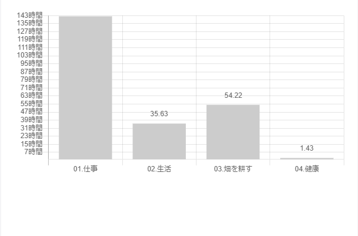
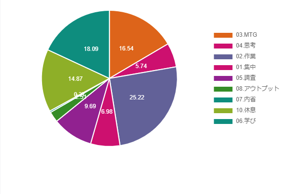
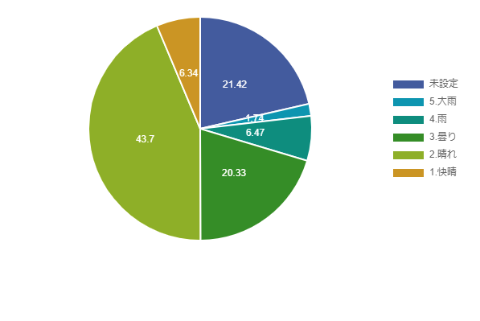
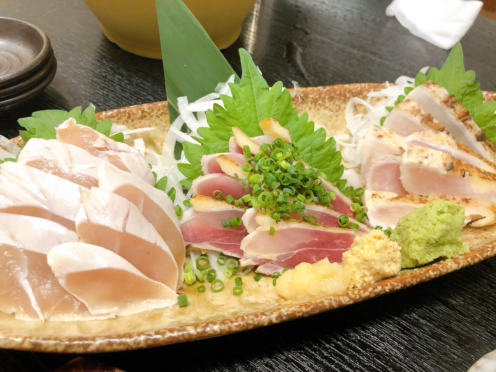
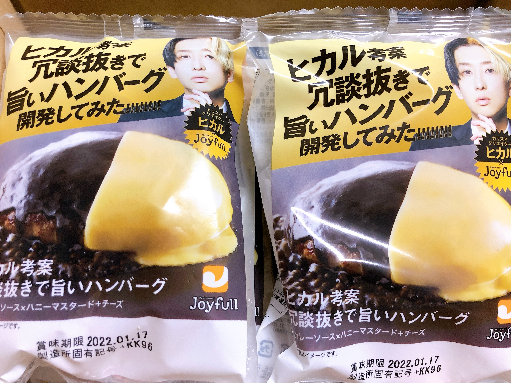
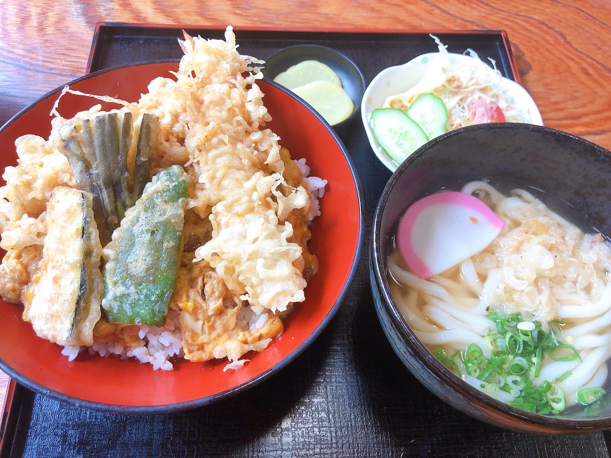
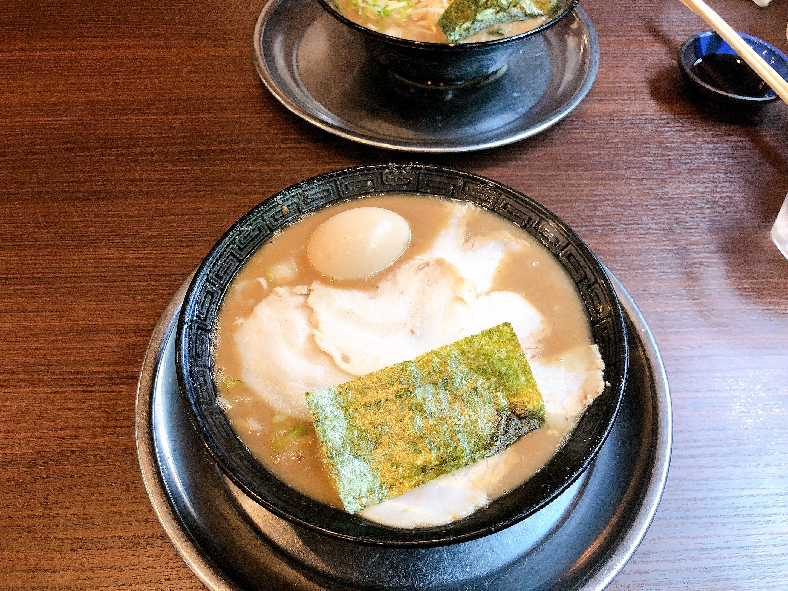

今月もやってきました振返りの時間です！  
振返るのに2、3時間かかるのですが今のところは意外に書けることありそうなので続けてます。  
このタイミングであれもこれもあったなーとなるので良い時間です。  

## 2021年7月のトピック
主なトピックを記載しています。  

- 仕事
  - 自社(週1日)
    - MVPの仕様決め・実装
    - 退会機能リリース
    - 採用強化のため会社ブログ誕生
  - 開発支援先(週4日)
    - タグ機能キックオフ・GraphQLスキーマ定義・実装開始
    - schemaspyを提案してみたり
- 勉強
  - スッキリわかるSQL入門
  - メタプログラミングRuby
  - パーフェクト Ruby on Rails
- 仕事環境
  - タスク管理周りの強化
- 買ったもの
  - [ソフトウェアデザイン 2021年8月号](https://www.amazon.co.jp/gp/product/B0971NZZT4/ref=ppx_yo_dt_b_asin_title_o05_s00?ie=UTF8&psc=1)
  - [お中元 ギフト 人気 食べ物 島の人 北海道 海鮮セット 7点 内祝い 詰め合わせ 贈答 いくら](https://www.amazon.co.jp/gp/product/B01N9A1MZ6/ref=ppx_yo_dt_b_asin_title_o04_s00?ie=UTF8&psc=1)
  - [ヒカル 考案 冗談抜きで旨い ハンバーグ （120ｇ） 黒カレーソース×ハニーマスタードチーズ 6個入り 冷凍](https://www.amazon.co.jp/gp/product/B097749M9D/ref=ppx_yo_dt_b_asin_title_o03_s00?ie=UTF8&psc=1)
  - [ここはウォーターフォール市、アジャイル町 ストーリーで学ぶアジャイルな組織のつくり方](https://www.amazon.co.jp/gp/product/B08G1DX2N5/ref=ppx_yo_dt_b_d_asin_title_o02?ie=UTF8&psc=1)
  - [Vimが好きになる本 (技術の泉シリーズ（NextPublishing）)](https://www.amazon.co.jp/gp/product/B0899SR52S/ref=ppx_yo_dt_b_d_asin_title_o01?ie=UTF8&psc=1)
  - [OSの仕組みの絵本](https://www.amazon.co.jp/gp/product/B00G9QITO8/ref=ppx_yo_dt_b_d_asin_title_o00?ie=UTF8&psc=1)
- プライベート
  - 美味しいものを食べた

## TaskChuteCloudで振返り(2021/07/01～2021/07/31)
このブログを始めてからは初めての取り組みですが、今月からTaskChuteCloudでタスク管理をやっているので振返っていこうと思います。  

TaskChuteCloudの詳しい内容は下記に書きました。  
[3回も挫折した私がTaskChute Cloud(タスクシュートクラウド)に再入門した話](https://snyt45.com/posts/20210715/taskchute-cloud/)

私はすべての時間を管理しているわけではなく、仕事の時間やプライベートでも勉強した時間などをTaskChuteCloudに記録しています。  

**TaskChuteCloudは使えば使うほどタスク管理に書ける時間は減りタスクに集中できるようになるので  
最初のランニングコストはそこそこありますが、小さく始めればハードルは低くかなり簡単に導入できるとおもいます。**  

始め方などはさきほどの記事が参考になると思います。  

データが溜まってくるといい感じにグラフを自動で作ってくれるので  
そのグラフを使って簡単に振返ろうと思います。

### プロジェクト別実績時間

「畑を耕す」という項目は第2領域といって緊急ではないけど重要なことにあたります。  
この時間が増えれば増えるほど、自分にとって重要なことに時間を使えていると言えますね。  

大体50hなので週に12.5hくらいは勉強とかの時間に使えてそうです。  

とはいえ、元々こんなに勉強の時間にあてられていたわけではなくて、  
**TaskChuteCloudを導入して、まずは〇〇に10分取り組むみたいなルーチンタスクを登録したのがうまくいったなという感想です。**  

また、順番やいつやるかというのもTaskChuteCloudを使っていると大事だなーと感じました。  

**朝だとストレッチ→簡単な勉強に10分取り組む→中級くらいの勉強に10分取り組むみたいな順番で徐々に肩を鳴らしていきます。**  

最初は大変だったのが今ではもう習慣になりました。  

健康は毎朝ストレッチするのですが、その時間のみです。。  
走ったりする時間も増やさないとですね。。  

### モード別実績時間

学びの時間は2割くらいありますが、アウトプットの時間がほぼないですね。  
私の場合は「アウトプット=記事に書く」なのですが、確かに今月は記事をあまりかけていないですね。  

### 評価別実績時間

評価はタスクが終わった後に入力するのですが、ここはどのように使ってもいいので  
私の場合はそのときの気持ちを天気で入力するようにしています。  

途中から導入したので、未設定もおおくありますがおおむね晴れのときが多いですね。  

**結構ネガティブなのですが、意外にデータでみるとポジティブであるときのほうが多いのは発見でした。**  

## トピックごとの振返り

### 採用強化のため会社ブログ誕生

今後、サービス拡大を見越してエンジニアの採用を増やしたいということで  
採用強化のための[会社ブログ](https://diddymag.diddyworks.co.jp/)が誕生しました！  

弊社はNotionアンバサダーがおりまして、なんとブログもNotionを使っています！  
[Anotion](https://anotion.so/)というものを使うとNotionがブログになるみたいです。  

そのうちAnotionの記事もあがるかもなので、要チェックです。  

### タグ機能キックオフ・GraphQLスキーマ定義・実装開始
開発支援先では本格的にプロジェクトに参加させてもらっています。  

色々と自分のペースで進めさせて頂いていてとても良い環境だなーと感じてます。  

GraphQLを使った開発は初めてですが、  
実装に入る前にBE側とFE側との認識合わせをGraphQLのスキーマでできるのは良い体験です。  

GraphQLのスキーマで認識をすり合わせることができるので、BEとFEの作業を同時並行で進行できますし、  
事前にすり合わせているので手戻りも少なさそうな感じです。  

大規模なサービスであるほど、会社的にBEとFEのエンジニアがいると思うので  
そういう所ではメリットが多そうです。  

まだ実装が始まったばかりなので、色々つかめてきたらそのうち記事にしたいなー。と思います。  

### schemaspyを提案してみたり
開発支援先でFE側で見れるER図的なもの求むみたいな課題があり、  
たまたま私も試していたところだったのでschemaspyを提案してみました。  

Docker使えますし、CIとの相性も良さそうです。  

こちらで記事にしました。  
[新しいプロジェクトでとりあえずER図を出力したいときにSchemaspyが便利だった話](https://snyt45.com/posts/20210703/schemaspy/)

### 勉強
コツコツと先月買った本の勉強を進めています。  

開発支援先での1on1のときに個人的な目標を聞かれたのですが、  
その時はざっくりFE側とBE側両方触れるといいなーと思ってました。  

ただ、せっかくBE担当としてジョインさせて頂いたこともあり、専門性を持つのは良いことだよなーと思ったので  
サーバーサイドの専門性を高めるために色々学びなおししてます。  

### タスク管理周りの強化

やりたいのに時間が足りないと感じていたので思い切ってTaskChuteCloudに再入門しました。  

また、下記の記事を参考に第2領域の管理にはhabiticaを使っています。  
RPG感覚で楽しいですし、第2領域がTaskChuteCloudに埋もれないので二重管理にはなりますが併用しています。  

[生産性の限界を押し上げるタスク管理ワークフロー実例【2020年最新版】](https://jmatsuzaki.com/archives/27283)

**TaskChuteCloudを使って、朝タスクを洗い出してタスクを追加して見積時間等を入れて並び替えということをやっているのですが  
これをやることで今日やる順番や終了予定も見えるので結構いい感じです。**  

### 美味しいものを食べた
プライベートでは久しぶりに高校の同級生と飯を食べました。  
地鶏を堪能したり、ウィスキーとピザが美味しいBARにいったりと最高でした！  

そういえば、さっきYouTuberヒカル×ジョイフルコラボのハンバーグもとどきました！  
どんな味か気になります。  

宮崎の美味しいものを堪能できるように来月も仕事頑張ります！  

うどん屋さんで食べた天ぷら丼

風来軒で食べたラーメン

