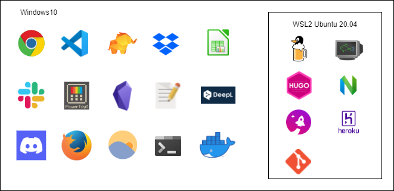

どういう構成で開発しているかとWindows10+WSL2で開発するメリットについてのメモです。  

## どういう構成で使っているの？

Windows10にWSL2をインストールして、LinuxディストリビューションはUbuntu-20.04を実行して使用しています。  

windows10上にはVSCODEなど開発に関連するものも入ってますが、基本的には汎用的に使うアプリを入れています。  

WSL2で実行しているLinuxディストリビューションには開発に特化したツールを入れています。  

また、Macでパッケージ管理システムといえばHomebrewが有名ですがWindowsでは使えません。  

ですが、WSL2をインストールすることでLinuxが使えるようになります。  

**Linuxでは本家HomebrewをLinuxでも使えるようにしたLinuxbrewがあるため、Macと同じようにパッケージ管理できるようになるのでとても便利です。**  

セットアップ時に行う設定やインストールなどはdotfilesとしてGitHub上で管理しています。

https://github.com/snyt45/windows10-dotfiles

https://github.com/snyt45/wsl-dotfiles

## Windows10+WSL2で開発するメリット
windwos10は開発以外、WSL2は開発のみという感じで切り分けて使っています。

新しく開発関連のツールを入れる際はWSL2のLinuxディストリビューション上にインストールします。

そのため、Windows上の環境変数やディレクトリが汚れません。

もし、WSL2のLinuxディストリビューション上に色々ツールを入れて失敗した場合はLinuxディストリビューションのみリセットが可能です。

そのため、Windowsを一からインストールしなおすというオーバーヘッドが発生しません。

また、WSL2のリセットは数秒で終わるため、壊して試してということが高速で試せませす。

web開発だとMacOSがデファクトスタンダードだと思いますが、  
今はWindowsでもMacと変わらない開発環境が手に入ります。  

WSL2からは、本物のLinuxカーネルが動作しますし、Linuxディストリビューションの起動は1,2秒ですし、WindowsのDockerをLinuxディストリビューション上でも併用して使えます(LinuxにDockerを入れ直さなくてもよい)。  

windowsからWSLファイルシステムへのアクセスもエクスプローラーのパスに`\\wsl$`を入力するだけなので非常に簡単です。  

また、WSLのIPアドレスは変わってしまうという問題がありましたが今は解消されており、localhostでアクセスできるため非常に快適です。  

[「WSL 2」最大の課題であった“localhost”問題が解決 ～「Windows 10」Build 18945 \- 窓の杜](https://forest.watch.impress.co.jp/docs/news/1198651.html)

Windows11からはWSLの導入がもっと簡単になったと聞いているのでそのうち試してみたいです。  
