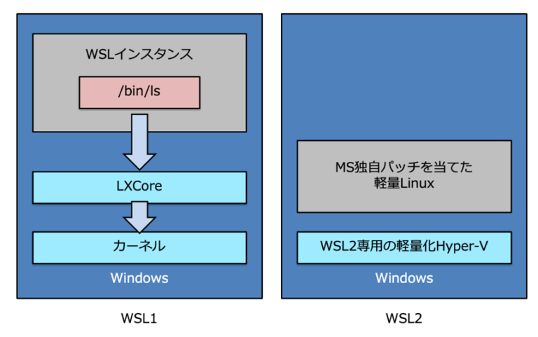
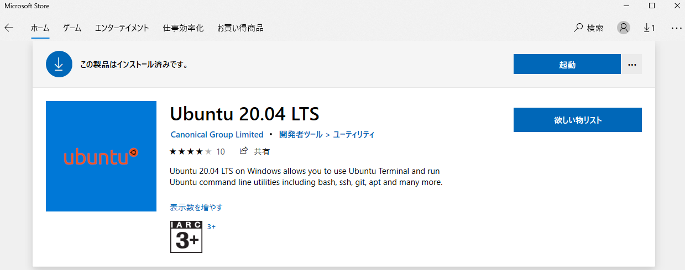
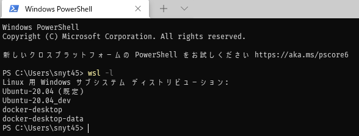
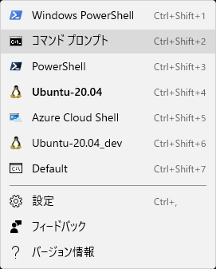
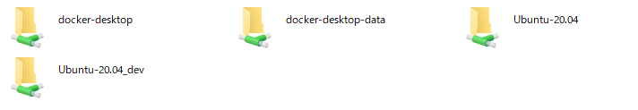
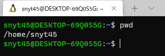
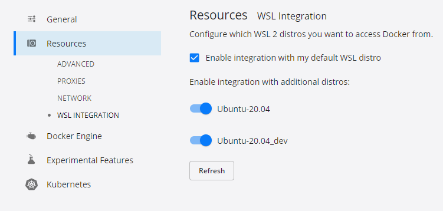
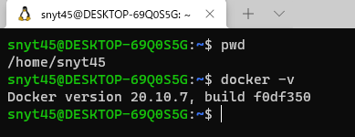
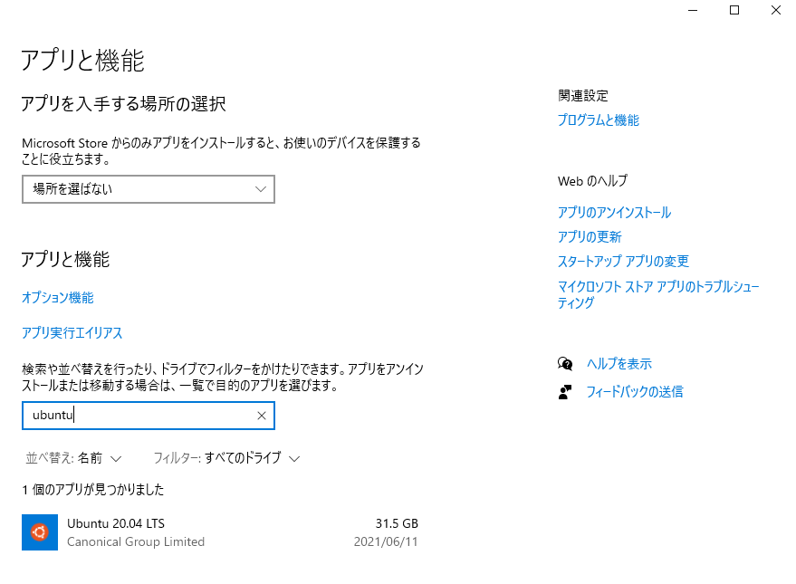
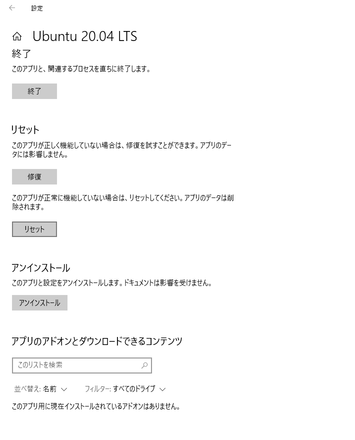

エンジニアとしてスタートアップのWebサービス開発に携わっています。  
仕事でWindows10+WSL2+Dockerを使って開発をするようになって2か月経ちました。  

WSL2だからといって仕事で困ることはなく、**Windowsの使いやすいUIを活かしつつWindows上で100%Linuxが使えるという恩恵を受けており、むしろ快適に開発しておりました。**  

最近ではさらにLinuxディストリビューションをインポートする方法を覚えたことで  
ついにローカル環境を汚さずに使い捨ての開発環境を手に入れることができました。  

**もっとWindows10+WSL2+Dockerの良さを伝えたいと思ったので、WSL2のメリット・デメリットに触れながらローカル環境を汚さずサクッと使い捨ての開発環境を作る方法について書こうと思います。**  

また、この方法であればいくらでも欲しい環境を好きなだけ作れてしまうので作りすぎには要注意ですね！笑

**すぐに使い捨ての開発環境が欲しいんだという方は[本題：Windows10+WSL2+Dockerでローカル環境を汚さずに使い捨ての開発環境を手に入れる](#本題windows10wsl2dockerでローカル環境を汚さずに使い捨ての開発環境を手に入れる)に飛んでください。**  

## WSL2とは
Macをお使いの人にもWSL2の良さが伝わればなと思うので、簡単にWSL2について触れたいと思います。  

**WSLとは、「Windows Subsystem for Linux」の略で簡単にいうとWindows上でLinuxが動くというものです。**  

WSL1ではLinuxカーネルのシステムコールをWindowsカーネルが処理できるシステムコールに変換して実行していましたが一部のシステムコールには対応できておらず一部のLinuxアプリ(Dockerなど)は動作しませんでした。  

そこでWSL2の登場です。  

WSL2は2ではありますが、WSL1とは全く別物となっています。  

### WSL2の特徴：100%のLinuxシステムコールの互換性
WSL2ではWIndows上で軽量VM(仮想マシン)が起動し、その中で実際のLinuxカーネルが動作します。
つまり、**全てのLinuxアプリが動作するため100%Linuxの資産が使えます。**  

ただし、仮想マシンといっても一般の仮想マシンとは違い非常に高速で1,2秒で起動しマシンの大量のリソースを占有することはありません。

また、**すごいのが軽量VMはバックグラウンドで管理および実行されるため使う側は全く意識する必要はありません。**

### WSL2の特徴：ファイルI/O操作のパフォーマンスが高速

Microsoftの動画の2分7秒くらいからWSL1とWSL2のパフォーマンス比較が見れます。  
(WSL2のアーキテクチャについては10分16秒くらいから見れます。)

**WSL1に比べてWSL2は約3～6倍速くなっており、インストールなども高速です。**  



### WSL1とWSL2のアーキテクチャ

WSL1とWSL2のアーキテクチャのイメージです。  

> 
[参考：【連載】WSL2、Visual Studio Code、DockerでグッとよくなるWindows開発環境 〜 その2：WSL1＆2のしくみ 〜](https://tech-lab.sios.jp/archives/21045)


### 朗報：Windows10 HomeでもWSL2は使える！

一般家庭用だとWindows10 Homeの方が多いと思いますが、**WSL2はなんとWindows10 Homeでも使えます！**  
(私も個人PCはWindows10 Homeです)

> **WSL 2 は、WSL を使用できるすべてのデスクトップ SKU で使用できます (WINDOWS 10 HOME)。**
>
> 最新バージョンの WSL では、仮想化を有効にするために、Hyper-V アーキテクチャが使用されます。 このアーキテクチャは、"仮想マシン プラットフォーム" のオプション コンポーネントで使用できます。 このオプションのコンポーネントは、すべての SKU 上で使用できます。
> 
> [faq's about Linux 用 Windows サブシステム 2 \| Microsoft Docs](https://docs.microsoft.com/ja-jp/windows/wsl/wsl2-faq#wsl-2---hyper-v-------------windows-10-home-----------------)

### WSL2が使えるということは、Dockerも使える！

[Docker公式のドキュメント](https://docs.docker.jp/docker-for-windows/install-windows-home.html)にもある通り、Windows HomeマシンでWSL2バックエンドを使うとDockerをインストールすることができます。  

つまり、**Windowsでも特に苦労なくDockerを使うことができます。**  

## 本題：Windows10+WSL2+Dockerでローカル環境を汚さずに使い捨ての開発環境を手に入れる

ここからが本題です(前置きが長くてすみません)。  

まず、Windows10にWSL2をインストールする必要があります。  

### WSL2とLinuxディストリビューションのインストール
Microsoft公式にインストールガイドがあり、「簡略化されたインストール」と「手動インストール」の2つの手順があります。  

ガイドに従ってインストールを進めてください。  

**なんと、「簡略化されたインストール」だと`wsl --install`するだけでWSL2をインストールできちゃいます。**  

[Windows 10 に WSL をインストールする \| Microsoft Docs](https://docs.microsoft.com/ja-jp/windows/wsl/install-win10)

手順に従うと、Windowsオペレーティングシステムと完全に統合されたLinuxディストリビューションが手に入ります。

**これでWindows上に隔離されたLinux環境の出来上がりです！**  

### Docker Desktopのインストール

Docker公式のガイドに従ってインストールを進めてください。  

[Windows Home に Docker Desktop をインストール — Docker\-docs\-ja 19\.03 ドキュメント](https://docs.docker.jp/docker-for-windows/install-windows-home.html)

### Windows Terminalのインストール

MacだとiTerm2などのターミナルがあると思いますが、  
WindowsにはWindows Terminalがありますので、インストールしておきましょう。  

[Windows Terminalをインストールする \| Microsoft Docs](https://docs.microsoft.com/ja-jp/windows/wsl/install-win10#install-windows-terminal-optional)

### Windows10+WSL2+Docker環境の出来上がり！

これだけでWindows10+WSL2+Docker環境が出来上がりました。  

これが今までの私の環境でした。  

詳しい話は[Windows10\+WSL2で開発するメリット](https://snyt45.com/posts/20210801/windows_wsl2_development/)の記事に書きました。  

### WSL2とLinuxディストリビューションの問題点
これだけでも開発環境はLinuxディストリビューションに構築すれば使い捨てできる完了の出来上がりなのですが、1つ問題がありました。  

それは**Linuxディストリビューション上に仕事で使う開発環境を構築してしまうと気軽に使い捨てできないという点**です。  

当たり前といえば当たり前の話ですが、これは使っていて最近気づきました…  

### Microsoft Store経由だと同一のLinuxディストリビューションは複数入れることができない問題
例えば、私の場合はMicrosoft Storeから「Ubuntu 20.04 LTS」をインストールして使っていました。  

じゃあ、もう一つ同じLinuxディストリビューション入れよう！と思いましたが入れられませんでした。  



全く同じLinuxディストリビューションは入れられませんが、例えば「Ubuntu 18.04 LTS」などバージョンが違えば入れられるみたいです。  

ですが、**私は全く同じLinuxディストリビューションを入れたかった**ので方法を調べてみました。  

### 新しくLinuxディストリビューションをインポートする方法を覚えた！

Microsoft公式のドキュメントにやり方が載っていました！  

CentOSをインポートする方法を参考にUbuntuでインポートを試してみました。  

[WSL で使用する Linux ディストリビューションをインポートする \| Microsoft Docs](https://docs.microsoft.com/ja-jp/windows/wsl/use-custom-distro)

こちらの方法は、

1. Linuxディストリビューションのtarファイルをコンテナから取得する
2. 取得したtarファイルをWSLにインポートする

という手順になります。  

#### 1. Linuxディストリビューションのtarファイルをコンテナから取得する

1. すでにインストールしたLinuxディストリビューションのコマンドラインを開く(この例ではUbuntu)

2. DockerでUbuntuコンテナを実行
```
docker run -t ubuntu:20.04 bash ls /
```

ubuntuのイメージがなければイメージの取得が始まる。
```
Unable to find image 'ubuntu:20.04' locally
20.04: Pulling from library/ubuntu
16ec32c2132b: Pull complete
Digest: sha256:82becede498899ec668628e7cb0ad87b6e1c371cb8a1e597d83a47fac21d6af3
Status: Downloaded newer image for ubuntu:20.04
/usr/bin/ls: /usr/bin/ls: cannot execute binary file
```

3. grepとawkを使用してUbuntuのコンテナIDを取得します。

bash用のコマンド
```
dockerContainerID=$(docker container ls -a | grep -i ubuntu:20.04 | awk '{print $1}')
```

fish用のコマンド
```
set dockerContainerID (docker container ls -a | grep -i ubuntu:20.04 | awk '{print $1}')
```

4. Cドライブ上にtarファイルをエクスポートします。
```
docker export $dockerContainerID > /mnt/c/temp/ubuntu.tar
```

#### 2. 取得したtarファイルをWSLにインポートする

1. 先ほどエクスポートしたtarファイルをWSLにインポートします。  

```
cd C:\temp
wsl --import Ubuntu-20.04_dev C:\Users\snyt45\AppData\Local\Packages\Ubuntu-20.04_dev C:\temp\ubuntu.tar
```

`--import`の補足：

- `--import <Distro> <InstallLocation> <FileName>`
  - `<Distro>` -- `wsl -l`で出てくるディストリビューション名
  - `<InstallLocation>` -- インストール先。ストレージである`ext4.vhdx`が配置される。
  - `<FileName>` -- インポートするtarファイル


2. Linuxディストリビューションのストレージ`ext4.vhdx`が作成されていることを確認します。  


3. `wsl -l`でディストリビューション一覧に追加されていることを確認します。  



4. Windows Terminalにディストリビューションが追加されていることを確認します。  

追加されていない場合は、Windows Terminalを再起動します。  



### Ubuntuのユーザー作成、Windows Terminalの開始ディレクトリ設定、dockerコマンドを使えるにする

1. Ubuntuを起動します。
```
wsl -d Ubuntu-20.04_dev
```

Ubuntuを起動すると、`\\wsl$`に追加したLinuxディストリビューションのフォルダが出てくるようになります。  



2. Ubuntuを諸々アップデートします。  

この後、vimが必要になるためインストールしています。  
```
apt update
apt upgrade
apt-get install vim
```

3. ユーザーを作成します。  

```
adduser ユーザー名
```

4. 3で作成したユーザーをログイン時のデフォルトユーザーに指定します。  

**設定を反映するには、一度wslを再起動(wsl -t [ディストリビューション名])する必要があります。**  

```
vi /etc/wsl.conf

# 下記を追加
[user]
default=ユーザー名
```

5. Windows Terminalで追加したUbuntuを開いた際に開始ディレクトリを設定します。  

settings.jsonを開き、下記のような場所を見つけてそこに`startingDirectory`を追記しましょう。  

```
  {
      "guid": "{a32514ec-a5a8-556e-a6a1-a1d48b6f0d84}",
      "hidden": false,
      "name": "Ubuntu-20.04_dev",
      "source": "Windows.Terminal.Wsl",
      "startingDirectory": "//wsl$/Ubuntu-20.04_dev/home/ユーザー名"  // 追加
  }
```

6. Windows Terminalを再起動してUbuntuを開く

これで、追加したユーザーでLinuxのホームディレクトリを開くようになっているはずです。  



7. Dockerの設定からWSLインテグレーションを有効にする。  

WSLインテグレーションを有効にしておきましょう。  



これで、**Ubuntu上でもdockerコマンドが使えるようになります。**  



このように**WSL2上にLinuxディストリビューションをインポートする方法を使えば、いくらでも好きな環境を作ることができます。**

あとはコーヒーを飲みながら、好きなツールを入れて遊ぶだけです！  

### インポートしたLinuxディストリビューションの登録解除

実は**このようにLinuxディストリビューションをインポートした場合は、環境のリセットができません。**  

そのため、もう一度初めからやり直したくなったら登録解除を行います。  

```
wsl --unregister <DistributionName>
```

> 注意: 登録を解除すると、そのディストリビューションに関連付けられているすべてのデータ、設定、ソフトウェアが完全に失われます。 ストアから再インストールすると、ディストリビューションのクリーン コピーがインストールされます。  
> 
> [ディストリビューションの登録解除と再インストール](https://docs.microsoft.com/ja-jp/windows/wsl/wsl-config#unregister-and-reinstall-a-distribution)

#### 環境のリセットとは
**Microsoft Store経由でLinuxディストリビューションをインストールした場合は、アプリと機能から簡単にリセットすることができます。**  

アプリと機能から「Ubuntu」で検索して、詳細オプションを押下します。  


リセットボタンからリセットできます。  


リセットをした場合は、環境が初期化されます。  
リセットの場合は数秒でリセットが完了します。  
また、再度Linxuディストリビューションをインストールする必要がないためすぐに新しい環境で始めることができます。  

## まとめ

これでローカル環境を汚さずに使い捨ての環境を手に入れることができました！  

仕事の開発環境をWSL2上に構築してからは最初からやり直したくてもリセットができずに色んなツールを試したくても試せていなかったのですが、これで心置きなく試せますね！  

ここ数年でWindowsの開発環境は進化を続けており、かなり開発がしやすい環境が整っています！  

またWSL2のインストールのワークフローも改善されていてワンコマンドでできるようになってきています。  

WSLgのプロジェクトが進めば、LinuxのGUIアプリが簡単にWindows上で動作します。  

一部のLinuxのGUIアプリは既にとても簡単な手順で動くようになっています。  

思ったよりもWindowsの開発環境はいいぞ！という記事でした。  



[microsoft/wslg: Enabling the Windows Subsystem for Linux to include support for Wayland and X server related scenarios](https://github.com/microsoft/wslg)


## 参考(自分があとで見る用)
WSL, WSL2の仕組みについてのわかりやすいスライド  
[Inside wsl](https://www.slideshare.net/SatoshiMimura/inside-wsl-180215871)

Microsoft公式ページでlocalhostを使ってWindowsからLinuxアプリに接続できる機能のお知らせ  
[What’s new for WSL in Insiders Preview Build 18945 \| Windows Command Line](https://devblogs.microsoft.com/commandline/whats-new-for-wsl-in-insiders-preview-build-18945/)

Microsoft公式ページでWSL2が利用できるようになったお知らせ  
[WSL 2 is now available in Windows Insiders \| Windows Command Line](https://devblogs.microsoft.com/commandline/wsl-2-is-now-available-in-windows-insiders/?WT.mc_id=thomasmaurer-blog-thmaure)

Microsoft公式ページでWSL1とWSL2の比較について  
[WSL1とWSL2の比較\| Microsoft Docs](https://docs.microsoft.com/en-us/windows/wsl/compare-versions?WT.mc_id=thomasmaurer-blog-thmaure#wsl-2-architecture)

WSL2の概要をさらっとつかむのにいいです  
[今度のWSL 2は「ホンモノ」のLinux。システムコール100%互換も \| PC\-answers](https://pc-answers.net/?p=7614)

WindowsのDocker環境は混在しており個人的に混乱してましたが順追って解説されていてとても貴重な記事です  
[Windows 10 Homeでも使えて、インストールも超簡単な「Docker Desktop for Windows」登場：Windows 10 The Latest（1/2 ページ） \- ＠IT](https://atmarkit.itmedia.co.jp/ait/articles/2011/20/news015.html)

WSLとDockerの機能についてわかりやすい回答があります  
[Docker \- wls2とDockerの関係性を知りたい｜teratail](https://teratail.com/questions/309712)

WSL2のVMの中でコンテナで仕切っている図はわかりやすいです  
[ついにDockerに対応したWSL2を私見で解説してみた \- ブログなんだよもん](https://koduki.hatenablog.com/entry/2019/05/10/124945)

Windows + Dockerの歴史について詳しく書いてあります  
[Windows上でDockerコンテナを動かす！ その歴史 \#docker \#windows \#linux \#lcow \#wcow \#wsl2 \- クリエーションライン株式会社](https://www.creationline.com/lab/42842)

Docker公式のWSL2周りの流れ  
[Creating the best Linux Development experience on Windows & WSL 2 \- Docker Blog](https://www.docker.com/blog/creating-the-best-linux-development-experience-on-windows-wsl-2/)

Windows HomeをDockerがサポートした歴史的瞬間  
[Docker Desktop for Windows Home is here\! \- Docker Blog](https://www.docker.com/blog/docker-desktop-for-windows-home-is-here/)

Docker Desktop WSL 2 Backendについて  
[Introducing the Docker Desktop WSL 2 Backend \- Docker Blog](https://www.docker.com/blog/new-docker-desktop-wsl2-backend/)
