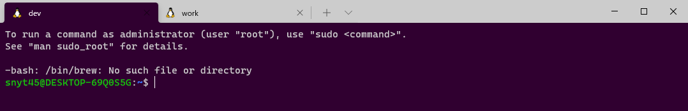
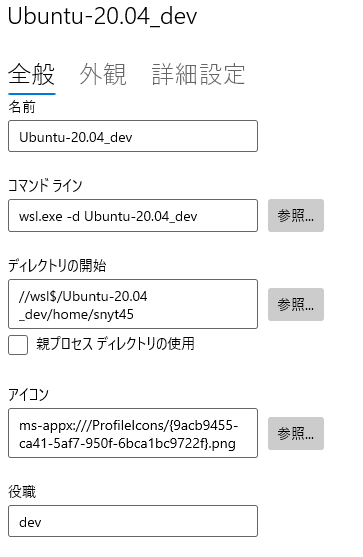
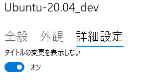

## 変更後のWindows Terminal

最終的にはこのような状態を目指します。  



## 最終的なWindows Terminalの設定

settigns.json

```
    "profiles": 
    {
        "defaults": {},
        "list": 
        [
            {
                "background": "#300030",
                "guid": "{a32514ec-a5a8-556e-a6a1-a1d48b6f0d84}",
                "hidden": false,
                "name": "Ubuntu-20.04_dev",
                "source": "Windows.Terminal.Wsl",
                "startingDirectory": "//wsl$/Ubuntu-20.04_dev/home/snyt45",
                "suppressApplicationTitle": true,
                "tabColor": "#300030",
                "tabTitle": "dev"
            },
            ...
        ]
    },
```

## タブ色を変更する

`tabColor`で設定できます。  

```
"tabColor": "#300030"
```

## 背景色を変更する

`background`で設定できます。  

```
"background": "#300030"
```

## タブ名を変更する

`tabTitle`で設定できます。  
Ubuntuの場合は、`suppressApplicationTitle`をtrueに設定する必要がありました。  

```
"suppressApplicationTitle": true,
"tabTitle": "dev"
```

GUIから設定する場合

日本語訳？がおかしいですが、役職の欄に入力した内容がタブ名になります。  



タイトルの変更を表示しないをオンにします。  
`suppressApplicationTitle`にあたります。  



## 参考

[Windows ターミナルのタブのタイトルの設定 \| Microsoft Docs](https://docs.microsoft.com/ja-jp/windows/terminal/tutorials/tab-title#set-the-shells-title)

[Windows Terminal Tips \- Qiita](https://qiita.com/whim0321/items/6a6b11dea54642bd6724)
