diddyworksのエンジニアをやっています。  

最近、diddyworksのエンジニアチームで新しく「コツコツ運動」というものをやっています。  

コツコツ運動とは、**「毎週15分やりたいことに取り組む時間」を設けて中長期的に開発の生産性向上をしていこうと運動**です。  

現在、開発支援をしつつ自社開発をするという体制なのでどうしても自社開発の時間が限られているというジレンマがあり、その中で**エンジニア同士で話をしたときに「あれ改善したいよね」という話を出るものの中々着手できずにいました。**  

そこで、**自社開発の日に5分でも10分でも改善する時間を設けようと提案したところ爆速で取り入れてもらえました。**  
(弊社のバリューの一つに「やってみる」というものがあり、これも弊社のいいところですね。)  

そして、コツコツ運動を始めたばかりなのですが、タスク管理にTrelloを使っており、  
**ガントチャートはNotionで、タスク管理はTrelloとバラバラになっていたり、Trelloじゃないとダメなわけではなかったみたいなのでこの機会にClickUpを導入してみました。**  

## 無料で使えるの？

企業で導入するときにまず気になるのが料金まわりですよね。  

無料で以下の機能が使えます。  

- 100MBのストレージ
- 無制限のタスク
- **無制限のメンバー**
- 二段階認証

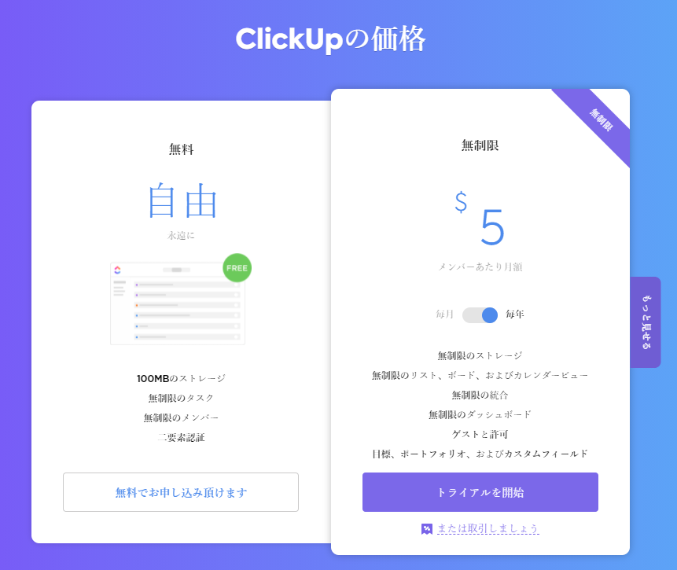

ClickUpのすごいところが**無料でメンバー無制限使える**ということです。  
メンバー数が増えてきたら有料になるツールが多い中で、メンバー無制限で使えるというのは大きいです。  

また、無料だとスペース数は5つまでと制限はありますが、とくに問題にはならなそうです。  

完全な料金の比較を見たい方は公式サイトを参照してください。  

[ClickUp™ Pricing \| Free Forever, Unlimited, & Business Plans](https://clickup.com/pricing)

## どこまで使えるの？

次に気になるのが無料でどこまで使えるの？という点でした。  

ここに関してはまだ導入したばかりでとりあえずコツコツ運動のタスク管理で使ってみようという感じなのですが、  
**実際に皆に触ってもらった感じだと「UIがおしゃれ」「多機能」という感じで良さそうという感想でした。**  

そこで実際に触ってみた機能について触れていきたいと思います。  

### ユーザー招待

まず、ユーザー招待です。  

招待画面右上の欄に招待したいユーザーのメールアドレスを入力して「Invite」とすると、  
招待メールを送信できます。  

権限もAdminとMemberが設定できます。  

いまはとりあえず全員が触れるようにAdmin権限にしています。  

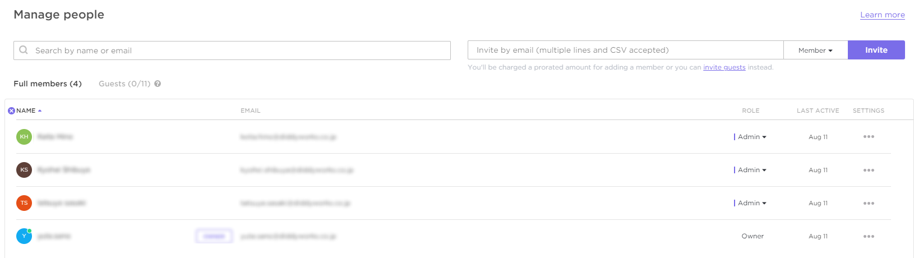

### スペース
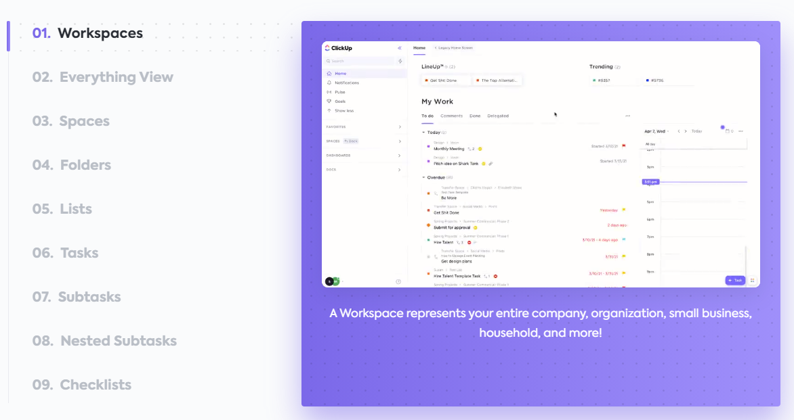

ClickUpは階層構造が作れます。  

詳しくは公式サイトを参照してください。  

[ClickUp's Hierarchy \- Structuring Projects in ClickUp™](https://clickup.com/hierarchy-guide)

ざっくりですが、ワークスペースが企業単位でワークスペースのスペースが複数作れます(無料だと最大5つまで)。  

スペースはチームや部門などの単位で分けたりするようです。  

このスペースの中に、タスクを管理するためのリストを作成することでタスク管理を行えます。  

スペースの設定画面では、  

- スペース名
- オーナー
- アバター
- 共有先
- タスクのステータス
- Apps
- ビューのデフォルト設定

などの設定を行えます。  

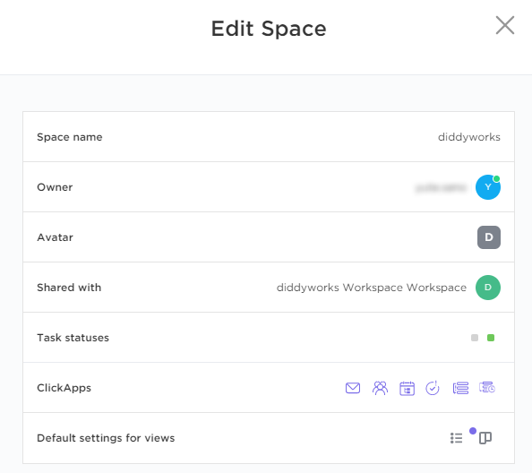

ここで重要なのが、**「タスクのステータス」「Apps」「ビューのデフォルト設定」の3つです。**  

#### タスクのステータス
ワークスペース毎の設定になります。  

このようにステータスをカスタムすることが可能です。  

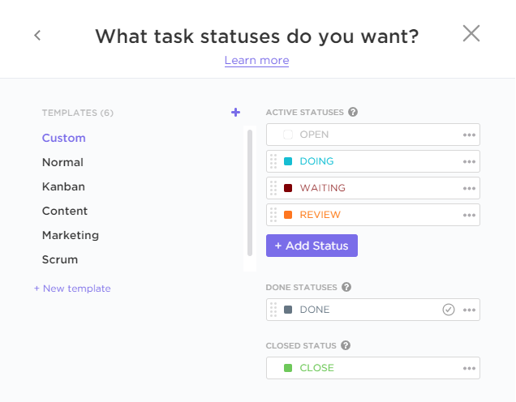

#### Apps

Work In Progress Limitsというアプリ以外は無料プランでも有効にできました！  

無料でこれだけの機能が使えるのはすごい…  

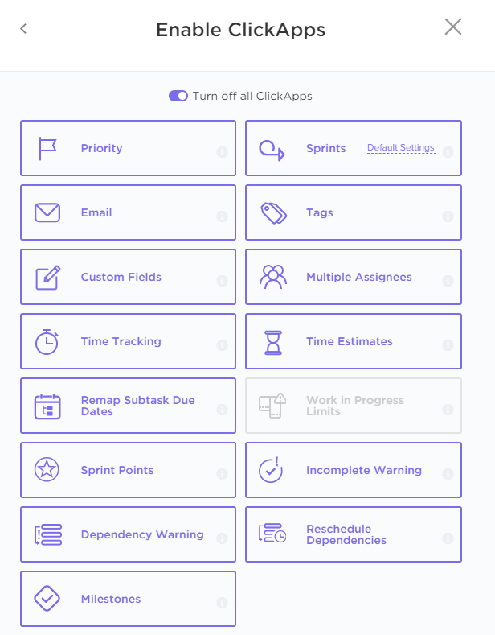

#### ビューのデフォルト設定

**Listビューが必ずデフォルトビューになるようです。**  

それ以外のビューはチェックすると、新しくリストを作成する際に必ず作成されるようにできるみたいです。  

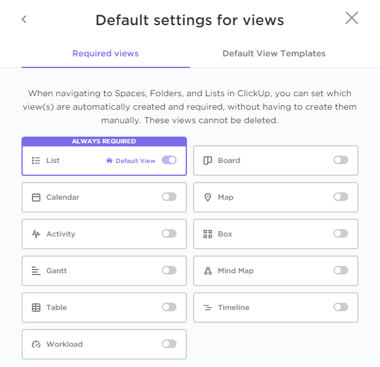

### 実際に試してみる

タスクをいくつか登録して、そのタスクに期限を設定したり、人をアサインしたりなど色々試してみます。  

そして、ビューをいくつか追加してみます。  

#### List

**こちらのビューが基本ビューになります。**  

ステータス毎にタスクが一覧できて見やすいです！  

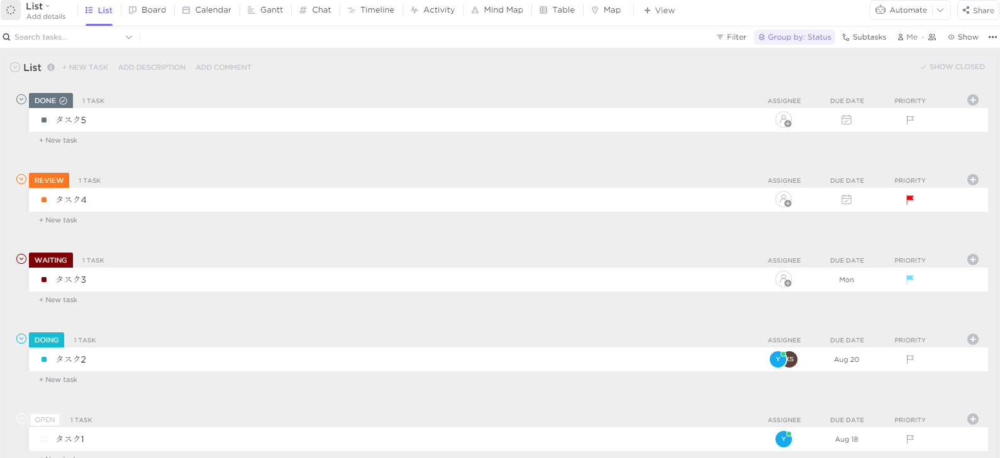

#### Board

よくあるカンバンです！  

タスクを登録すると、Boardビューではカンバン表示に様変わりです！  

もちろん、Boardビューでステータスを変更すると、Listビューでも変わっています。  

まじですごいです！  

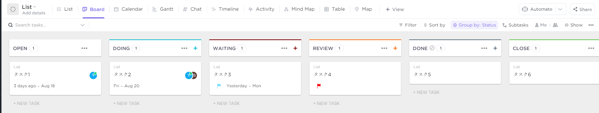

#### Box

**誰がどのタスクを持っているのかというのが一目でわかります！**  

アップグレードすれば誰がどのくらい過負荷などのレポート機能もあるようです。  

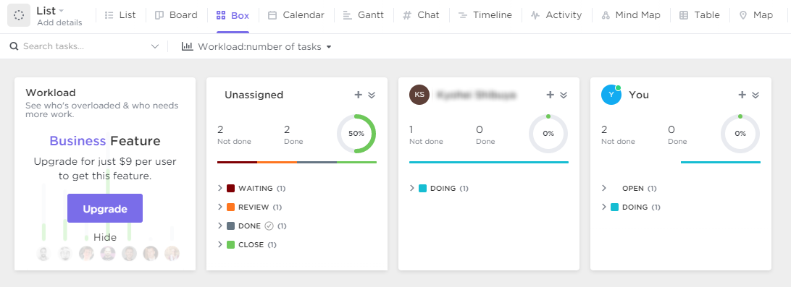

#### Calender

カレンダーです！  

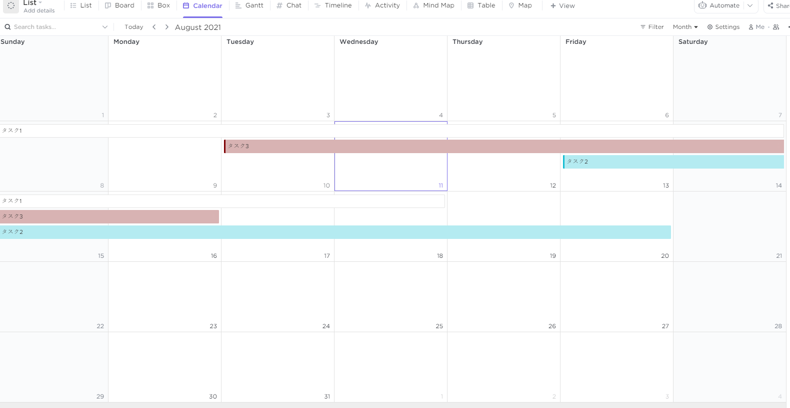

#### Grantt

ガントチャートです！  

**これでClickUp内で今まで別々のツールに分けていたことを一元管理できます。**  

しかも簡単に日付の調整ができます。  

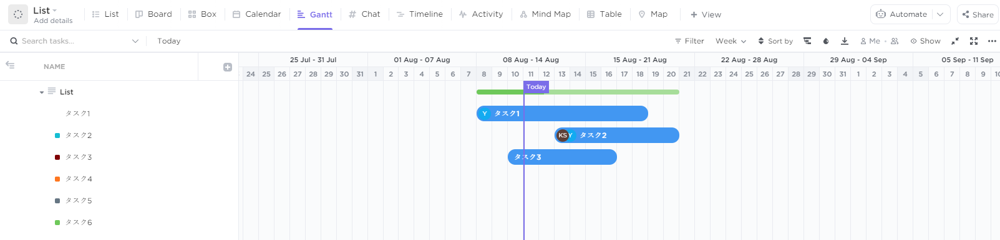

#### Chat

チャット機能までも…

ただ、チャットはSlackでよさそうですね。  

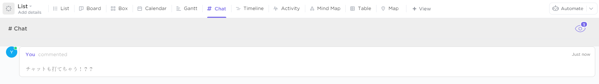

#### Timeline

タイムラインです。  

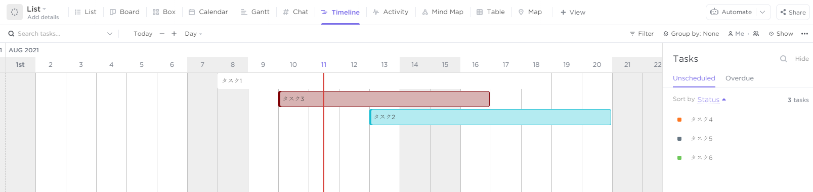

#### Activity

タスクの変更履歴もアクティビティビューで追うことができます。  

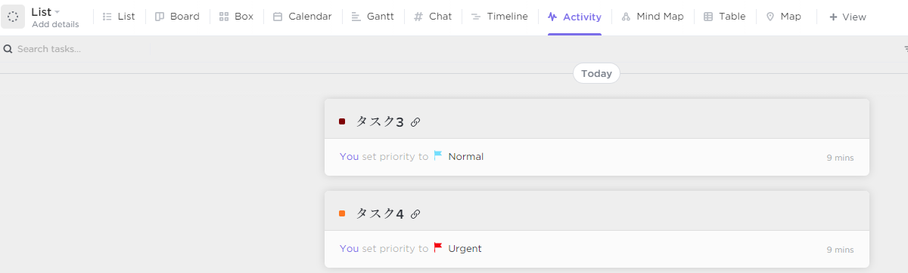

#### Table

**スプレッドシートなどでタスク管理していた人にはなじみそうですね！**  

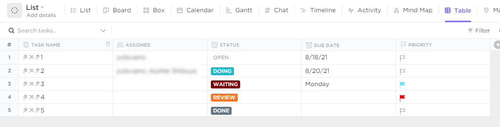

## まとめ

**ClickUpの簡単な紹介でしたが、実際に触ってみてここまで無料できるの！？という気持ちしかないです。**  

ここで紹介しきれていないものもまだまだあります。  

例えば、ドキュメント機能や通知画面など、GitやSlackなどのアプリとの連携、サブタスクの作成や依存関係、優先度付けなど  
基本的にタスク管理でやりたいなーと思ったことはできる印象です。  

また、Automationという機能もあり、IFTTTのような何かをトリガーにして何かをさせるような機能もありほんとに何でもできるツールだなーと印象です。  

そして、無料だと一部の機能は制限されますが、タスク管理するうえでのコア機能はほとんど使えるのですごいなと思いました。  

ひとまずはコツコツ運動でClickUpを使ってみたいと思います。  
