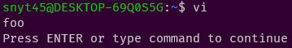

可読性をあげるため、vimrcを分割する方法について調べていると`runtime!`して読み込む方法が良さそうだった。  

例えば、次のような感じ。  

```vimrc
runtime! init/*.vim
runtime! plugins/*.vim
```

`runtime!`がどういう挙動するか不明だったので、  
実際に`runtime!`を使ってファイルが読み込まれるのかの検証をしてみた。  

## runtime!

構文
```vimrc
runtime[!] [where] {file}
```

- `!`をつけると、見つかったファイル全てのファイルを読み込む
- `!`をつけなければ、最初に見つかったファイルだけを読み込む
- `[where]`を省略すると、`runtimepath`のディレクトリ以下の`{file}`を検索する
- `{file}`がワイルドカードを含んでいると展開される。

## runtimepathを調べる

`:set runtimepath`で調べることができる。  

`:set runtimepath`の結果は以下の通り。  

```
runtimepath=~/.vim,~/.vim/pack/mypackage/start/vimdoc-ja,/var/lib/vim/addons,/etc/vim,/usr/share/vim/vimfiles,/usr/share/vim/vim81,/usr/share/vim/vimfiles/after,/etc/vim/after,/var/lib/vim/addons/after,~/.vim/after
```

## runtime!でファイルが読み込まれるか検証する

vimのディレクトリ構成は以下を想定している。  

`~/.vim/vimrc`から`runtime!`して`~/.vim/init`以下の`foo.vim`を読み込むか検証する。  

```
.vim
  ├── vimrc # vimrc
  ├── init # vimの基本設定
  │   └── foo.vim
```

読み込むためのファイルを`~/.vim/init/foo.vim`に作成。  

`foo.vim`は`echo "foo"`とする。  

`~/.vim/vimrc`は以下のようにする。  

```vimrc
runtime! init/foo.vim
```

この状態で、`vi`としてvimを開いてみると、`foo`と出力されているので読み込まれていることが確認できた。  



ディレクトリを指定する際は、`runtimepath`配下のディレクトリから指定すればよさそうだ。  

例えば、`~/.vim/init/foo.vim`を読み込む場合で、`runtimepath`が`~/.vim`の場合は`runtime! init/foo.vim`とすればよい。  
