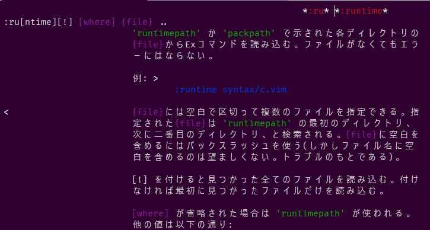

最近dotfiles管理周りを色々やってます。  

このタイミングで何度かあきらめているVim周りも整備してVimで開発もできたらいいなーと思いました。  

選択肢としては、NeoVimかVim8かみたいなところで**シンプルなVimの機能を使ってちゃんと理解しながら整備していきたい**と思ったのでVim8で設定等をやっていこうと思っています。  

## プラグイン管理をどうするか問題
次に、プラグイン管理をどうするかで悩みました。  

色々調べてみて、  

- プラグイン管理をするためのプラグインを入れたくない
- Vim8からは標準の機能でパッケージ管理ができる

という点で、**今回はVim8の標準のパッケージ管理を使ってプラグインを管理していこうと思います。**  

## Vim8標準のパッケージ管理

[Vimパッケージを使う](https://vim-jp.org/vimdoc-ja/repeat.html#packages)

Vim8標準のプラグインマネージャーは、特定のディレクトリ配下に配置されているプラグインを読み込む機能を持つ。  

- `~/.vim/pack/*/start/*`
  - 起動時に`runtimepath`に追加され、ロードされる。
- `~/.vim/pack/*/opt/*`
  - `:packadd myplugin`でロードできる。任意のタイミングでロードできる。

例えば、次のようなイメージ

`mapackage`と`myplugin`の部分はどんな名前でもよい。  

```
.vim
└── pack # vim8標準のパッケージ管理
    └── mypackage # どんな名前でもOK
        └── start 
        │   └── myplugin # 起動時に読み込プラグインを配置
        └── opt
            └── myplugin # :packadd mypluginでロードするプラグインを配置
```

`opt`配下のプラグインは任意のタイミングで読み込みたいプラグインを配置するようだ。  

インストール、更新、削除するのに便利なコマンド等はないみたいだが、シェルスクリプトで代用している記事もいくつか見たのでシェルスクリプトで代用する方向で一旦よさそう。  

## Vim8の標準パッケージ管理でvim-jaプラグインを入れる

Vim8のパッケージ管理について大体わかったので、手始めにvimのhelpコマンドの説明を日本語化してくれるvim-jaというプラグインを入れてみる。  

```
# パッケージ管理のディレクトリ作成
mkdir -p ~/.vim/pack/mypackage/start

# vim-jaプラグインをダウンロード
cd ~/vim/pack/mypackage/start
git clone https://github.com/vim-jp/vimdoc-ja.git

# vimrc作成
cd ~/.vim
vi vimrc
```

`vimrc`に設定を追加する。  

```vimrc
set helplang=ja,en
```


## :help runtimeで日本語化されたことを確認する



## まとめ

Vim8の標準のパッケージ管理を使って、vim-jaプラグインを入れてみた。  

特定のディレクトリにプラグインを入れるだけなのでシンプルで簡単だった。  

インストール、更新、削除まわりやdotfiles管理する場合はシェルスクリプトが必要になりそうだが、ひとまずよさそうな感じだ。  

## 参考

[プラグインマネージャーからVim8標準のパッケージ機能に移行した話 \| oliva Blog](https://blog.oliva.co.jp/index.php/2019/11/19/1109/)

[Vimをちゃんと知りたい！だからHelpを日本語化する！ \- Qiita](https://qiita.com/issuy/items/919d76ac1b94dc56a77e)

[Vimヘルプを日本語化 \| ゴリラの技術ブログ](https://gorilla.netlify.app/articles/20190427-vim-help-jp.html#%E3%83%95%E3%82%9A%E3%83%A9%E3%82%AF%E3%82%99%E3%82%A4%E3%83%B3%E3%81%AB%E6%97%A5%E6%9C%AC%E8%AA%9E%E3%83%9E%E3%83%8B%E3%83%A5%E3%82%A2%E3%83%AB%E3%82%92%E8%BF%BD%E5%8A%A0)
