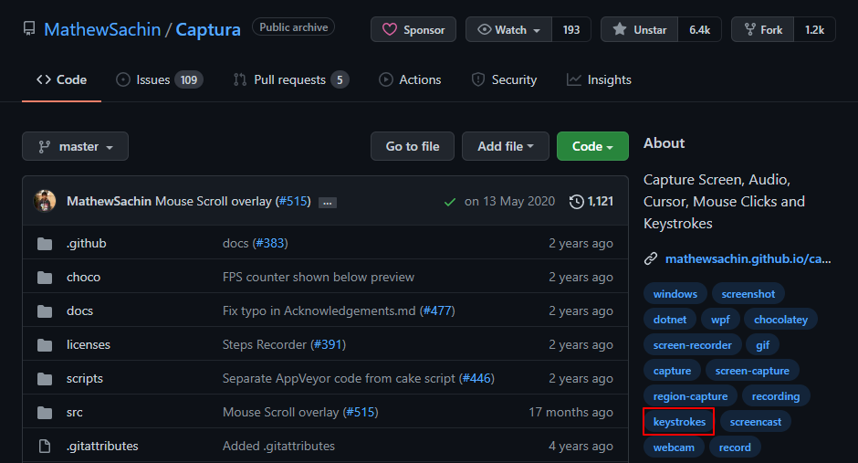
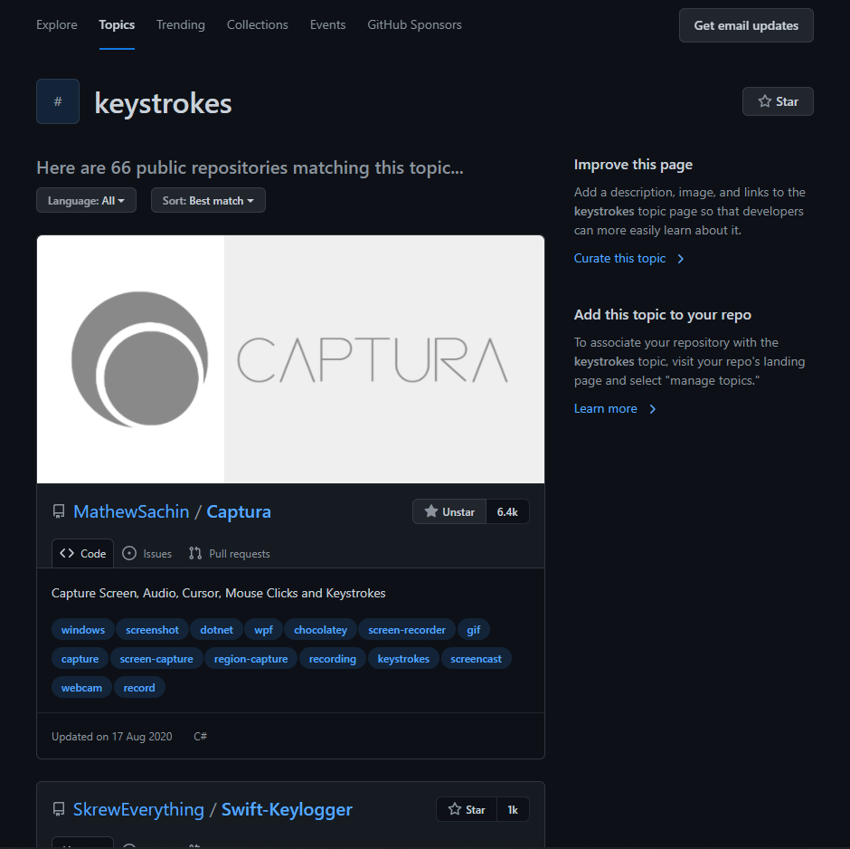
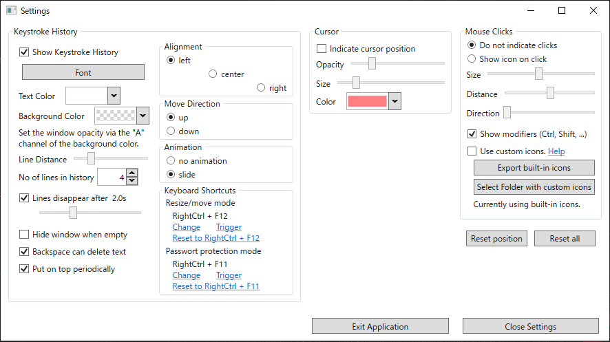
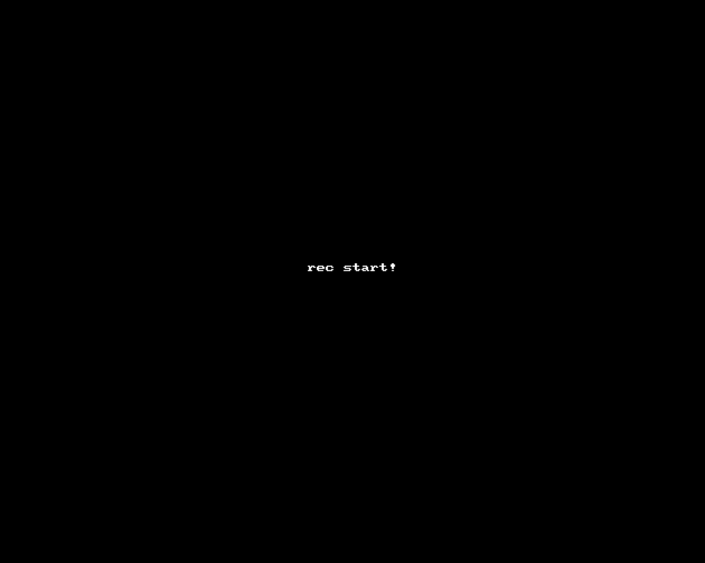

Vimに再入門しているのですが、記事を書くときに実演したものを紹介できたら良いなーと思いいい感じのものがないかなーと調べてやった良い組み合わせを見つけたので紹介していきたいと思います。  

## 今回の目的

- キーストロークを表示しつつターミナル操作を録画したい

## 試してみて今回の用途に適さなかったもの

紹介する前にせっかくなので使ってみたものの今回の用途に適さなかったものもあげておきます。  

### asciinema

[asciinema \- Record and share your terminal sessions, the right way](https://asciinema.org/)

結構昔から有名どころのようなので使ってみました。  

一度入れさえしてしまえば、`asciinema rec`でターミナル操作を録画することができ`exit`で録画終了することができるようになります。  

また、アカウント連携すればサービス上に録画したものをアップしてくれるので振返りたいときにも便利です。  

サービス上から共有したり、ブログに埋め込んだりすることもできるのでブログ側の容量を考えなくて良い点からかなり使い心地はよかったのですが、キーストローク表示しつつ録画することができなかったのであきらめました。  

ちなみに以下の記事では実際にasciinemaを使用しています。  

[Vim8のファイラー周りを充実させる • Small Changes](https://snyt45.com/posts/20210923/vim8-failer/)

### Orakuin

[ORAKUIN キー入力・マウス操作視覚化\(可視化\)ツール](https://orakuin.eksd.jp/)

こちらはキーストローク表示する用でつかってみましたが、動作が微妙でした。  

### KeyCastOW

[brookhong/KeyCastOW: keystroke visualizer for Windows, lets you easily display your keystrokes while recording screencasts\.](https://github.com/brookhong/KeyCastOW)

KeyCastというものがMacであるのですが、そちらのWindows版みたいなものです。  

こちらも良いのですが、Windowsで実行するときにWindowsDefenderでトロイの木馬と間違えられてexeファイルが削除されてしまうこともあり、ちょっと気になってしまったので使うのをあきらめました。  

使うときに参考にした記事。  

[【動画配信】キーボード入力内容を画面に表示するKeyCastOW \| ふるのーとさんのブログ](https://fullnoteblog.com/keycastow/)

### Captura

[Captura](https://mathewsachin.github.io/Captura/)

ついに見つけた！と思ったほどによかったCaptura。  

こちらの記事が参考になります。  

[動画キャプチャソフトCapturaの使い方 \| IT業務で使えるプログラミングテクニック](https://kekaku.addisteria.com/wp/20190412153241#toc2)

Capturaは録画機能だけではなく、キーストローク表示やマウス操作表示なども機能としてもっていて今回の目的がスムーズに実行できました。  

ただ、**数秒のGIFなのに容量が50MBくらいになってしまいました。**  

ffmpegを入れて、ffmpegで形式をGIFにして品質やFPSをいじってみたのですが容量問題が解決されずあきらめました。  

その問題がなければ神アプリでした。  

また、GitHubのリポジトリを見に行くとアーカイブ？されており、開発も2020年から止まっているぽかったのもあります。  

[MathewSachin/Captura: Capture Screen, Audio, Cursor, Mouse Clicks and Keystrokes](https://github.com/MathewSachin/Captura)

## 今回の目的なら最高の組み合わせを見つけた。

それが、**LICEcap + Key-n-Strokeの組み合わせ**です。  

■LICEcap  
[Cockos Incorporated \| LICEcap](https://www.cockos.com/licecap/)

■Key-n-Stroke  
[Key\-n\-Stroke
](https://github.com/Phaiax/Key-n-Stroke)

LICEcapは昔からあるアプリでWindowsでGIF動画を録画するのに最適な選択肢です。  
こちらは前から知っていてよく使っていましたがシンプルで扱いやすいアプリです。  
**保存されるGIFの容量は数百KB程度**で容量問題も解決しました。  

次にKey-n-Strokeです。  
こちらはほんとにたまたま見つけたキーストローク表示のためアプリです。  

Capturaのタグの所に「keystrokes」というタグがあり、そこをクリックするとこのタグを付けているリポジトリ一覧が表示されるのですがそこから見つけました。  

**私はキーストローク表示用で使っていますが、exeファイルを落とすだけで使えてキーストローク表示、マウスカーソルハイライト表示、クリック表示も行うことができるミニマムで使い勝手の良いアプリです。**  

↓Key-n-Strokeをいい感じに設定した後の設定画面

↓LICEcap + Key-n-Strokeの組み合わせで録画したGIF動画。  

本当に細かいことをいうと、`:`が`;`と表示されたりというのはありますがほんとに微々たることなのでそれを踏まえてもかなり良いアプリです。  

## まとめ
Windowsでキーストローク表示しながらターミナル操作を録画する方法が自分の中で良いものがなくて困っていたのですが、LICEcap + Key-n-Strokeの組み合わせは自信を持ってよいと思える組み合わせでした。  

これでVimの操作したGIF動画を快適に作成することができます。  
