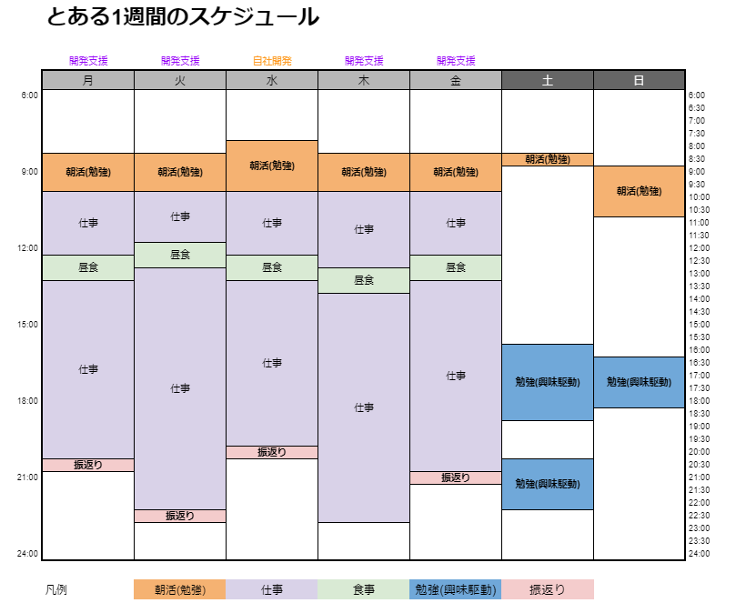
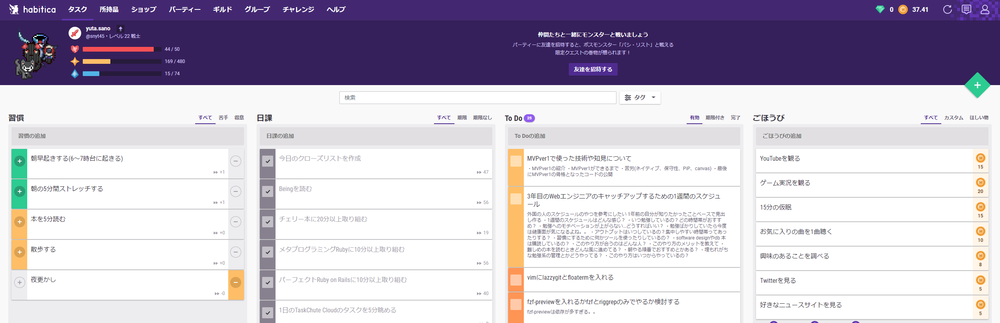

2019年4月から未経験でWebエンジニアとして働きはじめて今年の4月で2年が経ち、Webエンジニア3年目になりました。  
今はエンジニアになって2社目のスタートアップで働いています。  

**未経験の頃はフルリモート？そんなの無理無理…と思っていましたが、努力とご縁の結果今の会社ではフルリモートで働かせて頂いていて、働く環境はどんどん良い方向に向かっているなーと感じます。**  

とはいえ、そんな私も2年前は未経験でしたし  
エンジニアとしてはまだまだ未熟だなと思い日々技術のキャッチアップをしています。  

**恥ずかしながら、今の会社に入るまでは波が合ってやる気が出たときやるという感じでモチベーションに左右されてました…**

今の会社に入ってからは、環境のパワーを上手く使い周りのエンジニアからいい影響や刺激を受けてインプットやアウトプットの時間は安定してきました！  

結構いい感じに勉強できてるなー！と思ったので、  
**この機会に「エンジニアはいつ、どんな風にキャッチアップしているのか？」** という1年前の自分が知りたかっただろうという事について  
自分の整理も兼ねて書いていこうかなと思います。  

へえ、こういう人もいるんだーくらいの感じで読んでもらえればと思います。  

## 1週間のスケジュールはどんな感じ？

こんな感じです。  
普段からTaskChuteCloudを使って、勉強や仕事系の時間だけ記録しているので  
そちらを元に実際にとある1週間のスケジュールを抽出してみました！  

この1週間は開発支援先の開発が忙しめで結構残業していますが、  
それでも**コンスタントに勉強できていて大体14時間くらいは勉強に時間を当てられていました。**  

## 勉強するのはどの時間帯がおすすめ？

**圧倒的に朝がおすすめ**です。  
仕事が始まる前なので誰からも邪魔されずに勉強に取り組めます。  

今までは夜型で仕事が終わった後に勉強をしていたのですが、  
**その日の仕事がいつ終わるかは日によって変わるのでリズムが崩れますし、何より疲れているので全然頭に入ってきませんでした…**  

今は朝に回せばいいやーという感じで夜は夕食食べて後は自由に過ごして眠くなったら眠るという感じで気楽に過ごしています。  

## 朝活(勉強)って何しているの？

よくぞ聞いてくれました！  
**朝活はもうルーティン化していて習慣の力を借りて、無理なくやれています。**  
そこらへんのコツや工夫についても話したいと思います。  

朝は起きたら、PCを起動してTaskChuteCloudを開きます。  
すると既に登録してあるルーチンタスクが並んでいるのでそれに沿ってやるだけです。  

私が登録している朝のルーチンタスクは次の通りです。  

- 朝の5分間ストレッチする
- 今日のクローズリストを作成
- Beingを読む
- チェリー本に20分以上取り組む
- メタプログラミングRubyに10分以上取り組む
- パーフェクトRuby on Railsに10分以上取り組む
- 朝トイレ

簡単な流れをいうと、朝軽く音楽をかけながらストレッチをして体をほぐしてから  
今日一日のクローズリストをチェックリストに沿って作成しています。  
クローズリストは今日一日やることのタスク一覧みたないものを作ります。  
(**このタイミングで洗い出しておくことで仕事が始まってからスムーズにタスクに着手できます**)

作り終えたら、Beingを読むというタスクを入れています。  
Being(ありたい姿)を毎朝読むようにしています。  

**それが終わったら仕事が始まるまでは完全に自由で集中できる時間ができます。**  
あとは毎日勉強すると決めた内容についてキャッチアップします。  

勉強のコツとしては、まず**最初に軽めの内容から始めること**です。  
最初から重い内容だと中々筆が進みません…  
それから、私の場合は**学校の時間割のように若干違うもの3つを順繰り時間を決めてキャッチアップします。**  
これは最初は適当にやっていただけなのですが、**どんなに難しくても10分、20分やったら内容が変わるので気分転換になって案外嫌にならないことに気づきました。**  

この方法で既に**SQL入門の本も読了(手も動かした)** できています。  

今までは気分が乗ったときに一気にやるぞー！という感じだったのですが、モチベーションに左右されるとなかなか継続に結びつかなくて良くなかったなーと…

また、夜型で朝起きるの大変だなーと思っていた私もこの方法だとうまくいって続いています！  

**習慣ってスゴイ！**  

## 勉強へのモチベーションが上がらない…どうすればいい？

先ほどの通りでモチベーションに左右されないようにまずは10分でも読むというルーチンタスクを作って、やるだけです。  

**それでもモチベーションが上がらない日や忙しくて時間が取れない日はいつも10分の所は3分だけでもと着手するのがコツ**です。  
(それも難しいなーというときは1行読むだけでも全然いいです！それくらいのハードルの低さでいいと思ってます。)

モチベーションが低い日は誰だってあるので、とりあえず着手するようにしておくと次の日は案外前向きに着手できたりします。  
それを続ければ、習慣になってだいぶ楽に着手できるようになってきます。  

## 難しめの本を読むときどんな風に進めてる？

これも朝活の所で説明した通りで、毎日10分取り組むルーチンタスクとして登録して、時間割の中で一番最後に持ってきます。  
**全てが自分の身の丈に合っていなくて難しいやつだと切り替えも難しいので、簡単→普通→難しいの順番で時間割を組むのがおすすめです。**  

## アウトプットはいつしているの？集中しやすい時間帯ってあったりする？

**アウトプットに関しては完全に筆が乗ったとき駆動です…**  

最近会社でも採用に力を入れていてネタはなんでもいいのでブログ記事を書こうという感じなので、  
その波に乗れたのもあり、たまにブログを書いていたのもあり**今クォーターはQiitaも合わせると21記事書いてました！**   

スケジュールの中で**勉強(興味駆動)** とありますが、休日は仕事に縛られずに今自分が興味ある技術についてキャッチアップしています。  

**この時間は結構自分が好きで活動している時間なのでキャッチアップする中で「これはスゴイ!」だったり「これは記事書きたい」衝動が生まれやすくそのタイミングでさっとアウトプットすることも多いですね。**  

## 習慣にするために何かツールを使ったりしているの？

何度か登場しましたが、**[TaskChuteCloud](https://taskchute.cloud/)** を使っています。  

[3回も挫折した私がTaskChute Cloud\(タスクシュートクラウド\)に再入門した話 • Small Changes](https://snyt45.com/posts/20210715/taskchute-cloud/)
という記事も書いているので参考にどうぞ。  

また、合わせて **[Habitica](https://habitica.com/)** というゲーム感覚のタスク管理ツールを併用しています。  
こちらはTaskChuteCloudと二重管理にはなりますが、埋もれがちな第2領域(勉強など)のタスク管理で使っています。  

習慣・日課・ToDo・ごほうびとあり、習慣にしたいこと、日課にしたいことを登録してそれができたらチェックするような感じです。  

第2領域について抜き出すことで意識することができますし、RPG要素がありこなしていくとレベルもあがるので楽しいです。  
日課をさぼりすぎるとレベルも下がってしまうのでモチベーション管理にも寄与してくれます。

ToDoもそのとき思った第2領域系でやりたいことをメモしておきます。  
結構記事系のタイトル思いついたら書いて、そのタスクにメモも書けるのでメモに見出しとかを思いついたら書き入れていって、  
記事を書く際の参考にもしています。  

ごほうびは使っていません…

## 勉強ばかりしていたら今度は健康面が気になるよね。。

そうなんです…

ここは課題なので、平日の夜は比較的何もないのでステッパーを買って自宅で運動できる環境を整えてみようかななどと考えています。  

## まとめ

どうだったでしょうか。  
結構リアルに細かく色々書き出してみました。  
今回紹介したやり方は自分のように一気にはできないけど、コツコツならできるぞ！みたいな人には結構向いているやり方なのかなーと思います。  
誰かひとりでも参考になれば嬉しいです。  
