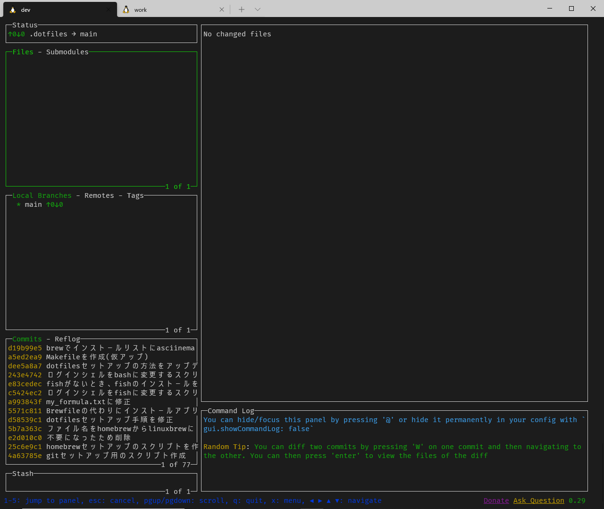
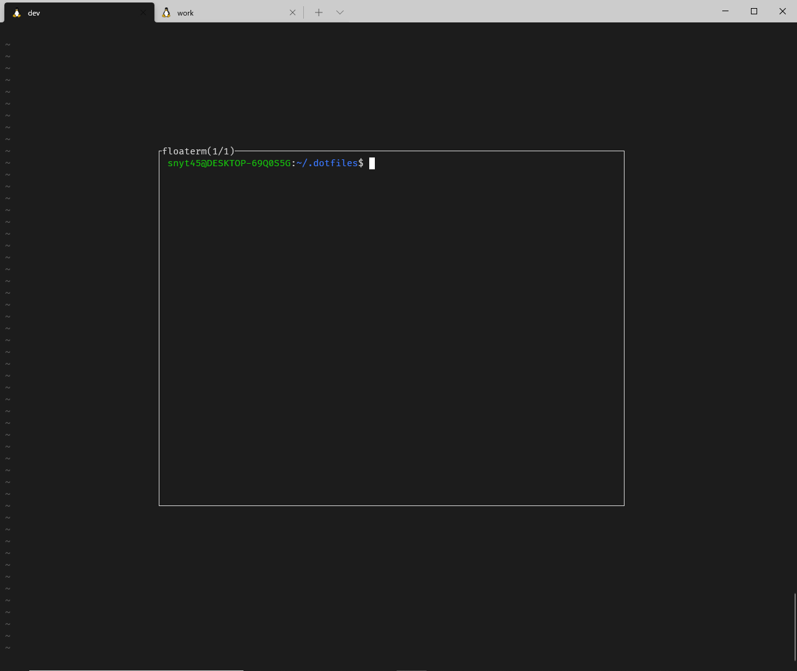

## 前置き
[lazygit](https://github.com/jesseduffield/lazygit)というTUIツールをご存じですか？  
こちらはターミナル上で`lazygit`と呼び出すことで使うことができます。  

下記のようなUI(個人的には超好みなUI)でGIT操作をすることができます。  



このlazygitをvimから呼び出せたら最高なのに…と思っていました。  

そこで色々調べているときにvim-floatermというvimのプラグインを知りました。  

## vim-floatermとは

[vim-floaterm](https://github.com/voldikss/vim-floaterm)は、vimからterminalを呼び出すことができるのですが  
terminalをフローティングウィンドウで表示してくれるプラグインです。  

下記のような感じでvimからterminalをフローティングウィンドウで表示してくれます。  



lazygit + vim-floatermを組み合わせれば最高にかっこいいgit操作環境が出来上がると思っていました。  

## vim-floatermが動かない！？

vim-floatermのREADMEを見る感じだと、vim8でpopupwinという機能が動けば良さそうです。  

この時点では、vimのバージョンは8.1で確かpopupwinはvim8からの新機能と思っていたので、  
なぜフローティングウィンドウにならないのかなーと思っていました。  

下記の記事の通り、`:echo has('popupwin')`を実行すると`0`が返ってきており無効だったのが原因でした。  

> coc.nvimに限らずVimのLSPクライアントを活用していくとき、popup-windowが有効になっていると便利です。 コマンドラインモードで :echo has('popupwin') を実行したとき、 1 が返ってくると有効になっています。
> [LSPクライアントをcoc\.nvimにした話 — kashew\_nuts\-blog](https://kashewnuts.github.io/2020/04/08/migrated_lsp_client_to_coc_nvim.html#popup-window)

## 対処法：popup-windowを有効にする

popup-windowを有効にするためにはバージョンを8.2にアップグレードするのが手っ取り早そうです。  

vim8.2は最新バージョンで通常の方法だと公式リポジトリには反映されていないため、下記方法でアップグレードを行いました。  

[Ubuntu: Vimの最新バージョンインストール \- Qiita](https://qiita.com/Fell/items/8619385da8e09a59c787)

`:echo has('popupwin')`を実行すると、`1`が返り有効になりました。  

これでやっとvim-floatermが動くようになりました！  

## 簡単なデモ

vimからterminalをフローティングウィンドウで呼びだしています。  

さらに呼び出しているのはterminalなのでterminal上で実行できるlazygitも呼び出すことができます。  

デモでは、  

- floatermの表示/非表示切り替え
- floatermのウィンドウ複数作成
- floatermのウィンドウ移動(next/prev)
- floaterm → lazygit起動

などを行っています。  


## vim-floatermの設定

- ターミナルモード時のショートカットキーの設定をしています。
- vim終了時にfloatermのインスタンス全てを必ずキルする設定をしています。

```vimrc
tnoremap <silent> <leader>tn <C-\><C-n>:FloatermNew<CR>
tnoremap <silent> <leader>[ <C-\><C-n>:FloatermNext<CR>
tnoremap <silent> <leader>] <C-\><C-n>:FloatermPrev<CR>
tnoremap <silent> <leader>tt <C-\><C-n>:FloatermToggle<CR>
tnoremap <silent> <leader>td <C-\><C-n>:FloatermKill!<CR>

augroup vimrc_floaterm
  autocmd!
  autocmd QuitPre * FloatermKill!
augroup END
```

- vim-which-key側のキーマップに下記を追加しています。  

```vimrc
" t is for terminal
let g:which_key_map.t = {
      \ 'name' : '+terminal' ,
      \ 'g' : [':FloatermNew lazygit' , 'git'],
      \ 't' : [':FloatermToggle'      , 'toggle'],
      \ }
```

上記の設定のショートカットキーについて。  

| モード   | コマンド   | 説明                          |
| -------- | ---------- | ----------------------------- |
| normal   | `SPC + tt` | floaterm 表示・非表示切り替え |
| 〃       | `SPC + tg` | floterm上でlazygitを呼び出し  |
| terminal | `SPC + tn` | floaterm作成                  |
| 〃       | `SPC + t[` | 次のfloatermへ                |
| 〃       | `SPC + t]` | 前のfloatermへ                |
| 〃       | `SPC + tt` | floaterm 表示・非表示切り替え |
| 〃       | `SPC + td` | 全てのfloatermをkill          |
