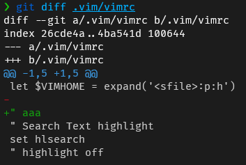
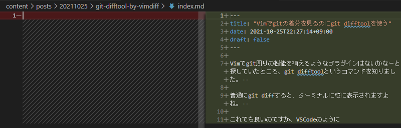
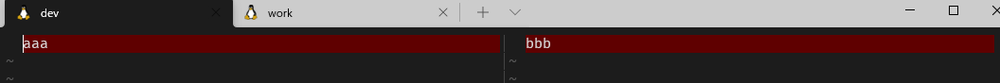

Vimでgit周りの機能を補えるようなプラグインはないかなーと探していたところ、git difftoolというコマンドを知りました。  

普通にgit diffすると、ターミナルに縦に表示されますよね。  



これでも良いのですが、VSCodeのように左に変更前のペイン、右に変更後のペインを表示する感じにしたかったんです。  



lazygitを使っているのでVimを終了してlazygitを開けばそれで済む話ですが、  
Vimでファイルを編集しながらサッとgitの差分を確認したいんです。  

ただ、fugitive.vimのような高機能はgit用プラグインは入れなくありません(その代わりとしてlazygitを入れたため)。  

どうにかシンプルなプラグインか何か別の方法ないか調べていたところgit difftoolというコマンドを知りました。  

## git difftoolコマンドとは

[Git \- git\-difftool Documentation](https://git-scm.com/docs/git-difftool)

git diffコマンドとは違って、git difftoolコマンドは一般的なdiffツールを使用して変更を表示してくれるコマンドです。  

**つまり、自分が好きなツールでdiffを見ることができるんです！**

公式ドキュメントを見ていると、そのツールの中に`vimdiff`という名称がありました。  

## vimdiffコマンドとは

Vim上で差分を表示するためのコマンドです。  

```
vimdiff file1 file2
```

のようなコマンドを打つとfile1とfile2の差分を表示してくれます。  

実際に使ってみると、VSCodeのように左に変更前のペイン、右に変更後のペインを表示されるじゃないですか。  



これは神機能です。  
しかもVimがあれば使えます。  

特に新しいものを入れずにいい感じにgitの差分を見るための準備が整いました。  

## git difftoolにvimdiffを使う方法

gitの設定を行います。  

```
# 差分ツールはvimdiffを使うように指定
git config --global diff.tool vimdiff
# 差分ツール呼び出す前のプロンプト表示オフ
git config --global difftool.prompt false
```

この設定をした状態で、Vimを開きます。  

**コマンドラインモードで次のコマンドを実行すると、vimdiffでgitの差分が見れました！**  

```
:!git difftool %:p
```


これでめでたし、めでたしなのですが、このまま`:qa`でvimdiffを閉じると`Press ENTER or type command to continue`というメッセージが表示されて、Enterを押さないと元のファイルの画面に戻れず、このワンステップどうにかしたいと思いました。  
※デモのGIFではすでに対応済みのため出てきません。  

## Vimで外部コマンド実行した後のメッセージを表示させない方法

色々調べて下記記事にたどり着きました。  

[How do I disable the "Press ENTER or type command to continue" prompt in Vim? \- Stack Overflow](https://stackoverflow.com/questions/890802/how-do-i-disable-the-press-enter-or-type-command-to-continue-prompt-in-vim)

最終的には下記のようにvimrcに設定を追記することで解決出来ました(なぜ、この書き方で解決したのかはわかっていませんが・・・)。  

```vimrc
map <F5> :wa!<CR>:!git difftool %:p<CR><CR>
```

これで`:qa`でvimdiffを閉じると出てきていたメッセージが表示されずにスムーズに元のファイルに戻ることができるようになりました。  

また、F5キーに割り当てたのでファイルを開いてF5キーを押すとgitの差分が見れるようになりました。  

## 番外編：WSLからgit difftoolでmeldを開く設定方法

difftoolの中にmeldというツールもありました。  
https://meldmerge.org/

シンプルで私好みでしたので、meldを使いたいなーと思い下記の設定をすることで  
WSLからWindowsにインストールしたmeldを開くこともできました(mergetoolというのもあることを知ったのでここでは設定しています)。  

```
[diff]
        tool = meld
[difftool "meld"]
        cmd = "'/mnt/c/Users/snyt45/scoop/apps/meld/current/Meld.exe' $LOCAL $REMOTE"
[difftool]
        prompt = false
[merge]
        tool = meld
[mergetool "meld"]
        cmd = "'/mnt/c/Users/snyt45/scoop/apps/meld/current/Meld.exe' $LOCAL $BASE $REMOTE --auto-merge"
[mergetool]
        prompt = false
```

meldをdifftoolにして動作させたときのデモ。  


GUIで差分を確認できるのとmeldの分かりやすい表示は良かったのですが、  
やはり起動に時間がかかるのとmeldを閉じないとVim側の操作ができなくなるため  
meldは使わずvimdiffを使っていこうと思います。  

ただ、色々試行錯誤してせっかく動いたので記録として残しておきます。  
