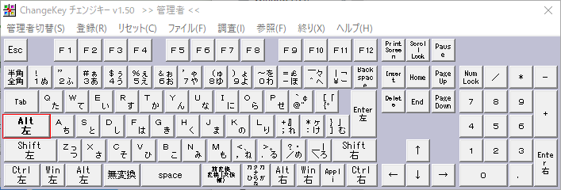

会社のエンジニアの方に下記記事を教えてもらい、個人的に「これは革命だな」と思ったので早速矢印キーを撲滅する設定をしてみました。

[\[Windows 10\] 矢印キーに指を伸ばすエンジニアはザコ！とバカにされた（Change KeyとAutoHotkeyの導入） \- Qiita](https://qiita.com/riekure/items/49b941fa5159f9948313)

私の場合は、ChangeKeyとPowerToys(Keyboard Manager)を使って設定を行いました。

## ChangeKey + PowerToys(Keyboard Manager)を使って矢印キーを撲滅する設定

### 最終的なキー割り当て

今回は、CapsLockキーにAltキーを割り当て、Altキーを軸にhjklを押すことで矢印キーと同じ挙動にしました。  

hjklはVimでの基本的な移動コマンドのため、かなり直感的で使いやすい操作方法になりました。  

| キー    | 実行されるキー |
| ------- | -------------- |
| Alt + h | ←              |
| Alt + j | ↓              |
| Alt + k | ↑              |
| Alt + l | →              |

### 1. ChangeKeyを使ってキーの割り当てを行う

キー割り当て自体はPowerToys(Keyboard Manager)でも行うことができるのですが、  
キー再マップでCapsLockキーをAltキーに割り当てると不具合で押しっぱなしになるためChange Keyを使用しています。  
(不具合が解消されたらPowerToys(Keyboard Manager)のみで実現できるのですが、残念です…)  

まず、Change Keyをインストールします。  
LZHファイルがダウンロードされるので展開するために7zipで解凍します。  

[「Change Key」非常駐型でフリーのキー配置変更ソフト \- 窓の杜](https://forest.watch.impress.co.jp/library/software/changekey/)

1. ChangeKeyを管理者として実行します。
2. Caps LockキーにAltキーを割り当てて保存します(設定を反映させるためにPCの再起動が必要です)。

### 2. PowerToys(Keyboard Manager)を使って、ショートカットの再マップを行う

MicrosoftがPowerToysという便利ツールを提供しているのでインストールします。  

今回はその中でもKeyboard Managerを使いますが、他の機能もとても便利なのでぜひ有効活用してください。  

[Microsoft PowerToys \| Microsoft Docs](https://docs.microsoft.com/ja-jp/windows/powertoys/)

1. Keyboard Managerを開き、ショートカットキーの再マップを行います。
2. 下記画像を参考に割り当てを行います。

## まとめ

Vimを使っていますが、なんだかんだ矢印キーを使うことが多くてキーボードを選ぶ際に矢印キーがあるものを選択肢としていましたが、この設定を入れれば矢印キーがないキーボードも選択肢に入れられますし、Vimのノーマルモード時やターミナルでの移動が便利になったので個人的には革命でした！  
