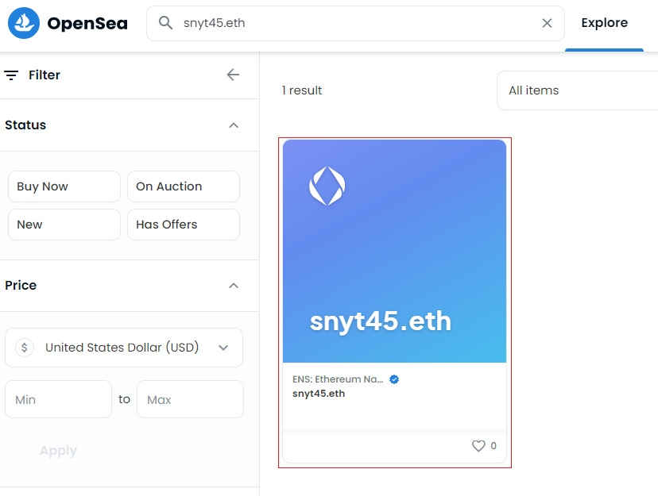
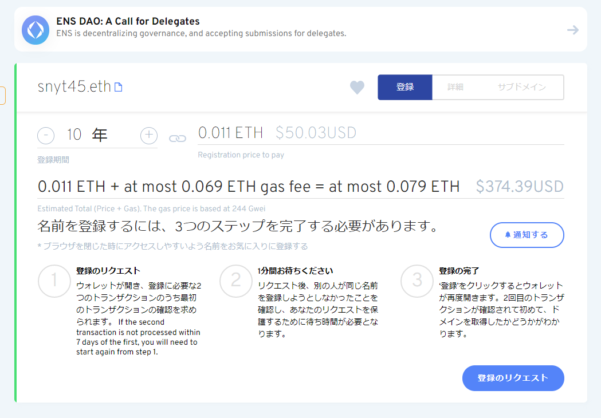

最近、副反応で寝込んでました。  

そのときに中田敦彦のYouTube大学でNFTとメタバース回がちょうど出たので見てました。  



NFT、メタバースという新しい波がきているなーと感じました！  

その中で色々調べているとENS(イーサリウムネームサービス)を知り、早速購入してみました。  

## ENS(イーサリウムネームサービス)とは

[ENS \| Ethereum Name Service](https://ens.domains/ja/)

新しいDNSのようなもので、暗号通貨の送信先などに使われる人間が読みにくいハッシュ値に「snyt45.eth」のような人間が読みやすいい文字列をマッピングしてくれるサービスです。  

またENSはNFTなので、ユーザー間で売却できることもできるのが面白いところです。  
(もう、お名〇.comみたない仲介業者を通す必要がないんです！)  

そのほかにも、ウェブサイトのドメインとしても使えるようです。  

さらに細かい説明はドキュメントを見るのが良さそうです。  
[Introduction \- ENS Documentation](https://docs.ens.domains/)

## ENSを10年分購入しました

私が取得したENSは「snyt45.eth」です。  

NFTなので、OpenSeaなどのNFTマーケットで検索して出てきますね！  

NFTはブロックチェーン技術を使っているため、誰が所有しているかもわかるところがまた面白いところです！  

## ENSを購入するときに困ったこと

ENSはブロックチェーン上のある情報を書き換える作業(トランザクション)が発生するため、ガス代(手数料)がかかります。  

現在はイーサリウムの取引が活発なのか、ドメイン代よりもガス代のほうが何倍も高かったです。。 

下記はドメインを取得するときのスクショです。  

「0.011ETH + at most 0.069ETH gas fee」とありますがガス代のほうが6倍も高いですね（笑）  

実際は上記のガス代ではなく、ガス代は手動で調整できるのですが、低めのガス代に設定したところトランザクションが失敗しました。  

これを数回繰り返したのですが、このときトランザクションを実行して失敗したときのガス代は返ってきません。。  

これは良い勉強代でした（泣）

## これから

ENSを暗号通貨のウォレットに登録することができたので、送金先が「snyt45.eth」になり圧倒的に分かりやすくなりました！  

ウェブサイトにも使えるみたいなので、ENSドメインのウェブサイトのページ公開などにチャレンジしてみたいなと思います。  
