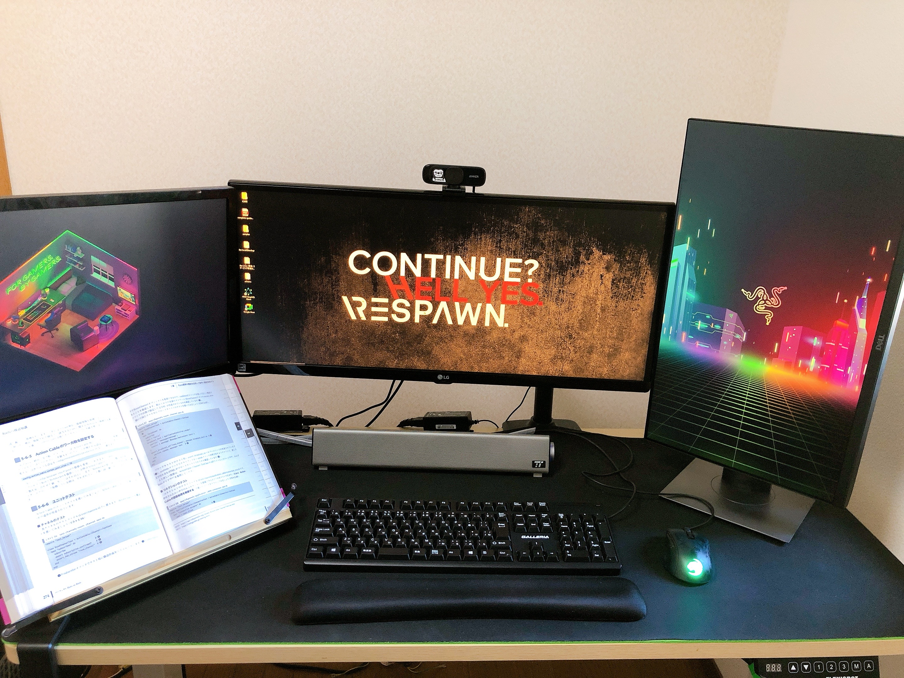
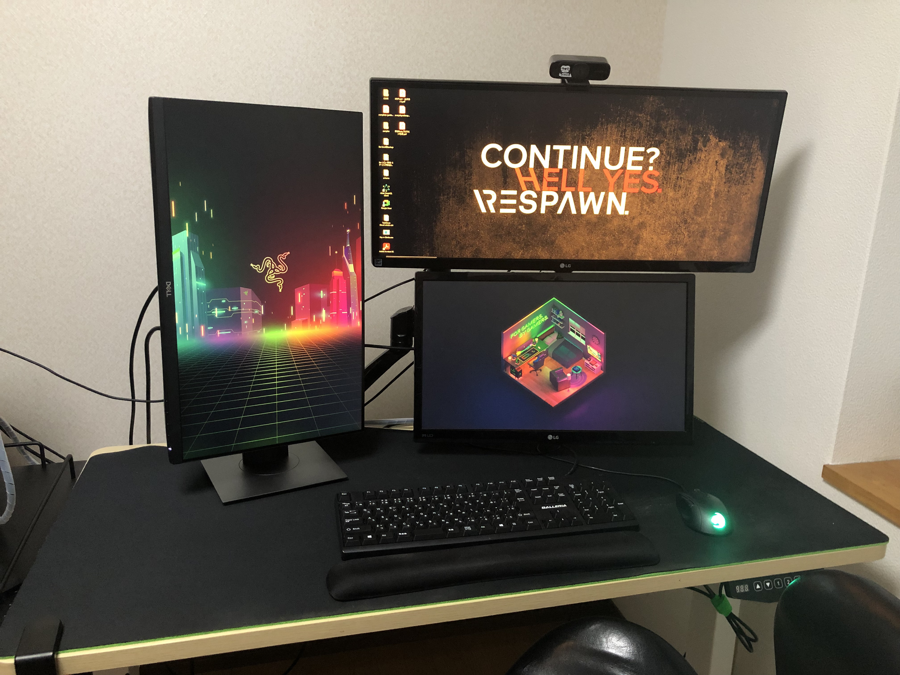

皆さん、2021～2022年の年末年始はいかがお過ごしだったでしょうか。  

2021年の年末前に仕事の兼ね合いで仙台に行き、帰りの飛行機でふと、こう思いました。  

**「2022年はもっと成果を出したいな～」**  

[2021年の振り返りと2022年の目標](https://snyt45.com/posts/20220102/furikaeri/)でも書きましたが、  
**個人の勉強もそれなりにやることはできたけど、やりっぱなしであまり良くなかったなという反省点があるので、  
2022年はその反省点を活かして、個人のPDCAサイクルをもっと小さく早く振り返り回して行きたいなと思ってました。**  

年末年始は早めに休みを取って10連休という感じで時間を作れたので、  
身の回りの整理や開発環境周りの見直しやもっと個人のPDCAサイクルを回せるように情報整理ツールをObsidianからRoam Researchに移行したりと結構色んなことをやったので振り返ってみようと思います。  

## 1. PCモニターの配置を変えた

まずは一番簡単な所で、気分転換も兼ねてPCモニターの配置を変えてみました。  

before、afterです。  

| before | after |
| --- | --- | 
|     |     | 

変更前は全てのモニターを横に並べていました。  

この配置も悪くないですが、少し不満があったのでこの機会に配置変えを行いました。  

- 首を右に左にと動かすので首への負担が結構あった。
- 右側に縦型モニターを配置していたけど、ちょっと違和感があった。

変更後は、縦型モニターを左に配置。横型のワイドディスプレイを右上に配置して、横型のディスプレイを右下に配置して縦に2つの横型ディスプレイが並ぶように配置してみました。  

モニターアームの都合もあり、横型のディスプレイを上下に並べるのは苦労しました。  
**特に高さを出すのには苦労しました。**  

横型のワイドディスプレイは、重量もそれなりにあるためエルゴトロンのLXモニターアームを使用しているのですが、  
通常のものだとポールが短いため、高さが出ず上下にディスプレイを並べることができませんでした…  
たまたま、家に同じサイズのポールの支えがあったのでそちらに入れ替えて高さを出しました。  

エルゴトロンのLXモニターアームを買う際に、**ディスプレイを上下に並べるかも知れないという方は最初からポールが長いやつを買っておくといいと思います。**  

使ってみて2週間くらい経ちましたが、**首の横の移動が減ったので前よりはだいぶ良くなった気がします。**  
また、モニターアームの都合もありワイドディスプレイが上で通常のディスプレイが下になりましたが、  
**右下の通常のディスプレイをメインにして、そこでノートアプリを開きながら、上のワイドディスプレイにブラウザを2面に開くという使い方ができて結構しっくり来ています。**

## 2. 赤羽 雄二 (著)の ゼロ秒思考を読み直した

以前は結構こういった自己啓発本を良く読んでいたのですが、個人のPDCAサイクルを回すうえで少し参考になるかもという気持ちがあったので再度読み直してみました。  

この後、ノートアプリをObsidianからRoam Researchに移行したという話もありますが、  
移行する前にゼロ秒思考のエッセンスを少し仕組みとして組み込みたいという構想も頭の中にあったので、  
ゼロ秒思考をどうノートアプリの仕組みに落とし込むかという観点で読んでみました。  

**ゼロ秒思考は頭に浮かんだ1つのテーマに対してA4用紙1枚に1分以内に書き出すという思考整理法**です。  

**頭で考えるよりは書き出すことで1つのテーマに対して深く考えることができ、思考を整理することができるので思考を前に進めやすいという効果があります。**  

A4用紙だと形式に取らわずに図や文字などの情報を好きなように書き込めるので頭の中の考えていることをすぐに書き出すという点では有利ですが、  
A4用紙だと検索や振り返りの面では不利なので、やはりデジタルツールが良いと思いました。  
また、それらの情報をカルタのように並べて情報を見ながら、さらに情報をまとめたりできると良いなと思いました。  

最終的にはRoam Researchを採用していますが、`/diagram`と打つと図で情報を整理することもできますし、ブロックという単位(Notionと似たような)で情報を紐づけることも容易で`/drawing`とることでiPadなどがあればペンを使って自由にメモをとることもできます(実際には`/drawing`はあまり使っていませんが)。  

## 3. ランニングを再開した

フルリモートになってからは一日中自宅にいることが圧倒的に増えたのと、  
**年齢も30になって体力の衰えや肩こり、腰痛など結構やばいなと思うくらい急激に衰えだした**のでこれはいいタイミングとばかりに奥さんを巻き込んでランニングを再開しました。  

週1ペースくらいで無理せずゆるーく走るくらいで継続して体力がついてきたらマラソン大会なんかも出たりしたいなと思っております。  

## 4. サブスクを断捨離した

結構使っていないサブスクがあったのでこの機械に断捨離しました。  

- 1Password

パスワード管理アプリです。  
一度使いだすとだいぶ乗り換えが大変なのですが、Bitwardenという無料のパスワード管理アプリを見つけたので時間はかかりましたが乗り換えました。UIもシンプルで個人的には全然1Passwordより使いやすかったです。  
**毎月400円の支払いが浮きました。**

- esa

ノートアプリです。  
ここ1年はほぼObsidianを使っていたので使っていなかったのですが、データが結構あってたまに検索するために一応継続して契約していました。  
いい機会だったのでDropboxにバックアップして解約しました。Dropboxは内容まではヒットしないですが、タイトルでヒットするので案外不便ではなかったです。また、markdownファイルを開く際も良い感じに表示してくれるので早くDropboxにバックアップしておけば良かったなと思いました。  
**毎月500円の支払いが浮きました。**

- ConoHa

レンタルサーバーです。  
だいぶ前に契約してブログで使っていると思っていましたが、何にも使ってませんでした（笑）
ブログはNetlifyにホスティングして無料で使えていました。  
**毎月600円の支払いが浮きました。**

- マイクラサーバー

奥さんとマイクラするのに2か月前くらいに契約しましたが、全然やってなかったので解約しました。  
**毎月500円の支払いが浮きました。**

毎月の支払いが2,000円浮きました。  
そのまま払い続けていたら年間24,000円ほどになるので塵も積もればなんとやらですね。  

## 5. Windows10 から Windows11に移行した
年末年始で絶対にやろうと思っていたことの一つです。  
移行するときに開発環境の見直しやツールの見直しも含めてやろうと思っていたので移行できて良かったです。  

Windows11に移行した感想
- 初期設定でローカルアカウントを作成する方法が少し面倒になっていました。でも、ローカルアカウントは作れるので問題なしです。
  - 参考：[Windows 11 の初期設定でローカルアカウントを作成する方法。Microsoft アカウントを使わない手順を紹介](https://nj-clucker.com/how-to-use-windows11-local-account/)
- UIが一新されてタスクバーのアイコンがセンター寄せになっているという事前情報は知っていましたが、**UIも洗練されていて非常に良かった**です(もうWindowsにダサいというイメージはだいぶなくなったと感じました)！また、タスクバーのアイコンがセンター寄せされているのも特に違和感はなくすぐ馴染めました！
- デフォルトインストールされているアプリ(InstagramとかTikTokとかDisney+など...)で不要なものが多い気がしました。
- Windows11からは標準でウィンドウの分割・整列がしやすいようにスナップレイアウト機能が入っていて結構便利でした。
  - ただ、PowerToysを使ったウィンドウ配置・アプリ起動が便利すぎて結局そっちに戻りました。とても便利なので、Windowsを使っていてPowerToysを使ったことがない人はぜひ使ってみてください。
- **WSLのインストールがワンコマンド(`wsl --install`)できるようになっていてエンジニアの方には最高の環境になってきました！**
- これもエンジニア向けですが、**Windows Terminal**が標準になりました！Windows10では別途インストールする必要があったのですが、その必要がなくなりました！
- Windows11からWSLを追加すると、**自動でエクスプローラーにLinuxというクイックアクセスが作られるようになっていて便利でした！**
- Windows Terminalが標準になったので**wingetというパッケージ管理ツールも最初からついてきます。**
  - 以前はscoopというツールを使っていましたがwingetに乗り換えました。scoopだと標準で管理していないものは別途バケットをインストールする必要があったのですがwingetではその必要がなくほとんどのアプリが簡単に導入できて便利でした。

結論から申し上げますとWindowsがさらに好きになりました！  

## 6. 知的生産ツール「Roam Research」完全ガイド を買った

Shu Omiさんという方が日本向けにRoam Researchの使い方についてまとめたガイドです。  
[Roam Research 知的生産術コース \| Shu Omi's School](https://shu-omi-s-school.teachable.com/p/roam-research)

4,000円しましたが、Roam Researchを今度こそちゃんと理解して使いたいという思いがあったので**思い切って買いましたが大正解でした。**  

2年前くらいにも一時期使っていたのですが、そのときは10%も良さを引き出せていなかったと思いました。  

このガイドを読めばそれを40%くらいに引き上げてくれてくれるので色々と応用が効くようになり情報整理が楽しくなりますし、第2の脳というのが実感できると思います。  

活用方法の一つとして紹介されていますが、Mornig-Journal、Evening-Reflection、Resonance-Calenderとして活用する方法はかなり学びが多いです。  

## 7. Obsidian から Roam Research に移行した

正直Obsidianについて全く不満はありませんでした。  
個人であれば無料で使えて、Vimのキーバインドも使えて、ローカルで動作するのでもっさり感はいっさいなく、デイリーノートも自動で作られ、プラグインも豊富で順風満帆なノート生活を過ごせました。  

それでも有料プランしかなく毎月1,500円もするRoam Researchに移行したのは第2の脳として優秀だからです。  
もちろんObsidianにも双方向リンク機能もありますが、実際に使ってみて第2の脳としての使い方をするのであればRoam Research一択でした。  

正直今のノートアプリは大体双方向リンクがあり、第2の脳的に使えるものが多いですが、**Roam Researchで優れていると思ったのは双方向リンクとタグがありどちらも同じように機能するのですが、ブロック単位で同じリンクまたはタグがあるブロックを横軸で情報を見返すことができたり、右サイドバーにノートを複数開きながら情報を整理したりといったことがスムーズにできる点**だと感じています。  

長くなるのでここには書きませんが、余裕があればRoam Researchの運用方法について記事を書きたいなーと思っています。  

## 8. WSLの開発環境周りを見直した

セットアップ方法から使用するツールやターミナル周り、Vim周りなど大幅に見直しました。  
dotfiles管理しています。  
[snyt45/wsl\-dotfiles2 at v0\.0\.2](https://github.com/snyt45/wsl-dotfiles2/tree/v0.0.2)

大きな変更点

- WSLの環境は個人、自社、開発支援先の3つで切り分けました。

**環境を切り分けたので影響範囲が小さくなりました。**  
どうにもいかなくなったときは思い切って環境を作り直しやすくなりました

- fzfを中心にした構成にしてみました

lazygitの記事などを書いておいてあれなのですが、使うツールによって操作UIがバラバラだったので見直してfzf中心にしました。  
fzf自体はシンプルで渡された情報をインクリメンタルサーチするものです。  
**シンプルがゆえにGitやDocker、Vimなどと組み合わせることもでき拡張性があったのでこの機会にターミナルやVimで操作するUIをできるだけ統一しました。**  
結構ネットに落ちているコードをコピペで動かしていて細かい所が調整できていないので都度設定を育てていこうと思います。  

- fishを使うのをやめました

**fishはデフォルトで補完機能が優秀**で一度入力したコマンドの一部を入力するとそれがシャドーのような感じで補完候補として出てきたり、存在しないコマンドの場合は入力する段階で赤くなったりとかなりユーザーフレンドリーなシェルです。  
ですが、Ubuntu標準ではなかったりbashで書かれているスクリプトだと実行できなかったり色々と不便な面があったのでfish自体は便利でしたが、Ubuntu標準のbashを使うようにしました。  

**fishのようなシャドー補完は実現できてないですが、fzfを組み合わせることでコマンド履歴検索して実行したりすることでbashにもある程度住めるような調整を行いました。**  

- linuxbrewを使うのをやめました

これは**WSLの利点だと思っていたのですが、導入に時間がかかるのとlinuxbrewでも入れられないパッケージは結局aptを使ったりしていたのでaptを使うようにしました。**  

パッケージによってはlinuxbrewのほうが簡単に導入できるのもあってもどかしさはありますが、aptでも今のところ問題なく使えているので結果良かったです。  

- Vim周りも大きく見直した

少し前はVimでなんでもかんでもやろうという感じで結構Vimのプラグインを入れていて動作がもっさりしていたのですが、  
Vimはエディタとしての機能に集中させるという方針でFernなどなくても良さそうなのものは削りました。  
ファイル検索、ファイル移動はfzf.vimとripgrepを使うことでかなり使い勝手が増しました。  

Git操作についてはいまだにどの方法でやるのか迷っていますが、とりあえずcode .でVS Code開いてVS Codeでやったりターミナルでpushやpullはやったりなどしています。早く良さげな方法を見つけたい。  

## 9. 冨田 和成 (著)の 図解 鬼速PDCAを読み直した

鬼速PDCAも以前読んだことがあるのですが、今年は「小さく目標設定し、小さく行動し、小さく振り返り、小さく次の行動につなげるための土台を作る。」という目標があり、その土台に一番大事な考え方だと思っているので再度読み直しました。  

鬼速PDCAの土台となっているのは、リーン・スタートアップという考え方みたいですが、鬼速PDCAでは3日に一度は検証するべきとあります。  
また、実行するためのワークフローも計画・実行・検証・調整とあり、それぞれかなり細かく実践するための方法が整理されています。  
まだRoam Researchに落とし込めていないですが、早い段階で仕組みとして落とし込んで土台を作っていきたいです。  

## 10. エルゴヒューマン エンジョイを買った

最後に年末年始で結構お高い椅子をぽちりました。  
ランニングの所にもありますが、体の衰えを感じ今座っている椅子の相性もありますが、フルリモートになってから首痛、肩こり、腰痛が悪化しており限界を迎えたので体のためにもと思い色々調べて買いました。  

早く欲しかったので試せていないのですが結構調べて同じくらいの身長の人のレビューを見たり、他の椅子と比較してみたりしてコスパも良かったのでこの椅子に決めました。  

決めてはこの記事でした。  
[エンジニアにおすすめのオフィスチェアはどれ？](https://idis.dev/blog/chair/)

私は椅子に持たれながら作業したいと思っていたのでこの記事を見てこれだ！と思ったのと、エルゴヒューマンは独立式ランバーサポートが特色なのですがエンジョイはクセがないランバーサポートなので試座できていないけど問題ないだろうという点もあり最終エルゴヒューマン エンジョイにしました。  

まだ届いていないですが、かなり楽しみです！  

## まとめ

振り返ってみると年末年始の10連休は2022年を気持ちよくスタートするために色々な準備ができて個人的にはかなり有意義な時間でした。  
開発や勉強などはほとんどできなかったので環境が整ったら徐々にエンジンをかけていこうと思います！  
